# Atlantis: Terraform Pull Request Automation
## A Deep Dive into the Codebase

---

# What is Atlantis?

- Self-hosted Golang application
- Listens for Terraform pull request events via webhooks
- Automates Terraform operations in a controlled way
- Provides visibility and collaboration for infrastructure changes
- Used by top companies to manage over 600 repos with 300 developers

---

# Core Architecture

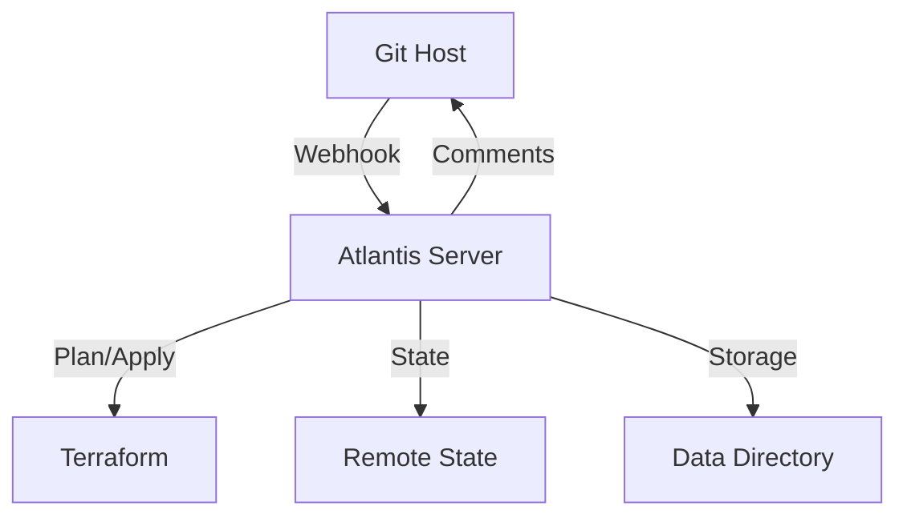

---

# Major Components

1. **Webhook Handler**
   - Processes GitHub/GitLab/Bitbucket/Azure DevOps webhooks
   - Validates webhook signatures
   - Triggers appropriate Terraform operations

2. **Terraform Executor**
   - Manages Terraform command execution
   - Handles state management
   - Processes command outputs
   - Supports multiple Terraform versions

3. **Pull Request Commenter**
   - Formats and posts results back to PRs
   - Provides clear feedback to users
   - Handles command parsing and validation

---

# Project Structure

```
atlantis/
├── cmd/           # Command-line entry points
│   ├── server.go  # Main server implementation
│   └── version.go # Version information
├── internal/      # Core application logic
│   ├── domain/    # Domain models and interfaces
│   ├── config/    # Configuration management
│   └── server/    # Server implementation
├── server/        # Server-specific code
├── docs/          # Documentation
└── runatlantis.io # Website and documentation
```

---

# Key Features

1. **Automated Planning**
   - Runs `terraform plan` on PR creation/update
   - Comments plan output back to PR
   - Supports multiple Terraform projects

2. **Controlled Applying**
   - Requires explicit approval via PR comments
   - Supports workspace-specific applies
   - Handles locking to prevent conflicts

3. **Security Features**
   - Webhook secret validation
   - Repository allowlisting
   - Team-based access control
   - SSL/TLS support

---

# Deployment Options

## Implementation

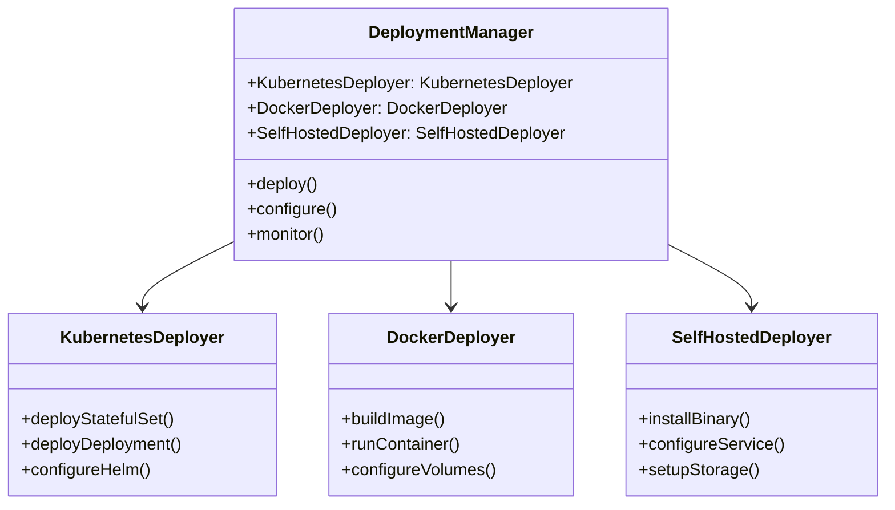

## Features

1. **Kubernetes Deployment**
   ```yaml
   apiVersion: apps/v1
   kind: StatefulSet
   metadata:
     name: atlantis
   spec:
     serviceName: atlantis
     replicas: 1
     template:
       spec:
         containers:
         - name: atlantis
           image: ghcr.io/runatlantis/atlantis:latest
           env:
           - name: ATLANTIS_GH_USER
             value: <USER>
           - name: ATLANTIS_GH_TOKEN
             valueFrom:
               secretKeyRef:
                 name: atlantis-vcs
                 key: token
   ```

2. **Docker Deployment**
   ```dockerfile
   FROM ghcr.io/runatlantis/atlantis:latest
   ENV ATLANTIS_GH_USER=<USER>
   ENV ATLANTIS_GH_TOKEN=<TOKEN>
   ENV ATLANTIS_REPO_ALLOWLIST="github.com/org/*"
   VOLUME ["/atlantis"]
   EXPOSE 4141
   ```

3. **Self-hosted Deployment**
   ```bash
   # Download binary
   curl -L https://github.com/runatlantis/atlantis/releases/latest/download/atlantis_linux_amd64.zip -o atlantis.zip
   
   # Configure service
   cat > /etc/systemd/system/atlantis.service << EOF
   [Unit]
   Description=Atlantis
   After=network.target
   
   [Service]
   ExecStart=/usr/local/bin/atlantis server
   Restart=always
   
   [Install]
   WantedBy=multi-user.target
   EOF
   ```

## Deployment Lifecycle

1. **Kubernetes Flow**
   ```mermaid
   sequenceDiagram
       participant User
       participant Helm
       participant Kubernetes
       participant Atlantis
       User->>Helm: Install Chart
       Helm->>Kubernetes: Create Resources
       Kubernetes->>Kubernetes: Create StatefulSet
       Kubernetes->>Kubernetes: Create Service
       Kubernetes->>Atlantis: Start Pod
       Atlantis->>Atlantis: Initialize
   ```

2. **Docker Flow**
   ```mermaid
   sequenceDiagram
       participant User
       participant Docker
       participant Atlantis
       User->>Docker: Build Image
       Docker->>Docker: Pull Base
       Docker->>Docker: Configure
       User->>Docker: Run Container
       Docker->>Atlantis: Start
       Atlantis->>Atlantis: Initialize
   ```

## Deployment Features

1. **Kubernetes Features**
   - Helm chart support
   - StatefulSet deployment
   - Resource management
   - Service configuration
   - Volume management
   - Health checks
   - Auto-scaling

2. **Docker Features**
   - Official image
   - Volume mounting
   - Environment configuration
   - Network setup
   - Health monitoring
   - Resource limits
   - Security context

3. **Self-hosted Features**
   - Binary distribution
   - Service management
   - Storage configuration
   - Network setup
   - Monitoring
   - Backup/restore
   - Security hardening

## Use Cases

1. **Kubernetes Deployment**
   ```yaml
   # values.yaml
   github:
     user: atlantis
     token: <TOKEN>
     secret: <SECRET>
   orgAllowlist: github.com/org/*
   persistence:
     enabled: true
     size: 5Gi
   ```

2. **Docker Deployment**
   ```bash
   docker run -d \
     -v atlantis-data:/atlantis \
     -e ATLANTIS_GH_USER=atlantis \
     -e ATLANTIS_GH_TOKEN=<TOKEN> \
     -e ATLANTIS_REPO_ALLOWLIST="github.com/org/*" \
     -p 4141:4141 \
     ghcr.io/runatlantis/atlantis:latest
   ```

3. **Self-hosted Deployment**
   ```bash
   # Install binary
   unzip atlantis.zip
   mv atlantis /usr/local/bin/
   
   # Configure
   mkdir -p /var/lib/atlantis
   chown atlantis:atlantis /var/lib/atlantis
   
   # Start service
   systemctl enable atlantis
   systemctl start atlantis
   ```

4. **High Availability**
   ```yaml
   # values.yaml
   replicaCount: 3
   persistence:
     enabled: true
     size: 5Gi
   resources:
     requests:
       memory: 256Mi
       cpu: 100m
     limits:
       memory: 512Mi
       cpu: 200m
   ```

---

# Configuration

1. **Server Configuration**
   - Git host credentials
   - Webhook secrets
   - Repository allowlists
   - Terraform versions

2. **Repository Configuration**
   - `atlantis.yaml` for project settings
   - Custom workflows
   - Workspace configuration
   - Auto-planning rules

---

# Configuration Options

## Implementation

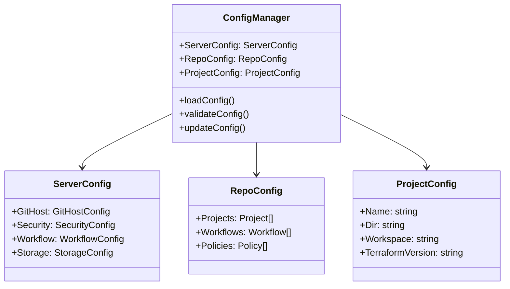

## Features

1. **Server Configuration**
   ```yaml
   # server-config.yaml
   gh-user: atlantis
   gh-token: <TOKEN>
   repo-allowlist: github.com/org/*
   webhook-secret: <SECRET>
   data-dir: /var/lib/atlantis
   log-level: info
   ```

2. **Repository Configuration**
   ```yaml
   # atlantis.yaml
   version: 3
   projects:
   - name: project1
     dir: project1
     workspace: default
     terraform_version: v1.0.0
   workflows:
     custom:
       plan:
         steps:
         - run: terraform plan -out $PLANFILE
   ```

3. **Project Configuration**
   ```yaml
   # project-config.yaml
   name: project1
   dir: project1
   workspace: default
   terraform_version: v1.0.0
   autoplan:
     when_modified: ["*.tf", "*.tfvars"]
   ```

## Configuration Lifecycle

1. **Server Configuration Flow**
   ```mermaid
   sequenceDiagram
       participant User
       participant ConfigManager
       participant Server
       User->>ConfigManager: Load Config
       ConfigManager->>ConfigManager: Validate Config
       ConfigManager->>Server: Apply Config
       Server->>Server: Initialize
   ```

2. **Repository Configuration Flow**
   ```mermaid
   sequenceDiagram
       participant User
       participant ConfigManager
       participant Repository
       User->>ConfigManager: Load Config
       ConfigManager->>ConfigManager: Validate Config
       ConfigManager->>Repository: Apply Config
       Repository->>Repository: Initialize
   ```

## Configuration Features

1. **Server Features**
   - Git host integration
   - Security settings
   - Workflow configuration
   - Storage management
   - Logging configuration
   - Webhook settings
   - Authentication

2. **Repository Features**
   - Project definitions
   - Workflow customization
   - Policy configuration
   - Module dependencies
   - Workspace management
   - Terraform versions
   - Auto-planning rules

3. **Project Features**
   - Directory structure
   - Workspace settings
   - Terraform version
   - Auto-planning rules
   - Custom workflows
   - Policy checks
   - State management

## Use Cases

1. **Multiple Projects**
   ```yaml
   # atlantis.yaml
   version: 3
   projects:
   - name: project1
     dir: project1
     workspace: default
   - name: project2
     dir: project2
     workspace: staging
   ```

2. **Custom Workflows**
   ```yaml
   # atlantis.yaml
   version: 3
   workflows:
     custom:
       plan:
         steps:
         - run: terraform init
         - run: terraform plan -out $PLANFILE
       apply:
         steps:
         - run: terraform apply $PLANFILE
   ```

3. **Module Dependencies**
   ```yaml
   # atlantis.yaml
   version: 3
   projects:
   - dir: project1
     autoplan:
       when_modified: ["*.tf", "../modules/**/*.tf"]
   ```

4. **Policy Checks**
   ```yaml
   version: 3
   projects:
   - dir: .
     policy_check: true
   ```

---

# Integration Points

1. **Version Control Systems**
   - GitHub (public/enterprise)
   - GitLab (public/enterprise)
   - Bitbucket (Cloud/Server)
   - Azure DevOps
   - Gitea

2. **Terraform Backends**
   - Supports all remote backends
   - No local state support
   - Works with Terraform Cloud

---

# Best Practices

1. **Security**
   - Use webhook secrets
   - Configure repository allowlists
   - Enable SSL/TLS
   - Use team-based access control

2. **Reliability**
   - Use persistent storage
   - Configure proper resource limits
   - Set up monitoring
   - Regular backups

---

# Future Directions

1. **Planned Features**
   - Drift detection
   - Enhanced UI improvements
   - Additional VCS integrations
   - Plugin-based architecture

2. **Community Focus**
   - Open source development
   - Community-driven features
   - Regular updates and improvements

---

# Resources

- Documentation: [www.runatlantis.io/docs](https://www.runatlantis.io/docs)
- Getting Started: [www.runatlantis.io/guide](https://www.runatlantis.io/guide)
- Community: [Slack Channel](https://slack.cncf.io/)
- Contributing: [CONTRIBUTING.md](CONTRIBUTING.md)

---

# Thank You!

Questions?

---

# Package Structure and Interactions

## Core Packages

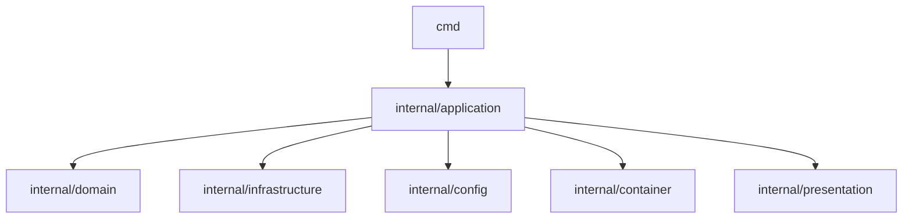

---

# Package Details

## 1. `cmd` Package
- Entry point for the application
- Contains main server implementation
- Handles command-line interface
- Key files:
  - `server.go`: Main server implementation
  - `version.go`: Version information
  - `bootstrap.go`: Application bootstrap
  - `root.go`: Root command definition

---

## 2. `internal/application` Package
- Application layer implementation
- Orchestrates business logic
- Coordinates between different components
- Key responsibilities:
  - Command handling
  - Event processing
  - Workflow management
  - Business rules implementation

---

## 3. `internal/domain` Package
- Core business logic and models
- Domain entities and interfaces
- Business rules and validations
- Key components:
  - Entity definitions
  - Value objects
  - Domain services
  - Repository interfaces

---

## 4. `internal/infrastructure` Package
- External system integrations
- Infrastructure implementations
- Technical concerns
- Key components:
  - VCS integrations (GitHub, GitLab, etc.)
  - Terraform execution
  - Storage implementations
  - External service clients

---

## 5. `internal/config` Package
- Configuration management
- Environment handling
- Settings validation
- Key features:
  - Configuration loading
  - Environment variables
  - Settings validation
  - Default values

---

## 6. `internal/container` Package
- Dependency injection
- Service container
- Component wiring
- Key responsibilities:
  - Service registration
  - Dependency resolution
  - Lifecycle management
  - Component initialization

---

## 7. `internal/presentation` Package
- User interface layer
- API endpoints
- Request/Response handling
- Key components:
  - HTTP handlers
  - API controllers
  - Response formatting
  - Input validation

---

# Package Interactions

## Flow of Control

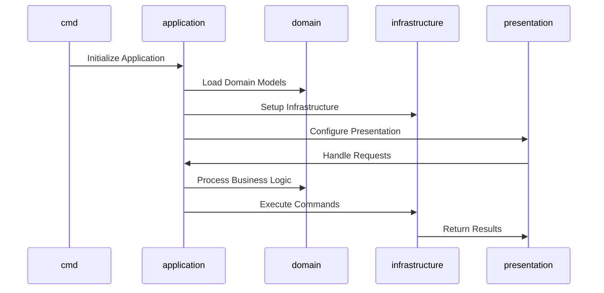

---

# Package Dependencies

## Dependency Rules

1. **Clean Architecture Principles**
   - Domain package has no external dependencies
   - Application depends on domain
   - Infrastructure implements domain interfaces
   - Presentation depends on application

2. **Dependency Direction**
   ```
   presentation → application → domain
   infrastructure → domain
   config → all packages
   container → all packages
   ```

3. **Interface Segregation**
   - Each package defines its own interfaces
   - Dependencies flow through interfaces
   - Implementation details are hidden

---

# Package Responsibilities

## 1. Command Handling
- `cmd`: Parse and validate commands
- `application`: Process commands
- `domain`: Define command structures
- `infrastructure`: Execute commands

## 2. Event Processing
- `application`: Event orchestration
- `domain`: Event definitions
- `infrastructure`: Event handling
- `presentation`: Event delivery

## 3. Configuration
- `config`: Configuration management
- `container`: Configuration injection
- `application`: Configuration usage
- `infrastructure`: Configuration application

---

# Package Evolution

## Current State
- Clean architecture implementation
- Clear separation of concerns
- Modular design
- Extensible structure

## Future Directions
- Enhanced plugin system
- Improved modularity
- Better testability
- Simplified dependencies 

# Core Functionality

## Event System

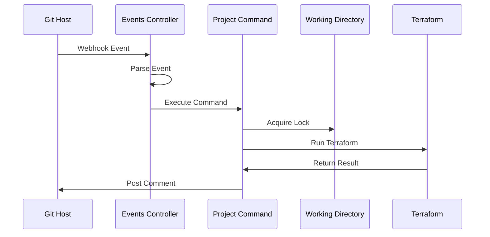

---

# Locking

## Implementation

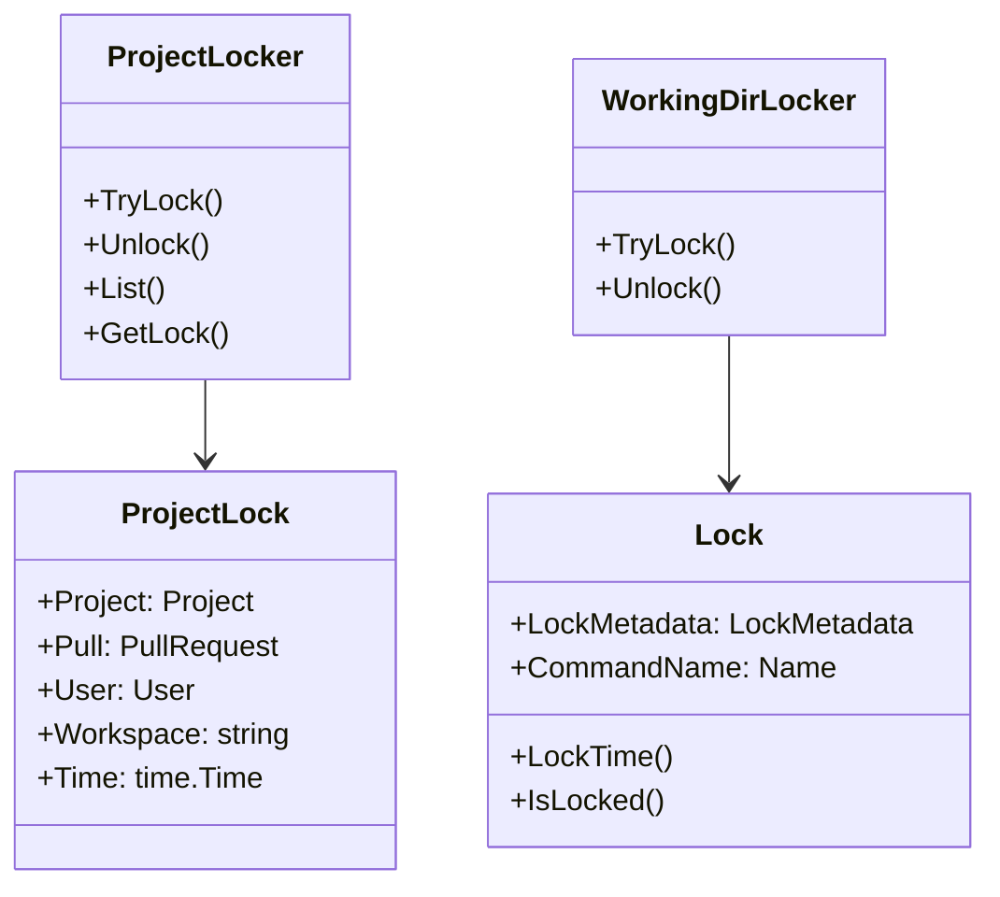

## Features

1. **Project Locking**
   ```yaml
   # Server-side configuration
   repos:
   - id: /.*/
     repo_locks:
       mode: on_plan  # or on_apply
   ```

2. **Working Directory Locking**
   ```go
   type WorkingDirLocker interface {
       TryLock(repoFullName string, pullNum int, workspace string, path string) (func(), error)
   }
   ```

3. **Lock Management**
   ```go
   type ProjectLock struct {
       Project   Project
       Pull      PullRequest
       User      User
       Workspace string
       Time      time.Time
   }
   ```

## Lock Lifecycle

1. **Lock Acquisition Flow**
   ```mermaid
   sequenceDiagram
       participant User
       participant ProjectLocker
       participant WorkingDirLocker
       participant Lock
       User->>ProjectLocker: TryLock
       ProjectLocker->>WorkingDirLocker: TryLock
       WorkingDirLocker->>Lock: Create Lock
       Lock-->>WorkingDirLocker: Return Lock
       WorkingDirLocker-->>ProjectLocker: Return Unlock Function
       ProjectLocker-->>User: Return Lock Status
   ```

2. **Lock Release Flow**
   ```mermaid
   sequenceDiagram
       participant User
       participant ProjectLocker
       participant WorkingDirLocker
       participant Lock
       User->>ProjectLocker: Unlock
       ProjectLocker->>WorkingDirLocker: Unlock
       WorkingDirLocker->>Lock: Delete Lock
       Lock-->>WorkingDirLocker: Confirm Deletion
       WorkingDirLocker-->>ProjectLocker: Confirm Unlock
       ProjectLocker-->>User: Confirm Release
   ```

## Lock Features

1. **Project Lock Features**
   - Directory-based locking
   - Workspace-based locking
   - Pull request tracking
   - User tracking
   - Time tracking
   - Lock persistence

2. **Working Directory Lock Features**
   - Concurrent execution prevention
   - Workspace isolation
   - Path-based locking
   - Automatic cleanup
   - Error handling

3. **Lock Management Features**
   - Lock listing
   - Lock details
   - Lock deletion
   - Lock expiration
   - Lock validation

## Use Cases

1. **Plan Locking**
   ```yaml
   version: 3
   projects:
   - dir: .
     repo_locks:
       mode: on_plan
   ```

2. **Apply Locking**
   ```yaml
   version: 3
   projects:
   - dir: .
     repo_locks:
       mode: on_apply
   ```

3. **Workspace Locking**
   ```yaml
   version: 3
   projects:
   - dir: .
     workspace: production
     repo_locks:
       mode: on_plan
   ```

4. **Custom Locking**
   ```yaml
   version: 3
   projects:
   - dir: staging
     repo_locks:
       mode: on_plan
   - dir: production
     repo_locks:
       mode: on_apply
   ```

---

# Workspace Management

## Working Directory Implementation

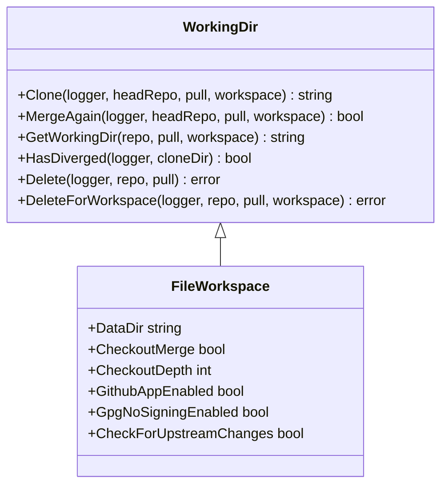

## Workspace Features

1. **Repository Management**
   ```go
   type FileWorkspace struct {
       DataDir string
       CheckoutMerge bool
       CheckoutDepth int
       GithubAppEnabled bool
       GpgNoSigningEnabled bool
       CheckForUpstreamChanges bool
   }
   ```

2. **Clone Operations**
   - Concurrent clone handling
   - Commit verification
   - Merge strategy support
   - Upstream change detection

3. **Directory Structure**
   ```
   /repos
     /{owner}
       /{repo}
         /{pull}
           /{workspace}
   ```

4. **Git Operations**
   - Branch management
   - Merge handling
   - Commit tracking
   - Untracked file detection

## Workspace Security

1. **Access Control**
   - Directory permissions
   - Git credentials
   - Clone URL sanitization
   - Workspace isolation

2. **State Management**
   - Lock synchronization
   - Concurrent access
   - Cleanup operations
   - State verification

3. **Error Handling**
   - Clone failures
   - Merge conflicts
   - Permission issues
   - State corruption

---

# Pre-Workflow Hooks

## Implementation

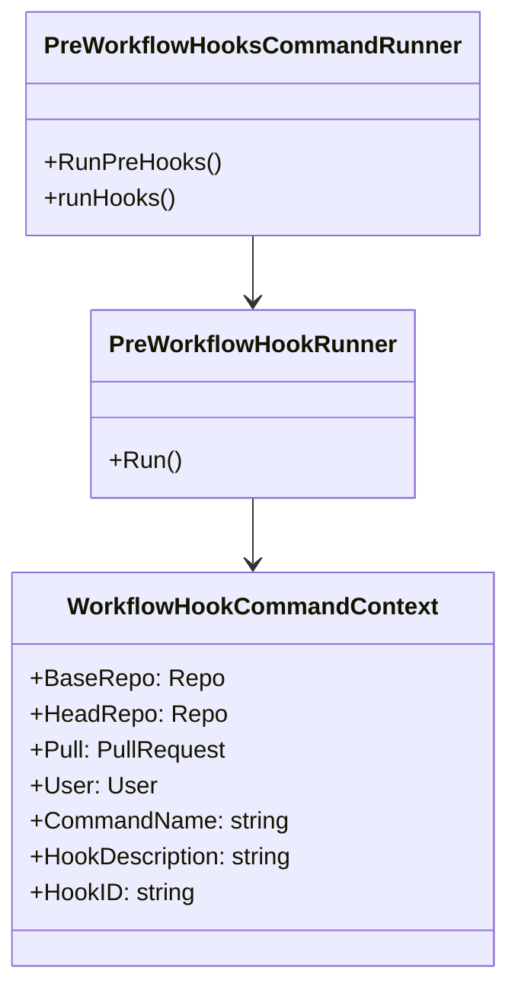

## Features

1. **Hook Configuration**
   ```yaml
   # Server-side configuration
   repos:
   - id: /.*/
     pre_workflow_hooks:
       - run: ./plan-hook.sh
         description: Plan Hook
         commands: plan
       - run: ./plan-apply-hook.sh
         description: Plan & Apply Hook
         commands: plan, apply
   ```

2. **Shell Customization**
   ```yaml
   repos:
   - id: /.*/
     pre_workflow_hooks:
       - run: |
           echo "generating atlantis.yaml"
           terragrunt-atlantis-config generate --output atlantis.yaml --autoplan --parallel
         description: Generating atlantis.yaml
         shell: bash
         shellArgs: -cv
   ```

3. **Dynamic Config Generation**
   ```yaml
   repos:
   - id: /.*/
     pre_workflow_hooks:
       - run: ./generate-config.sh
         description: Generate Atlantis config
   ```

## Hook Lifecycle

1. **Execution Flow**
   ```mermaid
   sequenceDiagram
       participant User
       participant PreWorkflowHooksCommandRunner
       participant PreWorkflowHookRunner
       participant WorkingDir
       User->>PreWorkflowHooksCommandRunner: Execute Command
       PreWorkflowHooksCommandRunner->>WorkingDir: Clone Repository
       PreWorkflowHooksCommandRunner->>PreWorkflowHookRunner: Run Hooks
       PreWorkflowHookRunner-->>PreWorkflowHooksCommandRunner: Return Result
       PreWorkflowHooksCommandRunner-->>User: Return Result
   ```

2. **Environment Variables**
   - `BASE_REPO_NAME`: Name of the base repository
   - `BASE_REPO_OWNER`: Owner of the base repository
   - `HEAD_REPO_NAME`: Name of the head repository
   - `HEAD_REPO_OWNER`: Owner of the head repository
   - `HEAD_BRANCH_NAME`: Name of the head branch
   - `HEAD_COMMIT`: SHA of the head commit
   - `BASE_BRANCH_NAME`: Name of the base branch
   - `PULL_NUM`: Pull request number
   - `PULL_URL`: Pull request URL
   - `PULL_AUTHOR`: Pull request author
   - `DIR`: Repository root directory
   - `USER_NAME`: Username of the VCS user
   - `COMMENT_ARGS`: Additional command arguments
   - `COMMAND_NAME`: Name of the command being executed
   - `OUTPUT_STATUS_FILE`: Status output file path

## Hook Features

1. **Command Targeting**
   - Run hooks for specific commands
   - Multiple command support
   - Command-specific configurations
   - Error handling options

2. **Shell Features**
   - Custom shell selection
   - Shell argument customization
   - Environment variable access
   - Output handling

3. **Error Handling**
   - Hook failure options
   - Status reporting
   - Error propagation
   - Cleanup procedures

## Use Cases

1. **Dynamic Config Generation**
   ```yaml
   repos:
   - id: /.*/
     pre_workflow_hooks:
       - run: ./generate-config.sh
         description: Generate Atlantis config
   ```

2. **Environment Setup**
   ```yaml
   repos:
   - id: /.*/
     pre_workflow_hooks:
       - run: |
           npm install
           cdktf get
           cdktf synth --output ci-cdktf.out
         description: Setup CDKTF environment
   ```

3. **Validation Checks**
   ```yaml
   repos:
   - id: /.*/
     pre_workflow_hooks:
       - run: ./validate-terraform.sh
         description: Validate Terraform files
         commands: plan, apply
   ```

4. **Custom Workflow Setup**
   ```yaml
   repos:
   - id: /.*/
     pre_workflow_hooks:
       - run: |
           echo "Setting up custom workflow"
           ./setup-workflow.sh
         description: Setup custom workflow
         shell: bash
         shellArgs: -cv
   ```

# Post-Workflow Hooks

## Implementation

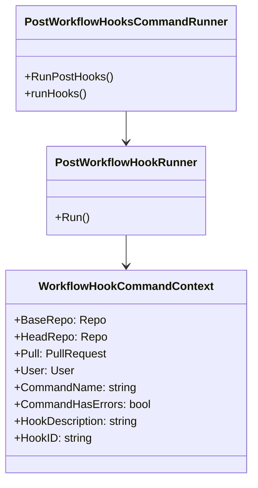

## Features

1. **Hook Configuration**
   ```yaml
   # Server-side configuration
   repos:
   - id: /.*/
     post_workflow_hooks:
       - run: ./plan-hook.sh
         description: Plan Hook
         commands: plan
       - run: ./plan-apply-hook.sh
         description: Plan & Apply Hook
         commands: plan, apply
   ```

2. **Shell Customization**
   ```yaml
   repos:
   - id: /.*/
     post_workflow_hooks:
       - run: |
           echo 'atlantis.yaml config:'
           cat atlantis.yaml
         description: atlantis.yaml report
         shell: bash
         shellArgs: -cv
   ```

3. **Cost Estimation**
   ```yaml
   # repos.yaml
   workflows:
     myworkflow:
       plan:
         steps:
         - init
         - plan
         - run: infracost breakdown --path=$PLANFILE --format=json --out-file=/tmp/$BASE_REPO_OWNER-$BASE_REPO_NAME-$PULL_NUM-$WORKSPACE-$REPO_REL_DIR-infracost.json
   repos:
     - id: /.*/
       workflow: myworkflow
       post_workflow_hooks:
         - run: infracost output --path=/tmp/$BASE_REPO_OWNER-$BASE_REPO_NAME-$PULL_NUM-*-infracost.json --format=github-comment --out-file=/tmp/infracost-comment.md
           description: Running infracost
   ```

## Hook Lifecycle

1. **Execution Flow**
   ```mermaid
   sequenceDiagram
       participant User
       participant PostWorkflowHooksCommandRunner
       participant PostWorkflowHookRunner
       participant WorkingDir
       User->>PostWorkflowHooksCommandRunner: Execute Command
       PostWorkflowHooksCommandRunner->>WorkingDir: Clone Repository
       PostWorkflowHooksCommandRunner->>PostWorkflowHookRunner: Run Hooks
       PostWorkflowHookRunner-->>PostWorkflowHooksCommandRunner: Return Result
       PostWorkflowHooksCommandRunner-->>User: Return Result
   ```

2. **Environment Variables**
   - `BASE_REPO_NAME`: Name of the base repository
   - `BASE_REPO_OWNER`: Owner of the base repository
   - `HEAD_REPO_NAME`: Name of the head repository
   - `HEAD_REPO_OWNER`: Owner of the head repository
   - `HEAD_BRANCH_NAME`: Name of the head branch
   - `HEAD_COMMIT`: SHA of the head commit
   - `BASE_BRANCH_NAME`: Name of the base branch
   - `PULL_NUM`: Pull request number
   - `PULL_URL`: Pull request URL
   - `PULL_AUTHOR`: Pull request author
   - `DIR`: Repository root directory
   - `USER_NAME`: Username of the VCS user
   - `COMMENT_ARGS`: Additional command arguments
   - `COMMAND_NAME`: Name of the command being executed
   - `COMMAND_HAS_ERRORS`: Whether command had errors
   - `OUTPUT_STATUS_FILE`: Status output file path

## Hook Features

1. **Command Targeting**
   - Run hooks for specific commands
   - Multiple command support
   - Command-specific configurations
   - Error handling options

2. **Shell Features**
   - Custom shell selection
   - Shell argument customization
   - Environment variable access
   - Output handling

3. **Error Handling**
   - Hook failure options
   - Status reporting
   - Error propagation
   - Cleanup procedures

## Use Cases

1. **Cost Estimation Reporting**
   ```yaml
   repos:
   - id: /.*/
     post_workflow_hooks:
       - run: infracost output --path=/tmp/*-infracost.json --format=github-comment
         description: Generate cost report
   ```

2. **Configuration Validation**
   ```yaml
   repos:
   - id: /.*/
     post_workflow_hooks:
       - run: ./validate-config.sh
         description: Validate configuration
         commands: plan, apply
   ```

3. **Notification System**
   ```yaml
   repos:
   - id: /.*/
     post_workflow_hooks:
       - run: |
           echo "Sending notifications"
           ./send-notifications.sh
         description: Send notifications
         shell: bash
         shellArgs: -cv
   ```

4. **Custom Reporting**
   ```yaml
   repos:
   - id: /.*/
     post_workflow_hooks:
       - run: |
           echo "Generating report"
           ./generate-report.sh
         description: Generate custom report
         commands: apply
   ```

# Custom Workflows

## Implementation

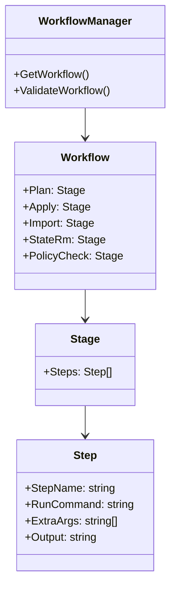

## Features

1. **Default Workflow**
   ```yaml
   workflows:
     default:
       plan:
         steps:
         - init
         - plan
       apply:
         steps:
         - apply
   ```

2. **Custom Workflow**
   ```yaml
   workflows:
     custom:
       plan:
         steps:
         - init:
             extra_args: ["-backend-config=staging.backend.tfvars"]
         - plan:
             extra_args: ["-var-file=staging.tfvars"]
       apply:
         steps:
         - apply:
             extra_args: ["-var-file=staging.tfvars"]
   ```

3. **Workflow Hooks**
   ```yaml
   workflows:
     custom:
       plan:
         steps:
         - run: ./pre-plan.sh
         - init
         - plan
         - run: ./post-plan.sh
       apply:
         steps:
         - run: ./pre-apply.sh
         - apply
         - run: ./post-apply.sh
   ```

## Workflow Lifecycle

1. **Execution Flow**
   ```mermaid
   sequenceDiagram
       participant User
       participant WorkflowManager
       participant Stage
       participant Step
       participant WorkingDir
       User->>WorkflowManager: Execute Command
       WorkflowManager->>Stage: Get Stage
       Stage->>Step: Execute Step
       Step->>WorkingDir: Run Command
       WorkingDir-->>Step: Return Result
       Step-->>Stage: Return Result
       Stage-->>WorkflowManager: Return Result
       WorkflowManager-->>User: Return Result
   ```

2. **Environment Variables**
   - `WORKSPACE`: Terraform workspace name
   - `ATLANTIS_TERRAFORM_VERSION`: Terraform version
   - `DIR`: Absolute path to current directory
   - `PLANFILE`: Path to plan file
   - `SHOWFILE`: Path to show file
   - `POLICYCHECKFILE`: Path to policy check output
   - `BASE_REPO_OWNER`: Base repository owner
   - `HEAD_REPO_NAME`: Head repository name
   - `HEAD_REPO_OWNER`: Head repository owner
   - `HEAD_BRANCH_NAME`: Head branch name
   - `HEAD_COMMIT`: Head commit SHA
   - `BASE_BRANCH_NAME`: Base branch name
   - `PROJECT_NAME`: Project name
   - `PULL_NUM`: Pull request number
   - `PULL_URL`: Pull request URL
   - `PULL_AUTHOR`: Pull request author
   - `REPO_REL_DIR`: Project relative path
   - `USER_NAME`: VCS username
   - `COMMENT_ARGS`: Additional command arguments

## Workflow Features

1. **Stage Features**
   - Plan stage customization
   - Apply stage customization
   - Import stage customization
   - State removal customization
   - Policy check customization

2. **Step Features**
   - Built-in commands
   - Custom commands
   - Extra arguments
   - Output handling
   - Shell customization

3. **Hook Features**
   - Pre-workflow hooks
   - Post-workflow hooks
   - Command targeting
   - Error handling
   - Environment variables

## Use Cases

1. **Environment-Specific Workflows**
   ```yaml
   workflows:
     staging:
       plan:
         steps:
         - init:
             extra_args: ["-backend-config=staging.backend.tfvars"]
         - plan:
             extra_args: ["-var-file=staging.tfvars"]
     production:
       plan:
         steps:
         - init:
             extra_args: ["-backend-config=production.backend.tfvars"]
         - plan:
             extra_args: ["-var-file=production.tfvars"]
   ```

2. **Custom Commands**
   ```yaml
   workflows:
     custom:
       plan:
         steps:
         - run: terraform init -input=false
         - run: terraform workspace select $WORKSPACE
         - run: terraform plan -input=false -refresh -out $PLANFILE
       apply:
         steps:
         - run: terraform apply $PLANFILE
   ```

3. **Policy Checks**
   ```yaml
   workflows:
     custom:
       policy_check:
         steps:
         - show
         - run: conftest test $SHOWFILE *.tf --no-fail
   ```

4. **Cost Estimation**
   ```yaml
   workflows:
     custom:
       plan:
         steps:
         - init
         - plan
         - run: infracost breakdown --path=$PLANFILE --format=json --out-file=/tmp/$BASE_REPO_OWNER-$BASE_REPO_NAME-$PULL_NUM-$WORKSPACE-$REPO_REL_DIR-infracost.json
   ```

# Command Execution Flow

## Implementation

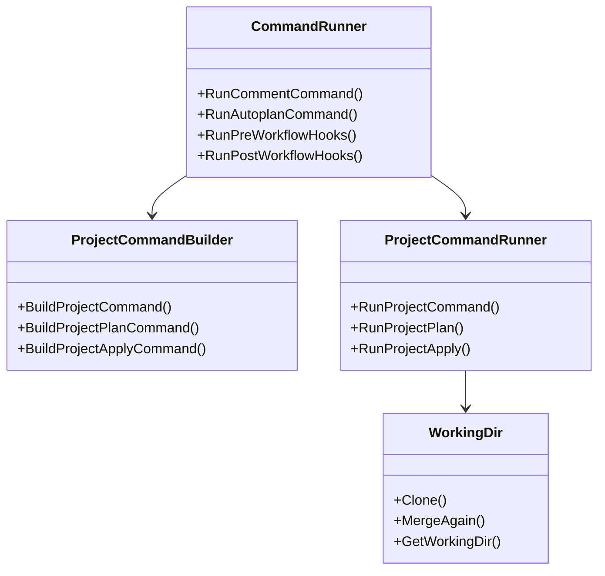

## Features

1. **Command Parsing**
   ```yaml
   # Example commands
   atlantis plan -d . -w staging
   atlantis apply -p project1
   atlantis import ADDRESS ID
   atlantis state rm ADDRESS
   atlantis version
   atlantis help
   ```

2. **Command Requirements**
   ```yaml
   repos:
   - id: /.*/
     plan_requirements: [approved, mergeable]
     apply_requirements: [approved, mergeable, undiverged]
     import_requirements: [approved, mergeable]
   ```

3. **Command Environment**
   ```yaml
   # Environment variables
   TF_IN_AUTOMATION=true
   WORKSPACE=staging
   ATLANTIS_TERRAFORM_VERSION=1.0.0
   DIR=/path/to/dir
   TF_PLUGIN_CACHE_DIR=/path/to/cache
   ```

## Command Lifecycle

1. **Execution Flow**
   ```mermaid
   sequenceDiagram
       participant User
       participant CommandRunner
       participant ProjectCommandBuilder
       participant ProjectCommandRunner
       participant WorkingDir
       User->>CommandRunner: Execute Command
       CommandRunner->>ProjectCommandBuilder: Build Command
       ProjectCommandBuilder->>WorkingDir: Clone Repository
       WorkingDir-->>ProjectCommandBuilder: Return Result
       ProjectCommandBuilder->>ProjectCommandRunner: Run Command
       ProjectCommandRunner-->>CommandRunner: Return Result
       CommandRunner-->>User: Return Result
   ```

2. **Command Stages**
   - Command parsing
   - Repository validation
   - Working directory setup
   - Command execution
   - Result handling
   - Status updates

## Command Features

1. **Command Types**
   - Plan commands
   - Apply commands
   - Import commands
   - State commands
   - Version commands
   - Help commands

2. **Command Options**
   - Directory targeting
   - Workspace selection
   - Project targeting
   - Extra arguments
   - Verbose output

3. **Command Security**
   - Team permissions
   - Repository allowlist
   - Command requirements
   - Variable file allowlist

## Use Cases

1. **Basic Command Execution**
   ```yaml
   # Plan command
   atlantis plan -d . -w staging
   
   # Apply command
   atlantis apply -p project1
   ```

2. **Command with Requirements**
   ```yaml
   # Plan with requirements
   atlantis plan -d . -- -var-file=staging.tfvars
   
   # Apply with requirements
   atlantis apply -p project1 -- -auto-approve
   ```

3. **Command with Environment**
   ```yaml
   # Plan with environment
   TF_IN_AUTOMATION=true
   WORKSPACE=staging
   atlantis plan -d .
   
   # Apply with environment
   TF_IN_AUTOMATION=true
   WORKSPACE=production
   atlantis apply -p project1
   ```

4. **Command with Security**
   ```yaml
   # Plan with team permissions
   atlantis plan -d . -w staging
   
   # Apply with repository allowlist
   atlantis apply -p project1
   ```

---

# Project Configuration

## Configuration Types

1. **Server Configuration**
   ```go
   type UserConfig struct {
       RepoAllowlist string
       RepoConfig string
   version: 3
   projects:
   - dir: staging
     plan_requirements: []
     apply_requirements: []
   - dir: production
     plan_requirements: [approved, mergeable]
     apply_requirements: [approved, mergeable]
   ```

## Requirement Lifecycle

1. **Validation Flow**
   ```mermaid
   sequenceDiagram
       participant User
       participant CommandRequirementHandler
       participant ProjectContext
       participant PullRequestStatus
       User->>CommandRequirementHandler: Execute Command
       CommandRequirementHandler->>ProjectContext: Get Requirements
       ProjectContext->>PullRequestStatus: Check Status
       PullRequestStatus-->>CommandRequirementHandler: Return Status
       CommandRequirementHandler-->>User: Return Result
   ```

2. **Requirement Types**
   - **Approved**: Requires pull request approval
   - **Mergeable**: Requires pull request to be mergeable
   - **UnDiverged**: Requires base branch to be up to date

## Requirement Features

1. **Approval Features**
   - GitHub: Any user with read permissions
   - GitLab: Configurable in repo settings
   - Bitbucket: Requires non-author approval
   - Azure DevOps: Built-in group permissions

2. **Mergeable Features**
   - GitHub: Protected branch rules
   - GitLab: Merge request conditions
   - Bitbucket: Conflict checking
   - Azure DevOps: Branch policies

3. **UnDiverged Features**
   - Merge checkout strategy
   - Base branch synchronization
   - Local state management
   - Remote state validation

## Use Cases

1. **Strict Approval Process**
   ```yaml
   version: 3
   projects:
   - dir: production
     apply_requirements: [approved, mergeable]
     plan_requirements: [approved]
   ```

2. **Environment-specific Requirements**
   ```yaml
   version: 3
   projects:
   - dir: staging
     apply_requirements: [mergeable]
   - dir: production
     apply_requirements: [approved, mergeable, undiverged]
   ```

3. **Team-based Requirements**
   ```yaml
   repos:
   - id: /.*/
     apply_requirements: [approved]
     allowed_overrides: [apply_requirements]
   - id: github.com/ops/.*/
     apply_requirements: [mergeable]
   ```

4. **Custom Workflow Requirements**
   ```