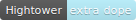
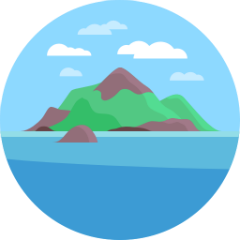

  

    
🌐 Language

    

      

        <a href="https://openaitx.github.io/view.html?user=runatlantis&project=atlantis&lang=en">English</a>
        | <a href="https://openaitx.github.io/view.html?user=runatlantis&project=atlantis&lang=zh-CN">简体中文</a>
        | <a href="https://openaitx.github.io/view.html?user=runatlantis&project=atlantis&lang=zh-TW">繁體中文</a>
        | <a href="https://openaitx.github.io/view.html?user=runatlantis&project=atlantis&lang=ja">日本語</a>
        | <a href="https://openaitx.github.io/view.html?user=runatlantis&project=atlantis&lang=ko">한국어</a>
        | <a href="https://openaitx.github.io/view.html?user=runatlantis&project=atlantis&lang=hi">हिन्दी</a>
        | <a href="https://openaitx.github.io/view.html?user=runatlantis&project=atlantis&lang=th">ไทย</a>
        | <a href="https://openaitx.github.io/view.html?user=runatlantis&project=atlantis&lang=fr">Français</a>
        | <a href="https://openaitx.github.io/view.html?user=runatlantis&project=atlantis&lang=de">Deutsch</a>
        | <a href="https://openaitx.github.io/view.html?user=runatlantis&project=atlantis&lang=es">Español</a>
        | <a href="https://openaitx.github.io/view.html?user=runatlantis&project=atlantis&lang=it">Italiano</a>
        | <a href="https://openaitx.github.io/view.html?user=runatlantis&project=atlantis&lang=ru">Русский</a>
        | <a href="https://openaitx.github.io/view.html?user=runatlantis&project=atlantis&lang=pt">Português</a>
        | <a href="https://openaitx.github.io/view.html?user=runatlantis&project=atlantis&lang=nl">Nederlands</a>
        | <a href="https://openaitx.github.io/view.html?user=runatlantis&project=atlantis&lang=pl">Polski</a>
        | <a href="https://openaitx.github.io/view.html?user=runatlantis&project=atlantis&lang=ar">العربية</a>
        | <a href="https://openaitx.github.io/view.html?user=runatlantis&project=atlantis&lang=fa">فارسی</a>
        | <a href="https://openaitx.github.io/view.html?user=runatlantis&project=atlantis&lang=tr">Türkçe</a>
        | <a href="https://openaitx.github.io/view.html?user=runatlantis&project=atlantis&lang=vi">Tiếng Việt</a>
        | <a href="https://openaitx.github.io/view.html?user=runatlantis&project=atlantis&lang=id">Bahasa Indonesia</a>
        | <a href="https://openaitx.github.io/view.html?user=runatlantis&project=atlantis&lang=as">অসমীয়া</
      

    

  

# Atlantis <!-- omit in toc -->

    
  <b>Terraform Pull Request Automation</b>

- [Resources](#resources)
- [What is Atlantis?](#what-is-atlantis)
- [What does it do?](#what-does-it-do)
- [Why should you use it?](#why-should-you-use-it)
- [Stargazers over time](#stargazers-over-time)

## Resources
* How to get started: [www.runatlantis.io/guide](https://www.runatlantis.io/guide)
* Full documentation: [www.runatlantis.io/docs](https://www.runatlantis.io/docs)
* Download the latest release: [github.com/runatlantis/atlantis/releases/latest](https://github.com/runatlantis/atlantis/releases/latest)
* Get help in our [Slack channel](https://slack.cncf.io/) in channel #atlantis and development in #atlantis-contributors
* Start Contributing: [CONTRIBUTING.md](CONTRIBUTING.md)

## What is Atlantis?
A self-hosted golang application that listens for Terraform pull request events via webhooks.

## What does it do?
Runs `terraform plan`, `import`, `apply` remotely and comments back on the pull request with the output.

## Why should you use it?
* Make Terraform changes visible to your whole team.
* Enable non-operations engineers to collaborate on Terraform.
* Standardize your Terraform workflows.

## Stargazers over time

