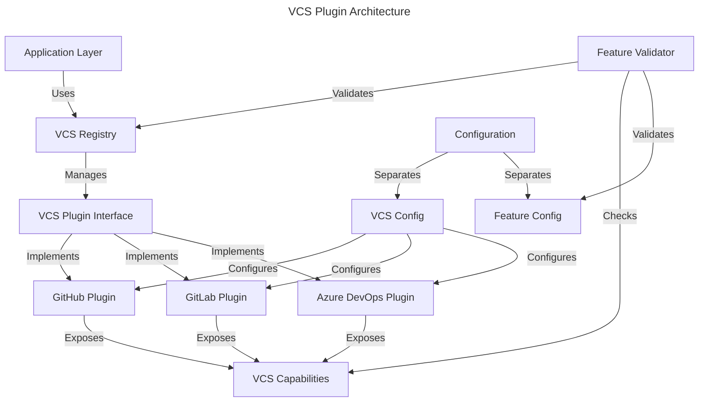

# VCS Plugin Architecture

## Overview

The VCS Plugin Architecture addresses [GitHub issue #5574](https://github.com/runatlantis/atlantis/issues/5574) by providing a consistent, extensible approach to handling VCS-specific features in Atlantis.

## Problem Statement

Previously, Atlantis had VCS-specific configuration flags that created several issues:

- **Tight Coupling**: Features were tied to specific VCS implementations
- **Inconsistent Interface**: Each VCS had different flag patterns
- **Limited Extensibility**: Hard to add features to new VCS providers
- **Configuration Confusion**: Unclear separation between VCS configuration and feature flags

### Legacy VCS-Specific Flags

```bash
# Legacy approach - VCS-specific flags
--gh-allow-mergeable-bypass-apply
--gh-team-allowlist
--gitlab-group-allowlist
--gitea-page-size
```

## Solution: Plugin-Based Architecture

### Architecture Overview



### Core Components

#### 1. VCS Plugin Interface

```go
type VCSPlugin interface {
    // Basic VCS operations
    GetRepository(ctx context.Context, owner, name string) (*Repository, error)
    GetPullRequest(ctx context.Context, repo Repository, number int) (*PullRequest, error)
    CreateCommitStatus(ctx context.Context, repo Repository, sha string, status CommitStatus) error
    
    // Capability detection
    Capabilities() VCSCapabilities
    
    // Feature implementations (only called if capability is supported)
    CheckMergeableBypass(ctx context.Context, pr *PullRequest) (bool, error)
    ValidateTeamMembership(ctx context.Context, user string, teams []string) (bool, error)
    ValidateGroupMembership(ctx context.Context, user string, groups []string) (bool, error)
}
```

#### 2. VCS Capabilities

```go
type VCSCapabilities struct {
    SupportsMergeableBypass bool
    SupportsTeamAllowlist   bool
    SupportsGroupAllowlist  bool
    SupportsCustomFields    bool
    MaxPageSize            int
}
```

#### 3. Feature Configuration

```go
type FeatureConfig struct {
    // General feature flags (VCS-agnostic)
    AllowMergeableBypass bool
    TeamAllowlist        []string
    GroupAllowlist       []string
    
    // VCS-specific configuration (not features)
    GitHubHostname    string
    GitLabURL         string
    AzureDevOpsOrg    string
}
```

## VCS Provider Implementations

### GitHub Plugin

**Capabilities:**
- ✅ Mergeable Bypass: Uses PR mergeable status
- ✅ Team Allowlist: Uses GitHub team membership API
- ❌ Group Allowlist: GitHub uses teams, not groups

**Configuration:**

```yaml
vcs_config:
  github:
    hostname: "github.com"  # or GitHub Enterprise hostname
    token: "${GITHUB_TOKEN}"

feature_config:
  allow_mergeable_bypass: true
  team_allowlist: ["devops", "platform"]
```

### GitLab Plugin

**Capabilities:**
- ✅ Mergeable Bypass: Uses GitLab merge request status
- ❌ Team Allowlist: GitLab uses groups, not teams
- ✅ Group Allowlist: Uses GitLab group membership API

**Configuration:**

```yaml
vcs_config:
  gitlab:
    url: "https://gitlab.com"  # or self-hosted GitLab URL
    token: "${GITLAB_TOKEN}"

feature_config:
  allow_mergeable_bypass: true
  group_allowlist: ["administrators", "developers"]
```

## Feature Validation

The architecture includes runtime feature validation:

```go
validator := vcs.NewFeatureValidator(vcsRegistry)

// Validate and warn about unsupported features
err := validator.ValidateAndWarn("gitlab", config)

// Get effective configuration with unsupported features filtered
effectiveConfig, err := validator.GetEffectiveConfig("gitlab", config)

// Check if specific feature is supported
supported, err := validator.IsFeatureSupported("github", "team-allowlist")
```

### Example Validation Output

```bash
WARN: team-allowlist is not supported by VCS provider 'gitlab', consider using group-allowlist instead
WARN: group-allowlist is not supported by VCS provider 'github', teams are used automatically
```

## Usage Examples

### Basic Plugin Registration

```go
// Create registry
registry := vcs.NewVCSRegistry()

// Register GitHub plugin
githubPlugin := vcs.NewGitHubPlugin(vcs.GitHubConfig{
    Token:         os.Getenv("GITHUB_TOKEN"),
    Hostname:      "github.com",
    TeamAllowlist: []string{"devops"},
})
registry.MustRegister("github", githubPlugin)

// Register GitLab plugin
gitlabPlugin := vcs.NewGitLabPlugin(vcs.GitLabConfig{
    Token:          os.Getenv("GITLAB_TOKEN"),
    BaseURL:        "https://gitlab.com",
    GroupAllowlist: []string{"administrators"},
})
registry.MustRegister("gitlab", gitlabPlugin)
```

### Using VCS Features

```go
// Get VCS plugin
vcsPlugin, err := registry.Get("github")
if err != nil {
    log.Fatal(err)
}

// Check capabilities before using features
caps := vcsPlugin.Capabilities()
if caps.SupportsMergeableBypass {
    allowed, err := vcsPlugin.CheckMergeableBypass(ctx, pullRequest)
    if err != nil {
        log.Printf("Error checking mergeable bypass: %v", err)
    }
}

// Validate team membership (if supported)
if caps.SupportsTeamAllowlist {
    isValid, err := vcsPlugin.ValidateTeamMembership(ctx, "user", []string{"devops"})
    if err != nil {
        log.Printf("Error validating team membership: %v", err)
    }
}
```

## Migration Strategy

### Phase 1: Implement Plugin Infrastructure ✅

- ✅ Define VCS plugin interfaces
- ✅ Create VCS registry for plugin management
- ✅ Implement feature validation system
- ✅ Add comprehensive tests

### Phase 2: Create VCS Plugin Implementations

- ✅ GitHub plugin with team allowlist and mergeable bypass
- ✅ GitLab plugin with group allowlist (placeholder implementation)
- 🔄 Azure DevOps plugin (future implementation)
- 🔄 Gitea plugin (future implementation)

### Phase 3: Integration with Existing Codebase

- 🔄 Update configuration system to support new format
- 🔄 Integrate plugins with existing command handlers
- 🔄 Add backward compatibility layer for legacy flags

### Phase 4: Migration and Deprecation

- 🔄 Add deprecation warnings for legacy flags
- 🔄 Update documentation and examples
- 🔄 Provide migration tools and guides

## Benefits

### 1. **Consistency**
All VCS providers implement the same interface, ensuring consistent behavior across different VCS systems.

### 2. **Extensibility**
New VCS providers can be easily added by implementing the `VCSPlugin` interface.

### 3. **Testability**
Mock plugins enable comprehensive unit testing without external dependencies.

### 4. **Clear Separation of Concerns**
VCS configuration (hostnames, tokens) is separate from feature configuration (allowlists, settings).

### 5. **Runtime Capability Detection**
Features are validated at runtime based on actual VCS capabilities, providing helpful error messages.

## Testing

### Mock Plugin for Testing

```go
// Create mock plugin with specific capabilities
mockPlugin := vcs.NewMockVCSPlugin(vcs.VCSCapabilities{
    SupportsMergeableBypass: true,
    SupportsTeamAllowlist:   false,
    SupportsGroupAllowlist:  true,
})

// Add test data
mockPlugin.AddRepository(&vcs.Repository{
    FullName: "owner/repo",
    Owner:    "owner",
    Name:     "repo",
})

mockPlugin.AddTeamMembership("user", []string{"team1", "team2"})
```

### Example Test

```go
func TestFeatureValidation(t *testing.T) {
    registry := vcs.NewVCSRegistry()
    
    // GitHub supports teams but not groups
    githubPlugin := vcs.NewMockVCSPlugin(vcs.VCSCapabilities{
        SupportsTeamAllowlist:  true,
        SupportsGroupAllowlist: false,
    })
    registry.Register("github", githubPlugin)
    
    validator := vcs.NewFeatureValidator(registry)
    
    config := vcs.FeatureConfig{
        TeamAllowlist: []string{"devops"},
    }
    
    // Should succeed for GitHub
    err := validator.ValidateAndWarn("github", config)
    assert.NoError(t, err)
}
```

## Future Enhancements

### 1. **External Plugin Support**
Allow loading external VCS plugins as shared libraries.

### 2. **Configuration Hot Reload**
Support dynamic reconfiguration without restart.

### 3. **Enhanced Capabilities**
Add more granular capability detection (e.g., specific API versions).

### 4. **Performance Optimization**
Implement caching for VCS API calls and capability checks.

### 5. **Metrics and Monitoring**
Add metrics for plugin usage and performance monitoring.

## Related Issues

- [#5574: Consider general approach for per-VCS features](https://github.com/runatlantis/atlantis/issues/5574)
- [#2496: VCS abstraction improvements](https://github.com/runatlantis/atlantis/issues/2496)

## API Reference

For detailed API documentation, see:

- [`VCSPlugin` Interface](internal/domain/vcs/plugin.go)
- [`VCSRegistry` Implementation](internal/domain/vcs/registry.go)
- [`FeatureValidator`](internal/domain/vcs/validator.go)
- [GitHub Plugin](internal/infrastructure/vcs/github_plugin.go)
- [GitLab Plugin](internal/infrastructure/vcs/gitlab_plugin.go) 