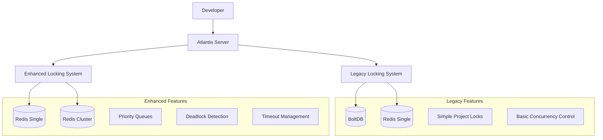

# Atlantis Locking System Diagrams and Visual Documentation

This document provides visual representations of both the legacy and enhanced Atlantis locking systems, including system architecture diagrams, lock lifecycle flows, and integration patterns.

## Table of Contents

- [System Architecture Overview](#system-architecture-overview)
- [Legacy System Architecture](#legacy-system-architecture)
- [Enhanced System Architecture](#enhanced-system-architecture)
- [Lock Lifecycle Diagrams](#lock-lifecycle-diagrams)
- [Queue Management and Priority System](#queue-management-and-priority-system)
- [Resource Hierarchy and Isolation](#resource-hierarchy-and-isolation)
- [atlantis.yaml Integration Patterns](#atlantisyaml-integration-patterns)
- [Database Schema Layouts](#database-schema-layouts)
- [Migration and Deployment Flows](#migration-and-deployment-flows)

## System Architecture Overview



## Legacy System Architecture

### Component Structure
```
┌─────────────────────────────────────────────────────────┐
│                  Atlantis Server                        │
├─────────────────────────────────────────────────────────┤
│               locking.Backend Interface                 │
├─────────────────┬────────────────┬─────────────────────┤
│   BoltDBLocker  │  RedisLocker   │  ApplyLockChecker   │
├─────────────────┼────────────────┼─────────────────────┤
│  models.go      │  models.go     │  apply_locking.go   │
│  (Key Generation) │ (Key Generation) │ (Global Locks)  │
├─────────────────┴────────────────┴─────────────────────┤
│                Storage Backends                         │
├─────────────────────────────────────────────────────────┤
│    BoltDB File              Redis Server                │
│  ┌─────────────┐           ┌─────────────┐             │
│  │ runLocks    │           │ pr:*        │             │
│  │ pulls       │           │ global:*    │             │
│  │ globalLocks │           │ ...         │             │
│  └─────────────┘           └─────────────┘             │
└─────────────────────────────────────────────────────────┘
```

### Legacy Lock Key Construction

```
Lock Key Format: {repoFullName}/{path}/{workspace}

Examples:
┌─────────────────────────────────────────────┐
│ Repository: runatlantis/atlantis            │
│ Path: server/core                           │
│ Workspace: default                          │
│ Lock Key: runatlantis/atlantis/server/core/default │
└─────────────────────────────────────────────┘

┌─────────────────────────────────────────────┐
│ Repository: company/infrastructure          │
│ Path: . (root directory)                    │
│ Workspace: production                       │
│ Lock Key: company/infrastructure/./production │
└─────────────────────────────────────────────┘

Storage Differences:
BoltDB: Direct key → bucket mapping
┌─────────────────┐
│ runLocks bucket │
├─────────────────┤
│ key1 → lock_data│
│ key2 → lock_data│
└─────────────────┘

Redis: Prefixed keys for namespacing
┌─────────────────────┐
│ Redis Key Space     │
├─────────────────────┤
│ pr:key1 → lock_data │
│ pr:key2 → lock_data │
│ global:key → data   │
└─────────────────────┘
```

## Enhanced System Architecture

### Component Hierarchy

```
Enhanced Locking System Architecture

┌─────────────────────────────────────────────────────────┐
│                    LockingAdapter                       │
│        (Backward Compatibility Layer)                  │
├─────────────────────────────────────────────────────────┤
│                 EnhancedLockManager                     │
│           (Core Orchestration & Logic)                 │
├─────────────────┬────────────────┬─────────────────────┤
│  PriorityQueue  │ TimeoutManager │ DeadlockDetector    │
│  ┌─────────────┐│ ┌─────────────┐│ ┌─────────────────┐ │
│  │ResourceQueue││ │RetryManager ││ │WaitForGraph     │ │
│  │MemoryQueue  ││ │CircuitBreaker│ │ResolutionPolicies│ │
│  └─────────────┘│ └─────────────┘│ └─────────────────┘ │
├─────────────────┴────────────────┴─────────────────────┤
│                 Backend Interface                      │
├─────────────────────────────────────────────────────────┤
│                 RedisBackend                           │
│  ┌─────────────┐  ┌─────────────┐  ┌─────────────────┐ │
│  │Atomic Lua   │  │Pub/Sub      │  │Cluster Support  │ │
│  │Scripts      │  │Events       │  │Consistent Hash  │ │
│  └─────────────┘  └─────────────┘  └─────────────────┘ │
├─────────────────────────────────────────────────────────┤
│                Storage Layer                            │
│  Redis Single Instance    │    Redis Cluster           │
│  ┌─────────────────────┐  │  ┌─────────────────────────┐│
│  │atlantis:lock:*      │  │  │Master 1 │Master 2 │...  ││
│  │atlantis:queue:*     │  │  │Slave 1  │Slave 2  │...  ││
│  │atlantis:event:*     │  │  └─────────────────────────┘│
│  └─────────────────────┘  │                             │
└─────────────────────────────────────────────────────────┘
```

### Enhanced Lock ID Format Evolution

```
Legacy Format: {repository}/{path}/{workspace}
├─ Simple string concatenation
├─ Path-dependent (fragile)
├─ No temporal information
└─ Backend-specific prefixing

Enhanced Format: {type}_{timestamp}_{owner}_{hash}
├─ Globally unique across all backends
├─ Temporal ordering for debugging
├─ Owner identification for security
└─ Hash for collision prevention

Example Comparison:
┌─────────────────────────────────────────────────────────┐
│ Legacy Lock ID:                                         │
│ runatlantis/atlantis/server/core/default               │
│                                                         │
│ Enhanced Lock ID:                                       │
│ lock_1638360000000000000_alice_a1b2c3d4e5f6           │
│ │    │                   │     │                      │
│ │    │                   │     └── Hash (collision)   │
│ │    │                   └── Owner (security)         │
│ │    └── Timestamp (ordering & debugging)             │
│ └── Type (resource classification)                     │
└─────────────────────────────────────────────────────────┘

Resource Identification:
┌─────────────────────────────────────────────────────────┐
│ ResourceIdentifier {                                    │
│   Type: project|workspace|global|custom                │
│   Namespace: repository name                            │
│   Name: resource name/path                              │
│   Workspace: terraform workspace                       │
│   Path: directory path                                  │
│ }                                                       │
│                                                         │
│ Example:                                                │
│ {                                                       │
│   Type: "project"                                       │
│   Namespace: "runatlantis/atlantis"                     │
│   Name: "server/core"                                   │
│   Workspace: "default"                                  │
│   Path: "server/core"                                   │
│ }                                                       │
└─────────────────────────────────────────────────────────┘
```

## Lock Lifecycle Diagrams

### Legacy System Lock Lifecycle

```
Request → TryLock() → Success/Failure
    │
    ├─ Success: Lock stored in backend
    │   │
    │   └─ Manual Unlock() or
    │      Process termination
    │
    └─ Failure: Immediate rejection
       (No queuing, no retry)

Detailed Flow:
┌─────┐    ┌──────────┐    ┌─────────┐    ┌─────────┐
│Start│───▶│GenerateKey│───▶│TryLock  │───▶│Success? │
└─────┘    └──────────┘    └─────────┘    └─────────┘
                                              │    │
                               ┌─────────────┘    └─────────────┐
                               ▼                                 ▼
                        ┌─────────────┐                 ┌──────────────┐
                        │Store in     │                 │Return Error  │
                        │Backend      │                 │(Lock Exists) │
                        └─────────────┘                 └──────────────┘
                               │
                               ▼
                        ┌─────────────┐
                        │Return Lock  │
                        │Object       │
                        └─────────────┘
```

### Enhanced System Lock Lifecycle

```
Enhanced Lock Acquisition Flow:

Request → Validate → DeadlockCheck → TryLock
    │                                    │
    ├─ Invalid: Return Error             ├─ Success: Setup & Return
    ├─ DeadlockRisk: Queue/Reject        └─ Failed: Queue/Retry/Reject
    └─ Valid: Continue

Detailed Enhanced Flow:
┌─────┐  ┌────────────┐  ┌─────────────┐  ┌──────────────┐
│Start│─▶│Validate    │─▶│DeadlockCheck│─▶│TryAcquireLock│
└─────┘  │Request     │  │(if enabled) │  └──────────────┘
         └────────────┘  └─────────────┘           │
                                                   ▼
                                          ┌────────────────┐
                                          │Success?        │
                                          └────────────────┘
                                               │        │
                                      ┌────────┘        └────────┐
                                      ▼                          ▼
                              ┌─────────────┐            ┌─────────────┐
                              │Setup        │            │Queue        │
                              │Timeout      │            │Enabled?     │
                              │& Events     │            └─────────────┘
                              └─────────────┘                   │
                                      │                         ▼
                                      ▼                ┌─────────────────┐
                              ┌─────────────┐         │Add to Priority  │
                              │Return Lock  │         │Queue & Wait     │
                              │Object       │         └─────────────────┘
                              └─────────────┘
```

### Queue Processing Flow

```
Queue Processing in Enhanced System:

Lock Released → Check Queue → Process Next → Setup Lock
                     │              │
                     ├─ Empty: Done  └─ Found: Acquire
                     └─ Found: Continue

Priority Queue Processing:
┌─────────────────────────────────────────────────────────┐
│                   Priority Queue                        │
├─────────────────────────────────────────────────────────┤
│ Critical Priority (3) │ ┌─────┐ ┌─────┐              │
│                       │ │Req1 │ │Req2 │              │
├─────────────────────────────────────────────────────────┤
│ High Priority (2)     │ ┌─────┐ ┌─────┐ ┌─────┐      │
│                       │ │Req3 │ │Req4 │ │Req5 │      │
├─────────────────────────────────────────────────────────┤
│ Normal Priority (1)   │ ┌─────┐ ┌─────┐ ┌─────┐      │
│                       │ │Req6 │ │Req7 │ │Req8 │      │
├─────────────────────────────────────────────────────────┤
│ Low Priority (0)      │ ┌─────┐                       │
│                       │ │Req9 │                       │
└─────────────────────────────────────────────────────────┘
                                 │
                                 ▼
                        Processing Order:
                        Req1 → Req2 → Req3 → Req4 → Req5 → ...
                        (FIFO within same priority level)
```

## Queue Management and Priority System

### Resource-Based Queue Architecture

```
Resource-Based Queue System (Prevents Head-of-Line Blocking):

Global Queue Manager
├─ Resource: runatlantis/atlantis/server/default
│  └─ Priority Queue for this resource
│     ├─ Critical: [Req1, Req2]
│     ├─ High: [Req3, Req4, Req5]
│     ├─ Normal: [Req6]
│     └─ Low: []
│
├─ Resource: company/infra/aws/production
│  └─ Priority Queue for this resource
│     ├─ Critical: []
│     ├─ High: [Req7]
│     ├─ Normal: [Req8, Req9, Req10]
│     └─ Low: [Req11]
│
└─ Resource: team-a/microservice-x/staging
   └─ Priority Queue for this resource
      ├─ Critical: [Req12]
      ├─ High: []
      ├─ Normal: []
      └─ Low: []

Benefits:
✓ Independent processing per resource
✓ No global blocking
✓ Priority maintained within resource
✓ Parallel execution across resources
```

### Priority System Details

```
Priority Levels and Use Cases:

┌─────────────────────────────────────────────────────────┐
│ Priority Level │ Use Case Examples                      │
├─────────────────────────────────────────────────────────┤
│ Critical (3)   │ • Hotfixes for production outages     │
│                │ • Security patches                     │
│                │ • Emergency rollbacks                  │
├─────────────────────────────────────────────────────────┤
│ High (2)       │ • Production deployments              │
│                │ • Release candidates                   │
│                │ • Time-sensitive changes               │
├─────────────────────────────────────────────────────────┤
│ Normal (1)     │ • Regular development work            │
│                │ • Feature deployments                  │
│                │ • Standard maintenance                 │
├─────────────────────────────────────────────────────────┤
│ Low (0)        │ • Experimental changes                │
│                │ • Documentation updates               │
│                │ • Non-critical cleanup                │
└─────────────────────────────────────────────────────────┘

Configuration Example:
```yaml
atlantis:
  enhanced-locking:
    enabled: true
    priority-queue:
      enabled: true
      default-priority: normal
      priority-mapping:
        production: high
        staging: normal
        development: low
        hotfix: critical
```
```

## Resource Hierarchy and Isolation

### Resource Identification and Isolation

```
Resource Hierarchy in Enhanced System:

Repository Level
└─ Project Level
   └─ Workspace Level
      └─ Directory Level (Optional)

Example Hierarchy:
┌─────────────────────────────────────────────────────────┐
│ Repository: company/infrastructure                       │
├─────────────────────────────────────────────────────────┤
│ ├─ Project: aws-foundation                              │
│ │  ├─ Workspace: production → Lock Resource A           │
│ │  ├─ Workspace: staging    → Lock Resource B           │
│ │  └─ Workspace: dev        → Lock Resource C           │
│ │                                                       │
│ ├─ Project: kubernetes-cluster                          │
│ │  ├─ Workspace: production → Lock Resource D           │
│ │  └─ Workspace: staging    → Lock Resource E           │
│ │                                                       │
│ └─ Project: applications                                │
│    ├─ Workspace: api-prod     → Lock Resource F         │
│    ├─ Workspace: api-staging  → Lock Resource G         │
│    ├─ Workspace: web-prod     → Lock Resource H         │
│    └─ Workspace: web-staging  → Lock Resource I         │
└─────────────────────────────────────────────────────────┘

Isolation Guarantees:
✓ Each resource can be locked independently
✓ No cross-resource blocking
✓ Workspace isolation maintained
✓ Project-level coordination possible
```

### Directory vs Project Locking

```
Directory-Based Locking (Legacy Focus):
atlantis.yaml:
  projects:
  - name: api
    dir: services/api          ← Directory path
    workspace: production

Lock Resource: company/infra/services/api/production

Project-Based Locking (Enhanced Focus):
atlantis.yaml:
  projects:
  - name: production-api      ← Project name
    dir: services/api
    workspace: production

Lock Resource: {
  Type: "project",
  Namespace: "company/infra",
  Name: "production-api",     ← Uses project name
  Workspace: "production",
  Path: "services/api"
}

Benefits of Project-Based:
✓ Stable identifiers (independent of directory moves)
✓ Better for refactoring
✓ Clearer intent and organization
✓ Enhanced metadata and filtering
```

## atlantis.yaml Integration Patterns

### Basic Integration Patterns

```yaml
# Pattern 1: Simple Project Locking
version: 3
projects:
  - name: infrastructure
    dir: .
    workspace: production
    # Enhanced locking automatically applied
    # Lock resource: {repo}/infrastructure/production

  - name: api-service
    dir: services/api
    workspace: production
    # Lock resource: {repo}/api-service/production
```

### Advanced Locking Configurations

```yaml
# Pattern 2: Parallel Execution with Locking Control
version: 3
projects:
  # High-priority production deployment
  - name: prod-database
    dir: database
    workspace: production
    execution_order_group: 1
    repo_locks:
      mode: on_plan              # Enhanced: supports on_plan, on_apply, disabled
      priority: high              # Enhanced: priority levels
      timeout: "30m"              # Enhanced: custom timeouts

  # Dependent service (waits for database)
  - name: prod-api
    dir: api
    workspace: production
    execution_order_group: 2
    depends_on:
      - prod-database
    repo_locks:
      mode: on_apply
      priority: high

  # Independent staging environment
  - name: staging-stack
    dir: .
    workspace: staging
    parallel_plan: true
    parallel_apply: true
    repo_locks:
      mode: on_apply
      priority: normal
      timeout: "15m"

# Pattern 3: Multi-Tenant with Enhanced Isolation
projects:
  # Tenant A resources
  - name: tenant-a-infra
    dir: tenants/tenant-a
    workspace: tenant-a
    repo_locks:
      mode: on_plan
      priority: normal
      resource_isolation: strict   # Enhanced: enhanced isolation

  # Tenant B resources
  - name: tenant-b-infra
    dir: tenants/tenant-b
    workspace: tenant-b
    repo_locks:
      mode: on_plan
      priority: normal
      resource_isolation: strict

  # Shared infrastructure (higher priority)
  - name: shared-infra
    dir: shared
    workspace: production
    repo_locks:
      mode: on_apply
      priority: high               # Takes precedence over tenant locks
      timeout: "45m"
```

### Integration with Parallel Execution

```
Parallel Execution Flow with Enhanced Locking:

atlantis.yaml execution groups:
┌─────────────────────────────────────────────────────────┐
│ Execution Order Group 1 (Parallel within group)        │
├─────────────────────────────────────────────────────────┤
│ ┌─────────────┐ ┌─────────────┐ ┌─────────────┐        │
│ │Project A    │ │Project B    │ │Project C    │        │
│ │Workspace: dev│ │Workspace: dev│ │Workspace: dev│       │
│ │Priority: norm│ │Priority: high│ │Priority: norm│       │
│ └─────────────┘ └─────────────┘ └─────────────┘        │
│        │              │              │                 │
│        ▼              ▼              ▼                 │
│ ┌─────────────┐ ┌─────────────┐ ┌─────────────┐        │
│ │Queue Pos: 3 │ │Queue Pos: 1 │ │Queue Pos: 2 │        │
│ │(Normal Pri) │ │(High Pri)   │ │(Normal Pri) │        │
│ └─────────────┘ └─────────────┘ └─────────────┘        │
├─────────────────────────────────────────────────────────┤
│ Execution Order Group 2 (Waits for Group 1)            │
├─────────────────────────────────────────────────────────┤
│ ┌─────────────┐ ┌─────────────┐                        │
│ │Project D    │ │Project E    │                        │
│ │Workspace:prod│ │Workspace:prod│                       │
│ │Priority: crit│ │Priority: high│                       │
│ └─────────────┘ └─────────────┘                        │
└─────────────────────────────────────────────────────────┘

Processing Order:
1. Group 1: Project B (high) → Project C (normal) → Project A (normal)
2. Group 2: Project D (critical) → Project E (high)
```

## Database Schema Layouts

### Legacy BoltDB Schema

```
BoltDB File Structure:
atlantis.db
├─ runLocks bucket
│  ├─ key: "runatlantis/atlantis/server/default"
│  │  value: {"project":{"repo_full_name":"runatlantis/atlantis",...},"workspace":"default","user":{"username":"alice"},"time":"2023-10-01T10:00:00Z"}
│  ├─ key: "company/infra/./production"
│  │  value: {"project":{...},"workspace":"production",...}
│  └─ ...
├─ pulls bucket
│  ├─ key: "runatlantis/atlantis/123"
│  │  value: {"base_repo":{"full_name":"runatlantis/atlantis"},"num":123,...}
│  └─ ...
└─ globalLocks bucket
   ├─ key: "global"
   │  value: {"time":"2023-10-01T10:00:00Z","user":{"username":"admin"}}
   └─ ...

Data Format (JSON):
{
  "project": {
    "repo_full_name": "runatlantis/atlantis",
    "path": "server/core",
    "clone_url": "https://github.com/runatlantis/atlantis.git",
    "vcs_host": {
      "hostname": "github.com",
      "type": "Github"
    },
    "repo_owner": "runatlantis",
    "repo_name": "atlantis"
  },
  "workspace": "default",
  "user": {
    "username": "alice"
  },
  "time": "2023-10-01T10:00:00Z"
}
```

### Legacy Redis Schema

```
Redis Key-Value Structure:
Key Pattern: pr:{repository}/{path}/{workspace}

Examples:
┌─────────────────────────────────────────────────────────┐
│ Key: pr:runatlantis/atlantis/server/default             │
│ Value: {JSON lock data same as BoltDB}                  │
├─────────────────────────────────────────────────────────┤
│ Key: pr:company/infra/./production                      │
│ Value: {JSON lock data}                                 │
├─────────────────────────────────────────────────────────┤
│ Key: global:apply                                       │
│ Value: {global lock data}                               │
└─────────────────────────────────────────────────────────┘

Issues:
- Simple key-value pairs
- No expiration (TTL)
- No atomic operations
- No queuing support
- Manual key management
```

### Enhanced Redis Schema

```
Enhanced Redis Schema (Structured):

Key Patterns:
├─ atlantis:enhanced:lock:{resource_hash}
├─ atlantis:enhanced:queue:{resource_hash}
├─ atlantis:enhanced:meta:{lock_id}
└─ atlantis:enhanced:event:{event_type}

Lock Data Structure:
Key: atlantis:enhanced:lock:a1b2c3d4e5f6
Value: {
  "id": "lock_1638360000000000000_alice_a1b2c3d4e5f6",
  "resource": {
    "type": "project",
    "namespace": "runatlantis/atlantis",
    "name": "server-core",
    "workspace": "default",
    "path": "server/core"
  },
  "state": "acquired",
  "priority": 1,
  "owner": "alice",
  "acquired_at": "2023-10-01T10:00:00Z",
  "expires_at": "2023-10-01T11:00:00Z",
  "metadata": {
    "pull_request": "123",
    "command": "plan"
  },
  "version": 1
}
TTL: 3600 seconds

Queue Data Structure:
Key: atlantis:enhanced:queue:a1b2c3d4e5f6
Type: Sorted Set (ZSET)
Value:
- Score: priority_timestamp (e.g., 3.1638360000)
- Member: {JSON lock request data}

Event Data Structure:
Key: atlantis:enhanced:event:lock_acquired
Type: Stream
Value: Event log with metadata

Benefits:
✓ TTL-based automatic cleanup
✓ Atomic operations via Lua scripts
✓ Priority queues via sorted sets
✓ Event streaming
✓ Cluster-compatible key distribution
```

## Migration and Deployment Flows

### Migration Strategy Diagram

```
Legacy to Enhanced Migration Flow:

Phase 1: Preparation & Testing
┌─────────────────────────────────────────────────────────┐
│ Current State: Legacy System Only                       │
├─────────────────────────────────────────────────────────┤
│ ┌─────────────┐                                        │
│ │Legacy       │ ◄── All Traffic                        │
│ │Locking      │                                        │
│ └─────────────┘                                        │
│                                                         │
│ Actions:                                                │
│ 1. Deploy enhanced system (disabled)                   │
│ 2. Run compatibility tests                             │
│ 3. Configure monitoring                                │
└─────────────────────────────────────────────────────────┘
                                │
                                ▼
Phase 2: Shadow Mode
┌─────────────────────────────────────────────────────────┐
│ Enhanced System Deployed (Shadow Mode)                  │
├─────────────────────────────────────────────────────────┤
│ ┌─────────────┐    ┌─────────────┐                     │
│ │Legacy       │    │Enhanced     │                     │
│ │Locking      │◄───│Locking      │ (monitoring only)   │
│ └─────────────┘    └─────────────┘                     │
│       ▲                                                 │
│       └── All Traffic                                   │
│                                                         │
│ Actions:                                                │
│ 1. Enable enhanced system (fallback mode)             │
│ 2. Monitor health and performance                      │
│ 3. Validate backwards compatibility                    │
└─────────────────────────────────────────────────────────┘
                                │
                                ▼
Phase 3: Gradual Migration
┌─────────────────────────────────────────────────────────┐
│ Hybrid Mode (Gradual Traffic Shift)                     │
├─────────────────────────────────────────────────────────┤
│ ┌─────────────┐    ┌─────────────┐                     │
│ │Legacy       │    │Enhanced     │                     │
│ │Locking      │◄───│Locking      │ ◄── Some Traffic    │
│ └─────────────┘    └─────────────┘                     │
│       ▲                                                 │
│       └── Remaining Traffic                             │
│                                                         │
│ Traffic Split:                                          │
│ • Enhanced: 10% → 50% → 90%                           │
│ • Legacy: 90% → 50% → 10%                             │
└─────────────────────────────────────────────────────────┘
                                │
                                ▼
Phase 4: Full Migration
┌─────────────────────────────────────────────────────────┐
│ Enhanced System Only                                     │
├─────────────────────────────────────────────────────────┤
│                    ┌─────────────┐                     │
│ All Traffic   ────►│Enhanced     │                     │
│                    │Locking      │                     │
│                    └─────────────┘                     │
│                                                         │
│ Actions:                                                │
│ 1. Disable legacy fallback                            │
│ 2. Remove legacy backend                               │
│ 3. Enable advanced features                           │
│ 4. Monitor performance                                 │
└─────────────────────────────────────────────────────────┘
```

### Deployment Architecture Options

```
Single Instance Deployment:
┌─────────────────────────────────────────────────────────┐
│                Atlantis Server                          │
├─────────────────────────────────────────────────────────┤
│  Enhanced Locking System                               │
├─────────────────────────────────────────────────────────┤
│              Redis Single                              │
│         ┌─────────────────┐                           │
│         │ atlantis:lock:* │                           │
│         │ atlantis:queue:*│                           │
│         └─────────────────┘                           │
└─────────────────────────────────────────────────────────┘

High Availability Deployment:
┌─────────────────────────────────────────────────────────┐
│             Atlantis Server Cluster                     │
├─────────────────────────────────────────────────────────┤
│  Enhanced Locking System (on each server)              │
├─────────────────────────────────────────────────────────┤
│              Redis Cluster                              │
│    ┌─────────────┬─────────────┬─────────────┐         │
│    │   Master 1  │   Master 2  │   Master 3  │         │
│    │   Slave 1   │   Slave 2   │   Slave 3   │         │
│    └─────────────┴─────────────┴─────────────┘         │
└─────────────────────────────────────────────────────────┘

Enterprise Deployment with Monitoring:
┌─────────────────────────────────────────────────────────┐
│ Load Balancer → Atlantis Servers (3+ instances)        │
├─────────────────────────────────────────────────────────┤
│ Enhanced Locking with Full Features:                   │
│ • Priority Queues                                      │
│ • Deadlock Detection                                   │
│ • Event Streaming                                      │
│ • Circuit Breakers                                     │
├─────────────────────────────────────────────────────────┤
│           Redis Cluster (6+ nodes)                     │
│ ┌─────────┬─────────┬─────────┬─────────┬─────────┐    │
│ │Master 1 │Master 2 │Master 3 │Master 4 │Master 5 │    │
│ │Slave 1  │Slave 2  │Slave 3  │Slave 4  │Slave 5  │    │
│ └─────────┴─────────┴─────────┴─────────┴─────────┘    │
├─────────────────────────────────────────────────────────┤
│                  Monitoring Stack                       │
│ ┌─────────────┬─────────────┬─────────────┐            │
│ │Prometheus   │Grafana      │AlertManager │            │
│ │(Metrics)    │(Dashboards) │(Alerts)     │            │
│ └─────────────┴─────────────┴─────────────┘            │
└─────────────────────────────────────────────────────────┘
```

---

## Conclusion

This visual documentation provides comprehensive diagrams and flowcharts showing:

1. **System Evolution**: Clear comparison between legacy and enhanced architectures
2. **Lock Management**: Detailed lifecycle flows for both systems
3. **Integration Patterns**: How locking integrates with atlantis.yaml configurations
4. **Resource Isolation**: Visual representation of resource hierarchy and queuing
5. **Migration Strategy**: Step-by-step deployment and migration flows
6. **Database Schemas**: Detailed storage layouts for all backend types

These diagrams serve as both educational material for understanding the systems and practical reference for implementation and troubleshooting.