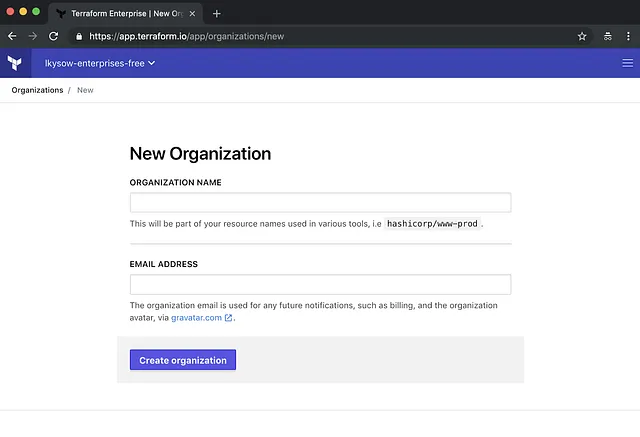
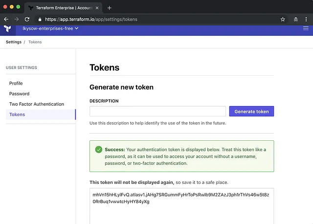
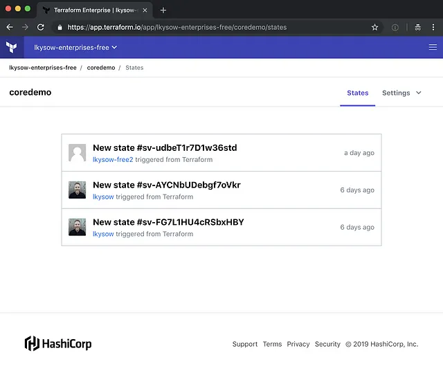
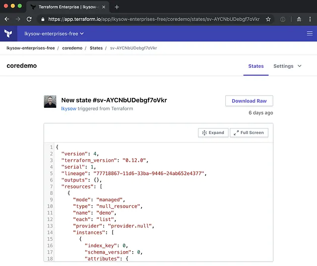
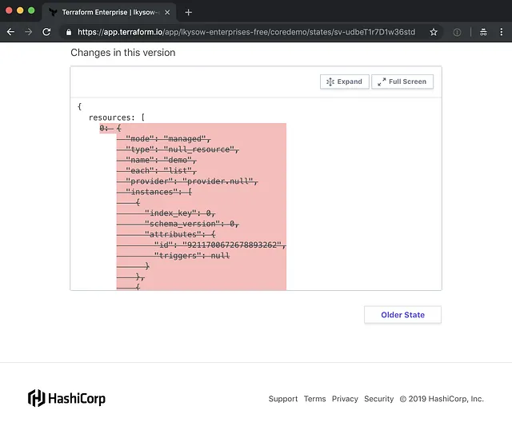

# 4 Reasons To Try HashiCorp's (New) Free Terraform Remote State Storage

::: info
This post was originally written on April 2nd, 2019

Original post: <https://medium.com/runatlantis/4-reasons-to-try-hashicorps-new-free-terraform-remote-state-storage-b03f01bfd251>
:::

Update (May 20/19) — Free State Storage is now called Terraform Cloud and is out of Beta, meaning anyone can sign up!

HashiCorp is planning to offer free Terraform Remote State Storage and they have a beta version available now. In this article, I talk about 4 reasons you should try it (Disclosure: I work at HashiCorp).

> _Sign up for Terraform Cloud [here](https://goo.gl/X5t5EM)._

## What is Terraform State?

Before I get into why you should use the new remote state storage, let's talk about what exactly we mean by state in Terraform.

Terraform uses _state_ to map your Terraform code to the real-world resources that it provisions. For example, if I have Terraform code to create an AWS EC2 instance:

```tf
resource "aws_instance" "web" {
  ami           = "ami-e6d9d68c"
  instance_type = "t2.micro"
}
```

When I run `terraform apply`, Terraform will make a “create EC2 instance” API call to AWS and AWS will return the unique ID of that instance (ex. `i-0ad17607e5ee026d0`). Terraform needs to record that ID somewhere so that later, it can make API calls to change or delete the instance.

To store this information, Terraform uses a state file. For the above code, the state file will look something like:

```json{4,7}
{
    ...
    "resources": {
      "aws_instance.web": {
        "type": "aws_instance",
        "primary": {
          "id": "i-0ad17607e5ee026d0",
     ...
}
```

Here you can see that the resource `aws_instance.web` from our Terraform code is mapped to the instance ID `i-0ad17607e5ee026d0`.

So if Terraform state is just a file, then what is remote state?

## Remote State

By default, Terraform writes its state file to your local filesystem. This is okay for personal projects, but once you start working with a team, things get messy. In a team, you need to make sure everyone has an up to date version of the state file **and** ensure that two people aren't making concurrent changes.

Enter remote state! Remote state is just storing the state file remotely, rather than on your filesystem. With remote state, there's only one copy so Terraform can ensure you're always up to date. To prevent team members from modifying state at the same time, Terraform can lock the remote state.

> Remote state is just storing the state file remotely, rather than on your filesystem.

Alright, so remote state is great, but unfortunately setting it up can be a bit tricky. In AWS, you can store it in an S3 bucket, but you need to create the bucket, configure it properly, set up its permissions properly, create a DynamoDB table for locking and then ensure everyone has proper credentials to write to it. It's much the same story in the other clouds.

As a result, setting up remote state can be an annoying stumbling block as teams adopt Terraform.

This brings us to the first reason to try HashiCorp's Free Remote State Storage...

## Reason #1 — Easy To Set Up

Unlike other remote state solutions that require complicated setup to get right, setting up free remote state storage is easy.

> Setting up HashiCorp's free remote state storage is easy

Step 1 — Sign up for your [free Terraform Cloud](https://app.terraform.io/signup) account

Step 2 — When you log in, you'll land on this page where you'll create your organization:



Step 3 — Next, go into User Settings and generate a token:



Step 4 — Take this token and create a local ~/.terraformrc file:

```tf
credentials "app.terraform.io" {
  token = "mhVn15hHLylFvQ.atlasv1.jAH..."
}
```

Step 5 — That's it! Now you're ready to store your state.

In your Terraform project, add a `terraform` block:

```tf{3,5}
terraform {
  backend "remote" {
    organization = "my-org" # org name from step 2.
    workspaces {
      name = "my-app" # name for your app's state.
    }
  }
}
```

Run `terraform init` and tada! Your state is now being stored in Terraform Enterprise. You can see the state in the UI:


Speaking of seeing state in a UI...

## Reason #2 — Fully Featured State Viewer

The second reason to try Terraform Cloud is its fully featured state viewer:



If you've ever messed up your Terraform state and needed to download an old version or wanted an audit log to know who changed what, then you'll love this feature.

You can view the full state file at each point in time:



You can also see the diff of what changed:



Of course, you can find a way to get this information from some of the other state backends, but it's difficult. With HashiCorp's remote state storage, you get it for free.

## Reason #3 — Manual Locking

The third reason to try Terraform Cloud is the ability to manually lock your state.

Ever been working on a piece of infrastructure and wanted to ensure that no one could make any changes to it at the same time?

Terraform Cloud comes with the ability to lock and unlock states from the UI:


While the state is locked, `terraform` operations will receive an error:


This saves you a lot of these:


## Reason #4 — Works With Atlantis

The final reason to try out Terraform Cloud is that it works flawlessly with [Atlantis](https://www.runatlantis.io/)!

Set a `ATLANTIS_TFE_TOKEN` environment variable to a TFE token and you're ready to go. Head over to <https://www.runatlantis.io/docs/terraform-cloud.html> to learn more.

Conclusion
I highly encourage you to try out the new free Remote State Storage backend. It's a compelling offering over other state backends thanks to its ease of set up, fully featured state viewer and locking capabilities.

If you're not on the waitlist, sign up here: <https://app.terraform.io/signup>.
