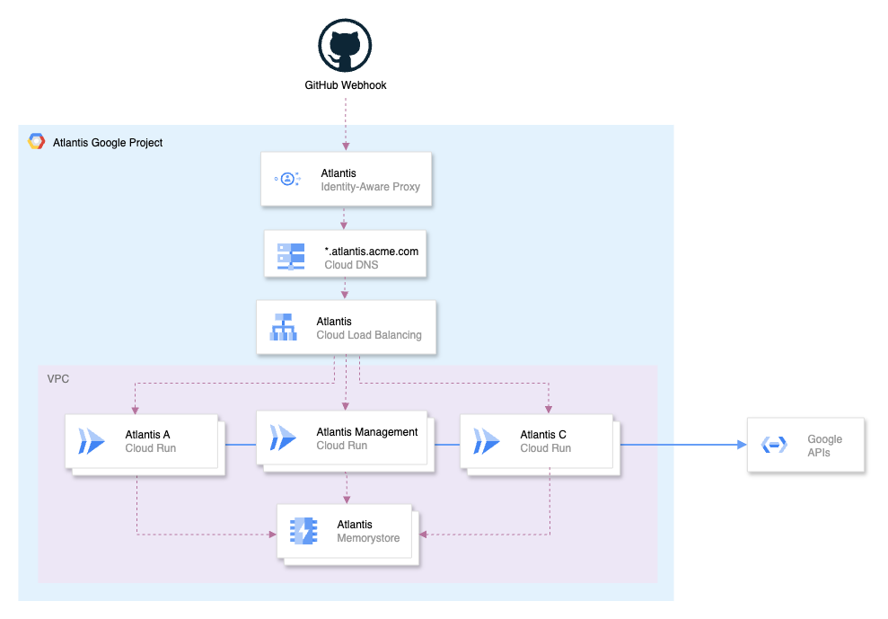

::: info
Though written for Google Cloud Run, this deployment architecture also applies to AWS Fargate, Azure Container Instances, and Kubernetes.
:::

::: info
This blog post covers the most important parts of the Terraform code. For a complete working example, see our [atlantis-on-gcp-cloud-run repository](https://github.com/runatlantis/atlantis-on-gcp-cloud-run).
:::

Most Atlantis deployments run on self-managed VMs. While this is a familiar and straightforward option, it comes with challenges. Identities often become overly powerful, with direct or indirect access — through impersonation — to many resources and projects. High availability is also lacking: Atlantis writes its locking backend directly to disk, so if the VM goes down, Atlantis becomes unavailable. In short, self-managed VMs create a single point of failure, offer no horizontal scaling, and demand ongoing maintenance — from patching and OS upgrades to backups.

In this blog post, we will show how to run Atlantis on serverless container platforms like Google Cloud Run. Instead of a single instance, we will use a central database for locking, and deploy multiple Atlantis instances behind a load balancer. Each instance runs with its own identity and limited permissions, managing only its own projects. This architecture eliminates the single point of failure, allows horizontal scaling, and enables a least-privilege security model.

## What we’ll build

Here’s a high-level overview of the architecture we’ll build:



1. An External HTTP(S) Load Balancer to route requests to multiple Atlantis instances.
2. Multiple Atlantis instances running on Google Cloud Run.
3. A Memorystore for Redis instance to provide a central locking backend.

::: info
If you're looking to skip ahead, you can find the Terraform code for this architecture in our [atlantis-on-gcp-cloud-run repository](https://github.com/runatlantis/atlantis-on-gcp-cloud-run).

However, we recommend reading through the rest of this blog post to understand how it all works.
:::

## We Left Things Out
To keep this post a reasonable length, we’ve left out some important details. For instance, we don’t cover setting up networking, DNS or how to pull a Docker image, nor do we dive into every knob and switch in Atlantis—our focus here is on the parts most relevant to the architecture. That said, we strongly recommend running Atlantis in an isolated VPC with [Private Service Access](https://cloud.google.com/vpc/docs/configure-private-services-access) enabled. This ensures Atlantis only talks to Google APIs to do its job, without ever reaching into your other infrastructure.

## BoltDB: Great, if you only have one writer

Atlantis uses [BoltDB](https://github.com/boltdb/bolt) as its default locking backend. BoltDB is a simple, embedded key-value store that writes directly to disk. This works well for single-instance deployments, but BoltDB locks Atlantis into a single-node architecture. To achieve high availability and horizontal scaling, you need to replace it with a managed, distributed database that multiple Atlantis instances can safely share.

## An Atlantis to Rule Them All
To facilitate the creation and management of multiple Atlantis instances, we’ll also deploy a dedicated “management” Atlantis instance. This instance will be responsible for managing the lifecycle of the other Atlantis instances, including creating, updating, and deleting them as needed. I usually keep this in a separate Google Cloud project called `atlantis-mgmt`, along with a dedicated Git repository for this purpose.

Once you have one instance set up, it’s straightforward to replicate it and place it behind a shared load balancer.

## Redis: A distributed locking backend
Since Atlantis v0.19.0, Redis is a supported locking backend. Redis is an in-memory data structure store that we will use to provide a central locking backend for multiple Atlantis instances. Each instance will connect to the same Redis instance, allowing them to coordinate locks and avoid conflicts.

Redis also supports persistence, through RDB (Redis Database), which performs point-in-time snapshots of the dataset at specified intervals, and AOF (Append Only File), which logs every write operation received by the Redis server. This means that even if the Redis instance goes down, we don't lose our locks.

Our first resource to create is a Redis instance:

```tf
resource "google_redis_instance" "atlantis" {
  name               = "atlantis"
  tier               = "STANDARD_HA"
  redis_version      = "REDIS_7_2"
  memory_size_gb     = 1
  region             = "your-region"
  authorized_network = "your-network-id"
  connect_mode       = "PRIVATE_SERVICE_ACCESS"
  persistence_config {
    persistence_mode    = "RDB"
    rdb_snapshot_period = "TWENTY_FOUR_HOURS"
  }
  maintenance_policy {
    # ...
  }
  project = "your-project-id"
  lifecycle {
    prevent_destroy = true
  }
}
```

This creates a Redis instance with 1 GiB of memory and enables RDB, taking snapshots every 24 hours. The `connect_mode` is set to `PRIVATE_SERVICE_ACCESS`, so the Redis instance is only accessible from within your VPC. Ensure that [Private Service Access](https://cloud.google.com/vpc/docs/configure-private-services-access) is configured on your VPC before creating the instance.

## Deploying to Cloud Run

Cloud Run is a serverless container platform that automatically scales your applications, handles HTTP requests, and abstracts away infrastructure. You pay only for the compute you use, and each service runs under a single service account that defines its permissions. This makes it a great fit for one or more Atlantis instances.

We'll begin by creating a server-side Atlantis configuration, `atlantis/management.yaml`:

```yaml
repos:
  - id: github.com/acme/example
    apply_requirements: [approved, mergeable]
    import_requirements: [approved, mergeable]
    allowed_overrides: ["workflow"]
    allowed_workflows: ["example"]
    delete_source_branch_on_merge: true

workflows:
  example:
    plan:
      steps:
        - init
        - plan
    apply:
      steps:
        - apply
```

::: info
The below Terraform configuration highlights only the Atlantis environment variables that are relevant to this blog post. For a complete working example, see our [atlantis-on-gcp-cloud-run repository](https://github.com/runatlantis/atlantis-on-gcp-cloud-run).
:::

Begin by creating the management Atlantis instance. Below this Terraform configuration, you’ll find details on the configuration options—such as environment variables and other important settings—that configure Atlantis for this architecture.

```tf
resource "google_cloud_run_v2_service" "atlantis_management" {
  provider             = google-beta
  name                 = "atlantis-management"
  location             = "your-region"
  deletion_protection  = false
  ingress              = "INGRESS_TRAFFIC_INTERNAL_LOAD_BALANCER"
  invoker_iam_disabled = true
  launch_stage         = "GA"

  template {
    scaling {
      min_instance_count = 1
      max_instance_count = 1
    }
    execution_environment = "EXECUTION_ENVIRONMENT_GEN2"
    service_account       = google_service_account.atlantis_management.email
    containers {
      image = "ghcr.io/runatlantis/atlantis:v0.35.1"
      resources {
        limits = {
          cpu    = "1"
          memory = "2Gi"
        }
      }
      volume_mounts {
        name       = "atlantis"
        mount_path = "/app/atlantis"
      }
      env {
        name  = "ATLANTIS_PORT"
        value = "8080"
      }
      env {
        name  = "ATLANTIS_DATA_DIR"
        value = "/app/atlantis"
      }
      env {
        name  = "ATLANTIS_USE_TF_PLUGIN_CACHE"
        value = "true"
      }
      env {
        name  = "ATLANTIS_LOCKING_DB_TYPE"
        value = "redis"
      }
      env {
        name  = "ATLANTIS_REDIS_HOST"
        value = google_redis_instance.atlantis.host
      }
      env {
        name  = "ATLANTIS_REDIS_DB"
        value = "0"
      }
      env {
        name  = "ATLANTIS_ATLANTIS_URL"
        value = "https://management.atlantis.acme.com"
      }
      env {
        name  = "ATLANTIS_REPO_CONFIG_JSON"
        value = jsonencode(yamldecode(file("${path.module}/atlantis/management.yaml")))
      }
    }
    vpc_access {
      egress = "ALL_TRAFFIC"
      network_interfaces {
        network    = "your-network-id"
        subnetwork = "your-subnetwork-id"
      }
    }
    volumes {
      name = "atlantis"
      empty_dir {
        medium     = "MEMORY"
        size_limit = "5Gi"
      }
    }
  }
  project = "your-project-id"
}
```

## Ephemeral Storage

Atlantis is I/O intensive: it checks out repositories, runs Terraform commands, downloads providers, and pulls modules. This requires a writable filesystem to store temporary data. On Cloud Run, this is handled with ephemeral storage, which is cleared whenever a container instance stops or restarts.

Because of how Atlantis operates, its ephemeral storage requirements are limited: pull request data is removed from the filesystem once merged or closed, providers can be cached using `ATLANTIS_USE_TF_PLUGIN_CACHE`, and Terraform binaries are already included in the container image. For this reason, we configure a 5 GiB in-memory `empty_dir` volume, mounted at `/app/atlantis` and set as the `ATLANTIS_DATA_DIR`.

```tf
    # ...
    volumes {
      name = "atlantis"
      empty_dir {
        medium     = "MEMORY"
        size_limit = "5Gi"
      }
    }
    # ...
    volume_mounts {
      name       = "atlantis"
      mount_path = "/app/atlantis"
    }
   # ...
    env {
      name  = "ATLANTIS_DATA_DIR"
      value = "/app/atlantis"
    }
    env {
      name  = "ATLANTIS_USE_TF_PLUGIN_CACHE"
      value = "true"
    }
```

## Keeping an Instance Warm
Cloud Run instances can scale down to zero when not in use, which can lead to cold starts and loss of the in-memory ephemeral storage. To avoid this, we set `min_instance_count` to 1, ensuring that at least one instance is always running and ready to handle requests.

```tf
    scaling {
      min_instance_count = 1
      max_instance_count = 1
    }
```

## Impersonation and Least Privilege
Each Atlantis Cloud Run service deployed runs under a service account that defines its identity. Instead of giving this account broad access, we use a service account that only has permission to impersonate other, more restricted service accounts.

This isn't something you'll need to do for the management Atlantis instance, as that gets deployed against a single project anyway, but it's important for the other Atlantis instances that will manage multiple projects and environments. By using impersonation, we can ensure that each Atlantis instance only has the permissions it needs to manage its specific projects.

For example, you can create one base Atlantis service account (`atlantis-example`) and separate service accounts for each environment (e.g. `atlantis-example-dev`, `atlantis-example-prod`). The base account is granted the `roles/iam.serviceAccountTokenCreator` role on those environment accounts, and impersonates them when Atlantis runs Terraform commands.

In turn, these environment-specific service accounts are granted only the permissions required against the projects they manage. This ensures that if one Atlantis instance is compromised, the blast radius is limited to only the resources that instance manages.

Here’s an example of how to set this up in Terraform:
```tf
locals {
  atlantis_network_service_accounts = [
    "atlantis-example-dev",
    "atlantis-example-prod",
  ]
}

# Base Atlantis service account
resource "google_service_account" "atlantis_example" {
  account_id = "atlantis-example"
  project    = local.project_id
}

# Per-environment service accounts
resource "google_service_account" "atlantis_example_service_accounts" {
  for_each   = toset(local.atlantis_example_service_accounts)
  account_id = each.value
  project    = local.project_id
}

# Allow base SA to impersonate the env-specific ones
resource "google_service_account_iam_member" "atlantis_example_impersonation" {
  for_each           = google_service_account.atlantis_example_service_accounts
  service_account_id = each.value.name
  role               = "roles/iam.serviceAccountTokenCreator"
  member             = "serviceAccount:${google_service_account.atlantis_example.email}"
}
```

The impersonation itself is enabled by setting the `GOOGLE_IMPERSONATE_SERVICE_ACCOUNT` environment variable within an `atlantis/example.yaml` workflow. In this setup, Atlantis manages two separate environments: `dev` and `prod` — by switching identities to the corresponding environment-specific service account during `plan` and `apply` operations.

```yaml
repos:
  - id: github.com/acme/example
    apply_requirements: [approved, mergeable]
    import_requirements: [approved, mergeable]
    delete_source_branch_on_merge: true
    allowed_overrides: ["workflow"]
    allowed_workflows: ["example-dev", "example-prod"]

workflows:
  example-dev:
    plan:
      steps:
        - env:
            name: GOOGLE_IMPERSONATE_SERVICE_ACCOUNT
            value: example-dev@acme-atlantis-mgmt.iam.gserviceaccount.com
        - run: rm -rf .terraform
        - init:
            extra_args:
              ["-lock=false", "-backend-config=env/dev/backend-config.tfvars"]
        - plan:
            extra_args: ["-lock=false", "-var-file=env/dev/vars.tfvars"]
    apply:
      steps:
        - env:
            name: GOOGLE_IMPERSONATE_SERVICE_ACCOUNT
            value: example-dev@acme-atlantis-mgmt.iam.gserviceaccount.com
        - apply:
            extra_args: ["-lock=false"]

  example-prod:
    plan:
      steps:
        - env:
            name: GOOGLE_IMPERSONATE_SERVICE_ACCOUNT
            value: example-prod@acme-atlantis-mgmt.iam.gserviceaccount.com
        - run: rm -rf .terraform
        - init:
            extra_args:
              ["-lock=false", "-backend-config=env/prod/backend-config.tfvars"]
        - plan:
            extra_args: ["-lock=false", "-var-file=env/prod/vars.tfvars"]
    apply:
      steps:
        - env:
            name: GOOGLE_IMPERSONATE_SERVICE_ACCOUNT
            value: example-prod@acme-atlantis-mgmt.iam.gserviceaccount.com
        - apply:
            extra_args: ["-lock=false"]
```

## The Shared Load Balancer

When running multiple Atlantis instances—each responsible for a different set of projects or environments—it’s important to route traffic to the right Atlantis instance. Instead of giving each instance its own public endpoint, we centralize traffic through a single global HTTPS load balancer.

The below load balancer uses host-based routing to direct requests to the appropriate Atlantis instance based on the subdomain. For example, requests to `network.atlantis.acme.com` are routed to the Atlantis instance managing the network projects, while requests to `workloads.atlantis.acme.com` go to the Atlantis instance managing the workload projects.

```tf
resource "google_compute_url_map" "atlantis" {
  name = "atlantis"
  default_url_redirect {
    host_redirect          = "atlantis.acme.com"
    https_redirect         = true
    redirect_response_code = "MOVED_PERMANENTLY_DEFAULT"
    strip_query            = false
  }
  host_rule {
    hosts        = ["network.atlantis.acme.com"]
    path_matcher = "atlantis-network-webhooks"
  }
  host_rule {
    hosts        = ["workloads.atlantis.acme.com"]
    path_matcher = "atlantis-workloads-webhooks"
  }
  host_rule {
    hosts        = ["management.atlantis.acme.com"]
    path_matcher = "atlantis-management-webhooks"
  }
  path_matcher {
    name            = "atlantis-network-webhooks"
    default_service = google_compute_backend_service.atlantis_network.id
    path_rule {
      paths   = ["/events"]
      service = google_compute_backend_service.atlantis_network_webhooks.id
    }
  }
  path_matcher {
    name            = "atlantis-workloads-webhooks"
    default_service = google_compute_backend_service.atlantis_workloads.id
    path_rule {
      paths   = ["/events"]
      service = google_compute_backend_service.atlantis_workloads_webhooks.id
    }
  }
  path_matcher {
    name            = "atlantis-management-webhooks"
    default_service = google_compute_backend_service.atlantis_management.id
    path_rule {
      paths   = ["/events"]
      service = google_compute_backend_service.atlantis_management_webhooks.id
    }
  }
  project = "your-project-id"
}

resource "google_compute_ssl_policy" "restricted" {
  name            = "restricted"
  profile         = "RESTRICTED"
  min_tls_version = "TLS_1_2"
  project         = "your-project-id"
}

resource "google_compute_target_https_proxy" "atlantis" {
  name    = "atlantis"
  url_map = google_compute_url_map.atlantis.id
  ssl_certificates = [
    google_compute_managed_ssl_certificate.atlantis_network.id,
    google_compute_managed_ssl_certificate.atlantis_workloads.id,
    google_compute_managed_ssl_certificate.atlantis_management.id,
  ]
  ssl_policy = google_compute_ssl_policy.restricted.id
  project    = "your-project-id"
}

resource "google_compute_global_forwarding_rule" "atlantis" {
  name                  = "atlantis"
  target                = google_compute_target_https_proxy.atlantis.id
  port_range            = "443"
  ip_address            = google_compute_global_address.atlantis.address
  load_balancing_scheme = "EXTERNAL_MANAGED"
  project               = "your-project-id"
}
```

Each Atlantis instance is registered as a backend service in the load balancer. Importantly, every instance requires two separate backends: one for the main Atlantis HTTP endpoint and another for the `/events` webhook endpoint. This separation allows us to protect the main Atlantis interface behind [Identity-Aware Proxy](https://cloud.google.com/iap/docs/concepts-overview) (IAP), ensuring only authorized users can access it, while keeping the webhook endpoint publicly reachable so GitHub or GitLab can deliver events without restriction.

We highly recommend protecting the `/events` endpoint with a [security policy](https://registry.terraform.io/providers/hashicorp/google/latest/docs/resources/compute_security_policy) to block unwanted traffic. At a minimum, restrict access to the IP ranges used by your Git provider, and some common web vulnerability patterns. See [Cloud Armor preconfigured WAF rules](https://cloud.google.com/armor/docs/waf-rules).

```tf
resource "google_compute_backend_service" "atlantis_workloads" {
  name                  = "atlantis-workloads"
  protocol              = "HTTP"
  port_name             = "http"
  timeout_sec           = 30
  load_balancing_scheme = "EXTERNAL_MANAGED"
  security_policy       = google_compute_security_policy.atlantis.id
  backend {
    group = google_compute_region_network_endpoint_group.atlantis_workloads.id
  }
  iap {
    enabled = true
  }
  project = "your-project-id"
}

resource "google_compute_backend_service" "atlantis_workloads_webhooks" {
  name                  = "atlantis-workloads-webhooks"
  protocol              = "HTTP"
  port_name             = "http"
  timeout_sec           = 30
  load_balancing_scheme = "EXTERNAL_MANAGED"
  security_policy       = google_compute_security_policy.atlantis_events_webhook.id
  backend {
    group = google_compute_region_network_endpoint_group.atlantis_workloads.id
  }
  project = "your-project-id"
}
```

## Conclusion
By deploying Atlantis on Google Cloud Run with a shared Redis locking backend and a shared load balancer, we provide a highly available, horizontally scalable, and secure Atlantis deployment. Each Atlantis instance runs with its own identity and limited permissions, managing only its own projects. 

As there's just so much to cover, and we want to keep this post at a reasonable length, we haven't covered everything. For a complete working example, see our [atlantis-on-gcp-cloud-run repository](https://github.com/runatlantis/atlantis-on-gcp-cloud-run).

If you have any questions or feedback, please join the #atlantis Slack channel in the Cloud Native Computing Foundation Slack workspace, or open an issue in the [atlantis-on-gcp-cloud-run repository](https://github.com/runatlantis/atlantis-on-gcp-cloud-run).
