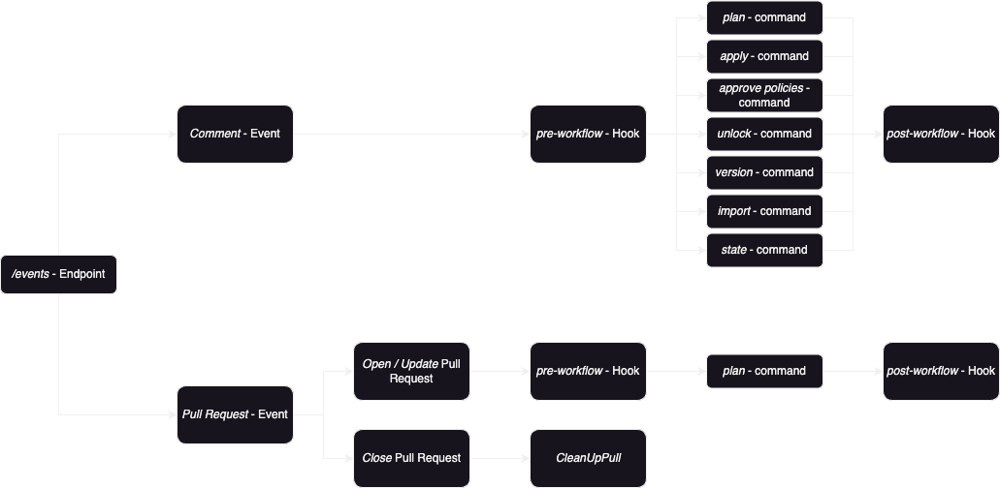

# Events Controller

Webhooks are the primary interaction between the Version Control System (VCS)
and Atlantis. Each VCS sends the requests to the `/events` endpoint. The
implementation of this endpoint can be found in the
[events_controller.go](https://github.com/runatlantis/atlantis/blob/main/server/controllers/events/events_controller.go)
file. This file contains the Post function `func (e *VCSEventsController)
Post(w http.ResponseWriter, r *http.Request`)` that parses the request
according to the configured VCS.

Atlantis currently handles one of the following events:

- Comment Event
- Pull Request Event

All the other events are ignored.

## Comment Event

This event is triggered whenever a user enters a comment on the Pull Request,
Merge Request, or whatever it's called for the respective VCS. After parsing the
VCS-specific request, the code calls the `handleCommentEvent` function, which
then passes the processing to the `handleCommentEvent` function in the
[command_runner.go](https://github.com/runatlantis/atlantis/blob/main/server/events/command_runner.go)
file. This function first calls the pre-workflow hooks, then executes one of the
below-listed commands and, at last, the post-workflow hooks.

- [plan_command_runner.go](https://github.com/runatlantis/atlantis/blob/main/server/events/plan_command_runner.go)
- [apply_command_runner.go](https://github.com/runatlantis/atlantis/blob/main/server/events/apply_command_runner.go)
- [approve_policies_command_runner.go](https://github.com/runatlantis/atlantis/blob/main/server/events/approve_policies_command_runner.go)
- [unlock_command_runner.go](https://github.com/runatlantis/atlantis/blob/main/server/events/unlock_command_runner.go)
- [version_command_runner.go](https://github.com/runatlantis/atlantis/blob/main/server/events/version_command_runner.go)
- [import_command_runner.go](https://github.com/runatlantis/atlantis/blob/main/server/events/import_command_runner.go)
- [state_command_runner.go](https://github.com/runatlantis/atlantis/blob/main/server/events/state_command_runner.go)

## Pull Request Event

To handle comment events on Pull Requests, they must be created first. Atlantis also allows the running of commands for certain Pull Requests events.
The following list shows the supported events:

- Opened Pull Request
- Updated Pull Request
- Closed Pull Request
- Other Pull Request event

The `RunAutoPlanCommand` function in the
[command_runner.go](https://github.com/runatlantis/atlantis/blob/main/server/events/command_runner.go)
file is called for the _Open_ and _Update_ Pull Request events. When enabled on
the project, this automatically runs the `plan` for the specific repository.

Whenever a Pull Request is closed, the `CleanUpPull` function in the
[instrumented_pull_closed_executor.go](https://github.com/runatlantis/atlantis/blob/main/server/events/instrumented_pull_closed_executor.go)
file is called. This function cleans up all the closed Pull Request files,
locks, and other related information.
