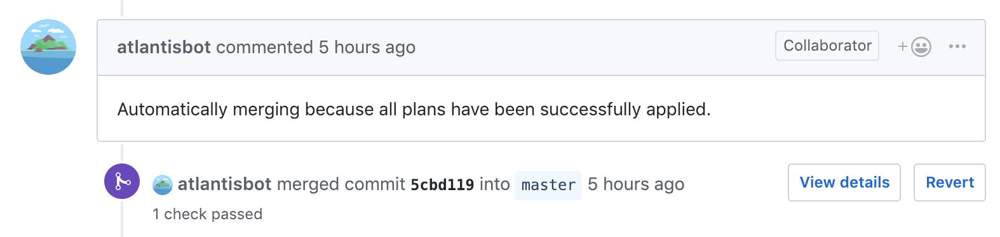

# Automerging

Atlantis can be configured to automatically merge a pull request after all plans have
been successfully applied.



## How To Enable

Automerging can be enabled either by:

1. Passing the `--automerge` flag to `atlantis server`. This sets the parameter globally; however, explicit declaration in the repo config will be respected and take priority.
1. Setting `automerge: true` in the repo's `atlantis.yaml` file:

    ```yaml
    version: 3
    automerge: true
    projects:
    - dir: .
    ```

    :::tip NOTE
    If a repo has an `atlantis.yaml` file, then each project in the repo needs
    to be configured under the `projects` key.
    :::

## How to Disable

If automerge is enabled, you can disable it for a single `atlantis apply`
command with the `--auto-merge-disabled` option.

## How to set the merge method for automerge

If automerge is enabled, the merge method can be set in three places. From
lowest to highest priority:

1. The `--automerge-method` server flag (or `ATLANTIS_AUTOMERGE_METHOD`
   environment variable), which sets the default for every repo:

    ```shell
    atlantis server --automerge-method <method>
    ```

2. The `automerge_method` key in a repo's `atlantis.yaml`, which overrides the
   server default for that repo:

    ```yaml
    version: 3
    automerge: true
    automerge_method: <method>
    projects:
    - dir: .
    ```

3. The `--auto-merge-method` flag on a single `atlantis apply` command, which
   overrides both of the above for that command:

    ```shell
    atlantis apply --auto-merge-method <method>
    ```

The `method` is one of a normalised set of values that Atlantis translates onto
each provider's own merge strategy:

- `merge` — merge with a merge commit
- `rebase` — rebase onto the base branch
- `squash` — squash the commits into one
- `fast-forward` — fast-forward the base branch, i.e. merge without a merge commit

Not every provider can perform every method. If a method is not supported for
the pull request's provider, the command is rejected with the list of methods
that provider does support:

| Method         | GitHub | Gitea / Forgejo | GitLab | Bitbucket Cloud | Bitbucket Server | Azure DevOps |
|----------------|:------:|:---------------:|:------:|:---------------:|:----------------:|:------------:|
| `merge`        |   ✓    |        ✓        |   ✓    |        ✓        |        ✓         |      ✓       |
| `rebase`       |   ✓    |        ✓        |        |                 |        ✓         |      ✓       |
| `squash`       |   ✓    |        ✓        |   ✓    |        ✓        |        ✓         |      ✓       |
| `fast-forward` |        |        ✓        |        |        ✓        |        ✓         |              |

A method must also be permitted by the repository's own settings. If the
requested method is disabled for the repository (for example, squash merges are
turned off), the merge API rejects it and Atlantis reports the failure.

:::tip NOTE
Each provider maps the normalised method onto its native strategy:
GitLab only lets squashing be toggled when accepting a merge request (the
merge/fast-forward/rebase choice is fixed by the project's merge method
setting), so it supports only `merge` and `squash`. On Bitbucket Server the
methods map to the `no-ff`, `rebase-ff`, `squash` and `ff-only` strategies
respectively, and on Azure DevOps to the `noFastForward`, `rebase` and `squash`
strategies. `fast-forward` requires the base branch to be fast-forwardable.
:::

## Requirements

### All Plans Must Succeed

When automerge is enabled, **all plans** in a pull request **must succeed** before
**any** plans can be applied.

For example, imagine this scenario:

1. I open a pull request that makes changes to two Terraform projects, in `dir1/`
   and `dir2/`.
1. The plan for `dir2/` fails because my Terraform syntax is wrong.

In this scenario, I can't run

```shell
atlantis apply -d dir1
```

Even though that plan succeeded, because **all** plans must succeed for **any** plans
to be saved.

Once I fix the issue in `dir2`, I can push a new commit which will trigger an
autoplan. Then I will be able to apply both plans.

### All Plans must be applied

If multiple projects/dirs/workspaces are configured to be planned automatically,
then they should all be applied before Atlantis automatically merges the PR.

## Permissions

The Atlantis VCS user must have the ability to merge pull requests.
