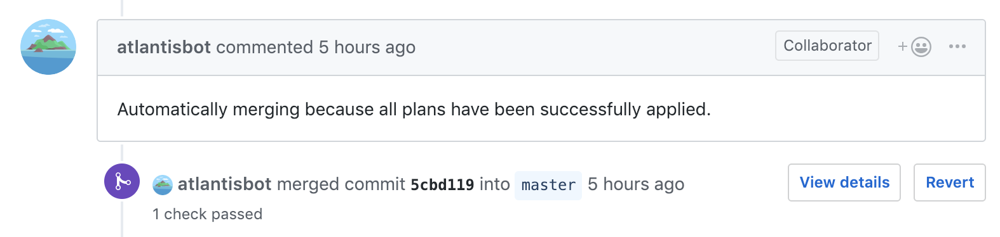

# Automerging

Atlantis can be configured to automatically merge a pull request after all plans have
been successfully applied.



## How To Enable

Automerging can be enabled either by:

1. Passing the `--automerge` flag to `atlantis server`. This sets the parameter globally; however, explicit declaration in the repo config will be respected and take priority.
1. Setting `automerge: true` in the repo's `atlantis.yaml` file:

    ```yaml
    version: 3
    automerge: true
    projects:
    - dir: .
    ```

    :::tip NOTE
    If a repo has an `atlantis.yaml` file, then each project in the repo needs
    to be configured under the `projects` key.
    :::

## How to Disable

If automerge is enabled, you can disable it for a single `atlantis apply`
command with the `--auto-merge-disabled` option.

## How to set the merge method for automerge

If automerge is enabled, you can set a default merge method with the
`--automerge-method` server flag or `ATLANTIS_AUTOMERGE_METHOD` environment
variable.

```shell
atlantis server --automerge-method <method>
```

You can override the server default for a single `atlantis apply` command with
the `--auto-merge-method` option.

```shell
atlantis apply --auto-merge-method <method>
```

The `method` must be one of:

- merge
- rebase
- squash
- merge-queue

This is currently only implemented for the GitHub VCS.

## How to merge via the GitHub merge queue

Setting the merge method to `merge-queue` makes Atlantis add the pull request to
the base branch's [GitHub merge queue](https://docs.github.com/en/repositories/configuring-branches-and-merges-in-your-repository/configuring-pull-request-merges/managing-a-merge-queue)
instead of merging it directly.

```shell
atlantis server --automerge-method merge-queue
```

Unlike `merge`, `rebase` and `squash`, this doesn't describe how the commits are
combined — that stays configured on the branch's merge queue ruleset. It only
changes who performs the merge: Atlantis hands the pull request off and GitHub
merges it once the queue's checks pass.

Atlantis pins the enqueue request to the commit it applied, so if someone pushes
to the branch between `atlantis apply` and the enqueue, GitHub rejects it and
Atlantis comments with the failure rather than queueing code that was never
planned.

:::warning
If `atlantis/apply` (or `atlantis/plan`) is a **required status check** on the
base branch, it is also required on the merge group that GitHub builds, and
nothing will post those statuses for the merge group's commit — the queue will
stall. Either exclude the Atlantis checks from the branch's required checks, or
run Atlantis with merge group support so it reports them.
:::

### Requirements

- The base branch must have a merge queue enabled via a branch ruleset or
  branch protection rule.
- The Atlantis VCS user needs write access, and the pull request must satisfy
  the branch's requirements for entering the queue (approvals, passing checks).
  GitHub rejects the enqueue otherwise and Atlantis comments with the reason.

## Requirements

### All Plans Must Succeed

When automerge is enabled, **all plans** in a pull request **must succeed** before
**any** plans can be applied.

For example, imagine this scenario:

1. I open a pull request that makes changes to two Terraform projects, in `dir1/`
   and `dir2/`.
1. The plan for `dir2/` fails because my Terraform syntax is wrong.

In this scenario, I can't run

```shell
atlantis apply -d dir1
```

Even though that plan succeeded, because **all** plans must succeed for **any** plans
to be saved.

Once I fix the issue in `dir2`, I can push a new commit which will trigger an
autoplan. Then I will be able to apply both plans.

### All Plans must be applied

If multiple projects/dirs/workspaces are configured to be planned automatically,
then they should all be applied before Atlantis automatically merges the PR.

## Permissions

The Atlantis VCS user must have the ability to merge pull requests.
