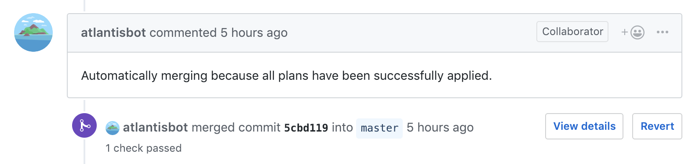

# Automerging

Atlantis can be configured to automatically merge a pull request after all plans have
been successfully applied.



## How To Enable

Automerging can be enabled either by:

1. Passing the `--automerge` flag to `atlantis server`. This sets the parameter globally; however, explicit declaration in the repo config will be respected and take priority.
1. Setting `automerge: true` in the repo's `atlantis.yaml` file:

    ```yaml
    version: 3
    automerge: true
    projects:
    - dir: .
    ```

    :::tip NOTE
    If a repo has an `atlantis.yaml` file, then each project in the repo needs
    to be configured under the `projects` key.
    :::

## How to Disable

If automerge is enabled, you can disable it for a single `atlantis apply`
command with the `--auto-merge-disabled` option.

## How to set the merge method for automerge

If automerge is enabled, you can set a default merge method with the
`--automerge-method` server flag or `ATLANTIS_AUTOMERGE_METHOD` environment
variable.

```shell
atlantis server --automerge-method <method>
```

You can override the server default for a single `atlantis apply` command with
the `--auto-merge-method` option.

```shell
atlantis apply --auto-merge-method <method>
```

The `method` must be one of:

- merge
- rebase
- squash

This is currently only implemented for the GitHub VCS.

## Requirements

### Failed Plans Don't Discard Successful Plans

When one plan in a pull request fails, Atlantis keeps the plans that succeeded, so
they can still be applied individually. Atlantis won't automatically merge the
pull request until every project has been applied (see below).

For example, imagine this scenario:

1. I open a pull request that makes changes to two Terraform projects, in `dir1/`
   and `dir2/`.
1. The plan for `dir2/` fails because my Terraform syntax is wrong.

In this scenario, I can still run

```shell
atlantis apply -d dir1
```

because the plan for `dir1/` succeeded and was saved.

Once I fix the issue in `dir2`, I can push a new commit which will trigger an
autoplan. After I apply `dir2`, every project has been applied and Atlantis
merges the pull request.

### All Plans must be applied

If multiple projects/dirs/workspaces are configured to be planned automatically,
then they should all be applied before Atlantis automatically merges the PR.

## Permissions

The Atlantis VCS user must have the ability to merge pull requests.
