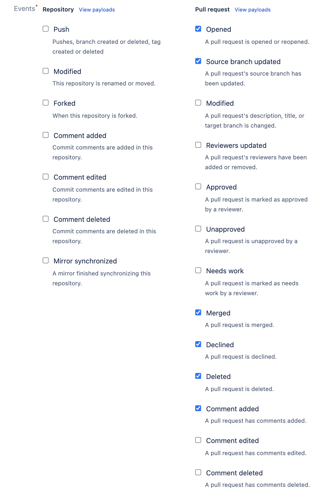

# Configuring Webhooks
Atlantis needs to receive Webhooks from your Git host so that it can respond to pull request events.

:::tip Pre-Requisites
* You have created an [access credential](access-credentials.html)
* You have created a [webhook secret](webhook-secrets.html)
* You have [deployed](deployment.html) Atlantis and have a url for it
:::

See the instructions for your specific provider below.
[[toc]]

## GitHub/GitHub Enterprise Webhook
You can install your webhook at the organization level, or for each repository.

If only some of the repos in your organization are to be managed by Atlantis, then you
may want to only install on specific repos for now.

::: tip
If you're not sure if you have a GitHub organization see [https://help.github.com/articles/differences-between-user-and-organization-accounts/](https://help.github.com/articles/differences-between-user-and-organization-accounts/)
:::

If you're installing on the organization, navigate to your organization's page and click **Settings**.
If installing on a single repository, navigate to the repository home page and click **Settings**.
- Select **Webhooks** or **Hooks** in the sidebar
- Click **Add webhook**
- set **Payload URL** to `http://$URL/events` (or `https://$URL/events` if you're using SSL) where `$URL` is where Atlantis is hosted. **Be sure to add `/events`**
- double-check you added `/events` to the end of your URL.
- set **Content type** to `application/json`
- set **Secret** to the Webhook Secret you generated previously
  - **NOTE** If you're adding a webhook to multiple repositories, each repository will need to use the **same** secret.
- select **Let me select individual events**
- check the boxes
	- **Pull request reviews**
	- **Pushes**
	- **Issue comments**
	- **Pull requests**
- leave **Active** checked
- click **Add webhook**

## GitLab Webhook
If you're using GitLab, navigate to your project's home page in GitLab
- Click **Settings > Integrations** in the sidebar
- set **URL** to `http://$URL/events` (or `https://$URL/events` if you're using SSL) where `$URL` is where Atlantis is hosted. **Be sure to add `/events`**
- double-check you added `/events` to the end of your URL.
- set **Secret Token** to the Webhook Secret you generated previously
  - **NOTE** If you're adding a webhook to multiple repositories, each repository will need to use the **same** secret.
- check the boxes
    - **Push events**
    - **Comments**
    - **Merge Request events**
- leave **Enable SSL verification** checked
- click **Add webhook**

## Bitbucket Cloud (bitbucket.org) Webhook
- Go to your repo's home page
- Click **Settings** in the sidebar
- Click **Webhooks** under the **WORKFLOW** section
- Click **Add webhook**
- Enter "Atlantis" for **Title**
- set **URL** to `http://$URL/events` (or `https://$URL/events` if you're using SSL) where `$URL` is where Atlantis is hosted. **Be sure to add `/events`**
- double-check you added `/events` to the end of your URL.
- Keep **Status** as Active
- Don't check **Skip certificate validation** because NGROK has a valid cert.
- Select **Choose from a full list of triggers**
- Under **Repository** **un**check everything
- Under **Issues** leave everything **un**checked
- Under **Pull Request**, select: Created, Updated, Merged, Declined and Comment created
- Click **Save**

## Bitbucket Server (aka Stash) Webhook
- Go to your repo's home page
- Click **Settings** in the sidebar
- Click **Webhooks** under the **WORKFLOW** section
- Click **Create webhook**
- Enter "Atlantis" for **Name**
- set **URL** to `http://$URL/events` (or `https://$URL/events` if you're using SSL) where `$URL` is where Atlantis is hosted. **Be sure to add `/events`**
- Double-check you added `/events` to the end of your URL.
- Set **Secret** to the Webhook Secret you generated previously
  - **NOTE** If you're adding a webhook to multiple repositories, each repository will need to use the **same** secret.
- Under **Repository** select **Push**
- Under **Pull Request**, select: Opened, Modified, Merged, Declined, Deleted and Comment added
- Click **Save**

## Next Steps
* Now you're finally ready to use Atlantis! Open up a Terraform pull request
    and you should see Atlantis respond.
