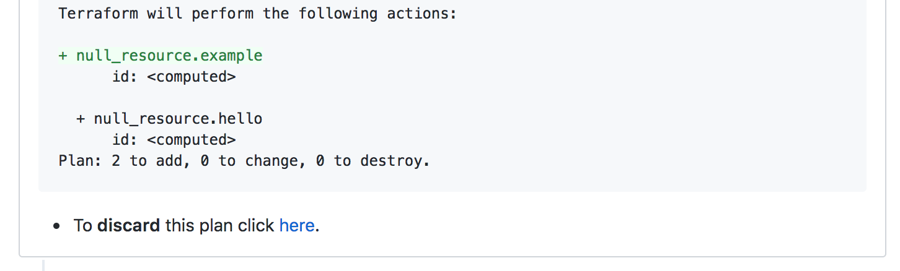

# Locking
When `plan` is run, the directory and Terraform workspace are **Locked** until the pull request is merged or closed, or the plan is manually deleted.

If another user attempts to `plan` for the same directory and workspace in a different pull request
they'll see this error:

Which links them to the pull request that holds the lock.

::: warning NOTE
Only the directory in the repo and Terraform workspace are locked, not the whole repo.
:::

[[toc]]

## Why
1. Because `atlantis apply` is being done before the pull request is merged, after
an apply your `master` branch does not represent the most up to date version of your infrastructure
anymore. With locking, you can ensure that no other changes will be made until the
pull request is merged.

::: tip Why not apply on merge?
Sometimes `terraform apply` fails. If the apply were to fail after the pull
request was merged, you would need to create a new pull request to fix it.
With locking + applying on the branch, you effectively mimic merging to master
but with the added ability to re-plan/apply multiple times if things don't work.
:::
2. If there is already a `plan` in progress, other users won't see a plan that
will be made invalid after the in-progress plan is applied.

## Viewing Locks
To view locks, go to the URL that Atlantis is hosted at:

You can click on a lock to view its details:

    

## Unlocking
The project and workspace will be automatically unlocked when the PR is merged or closed.

To unlock the project and workspace without completing an `apply` and merging, click the link
at the bottom of the plan comment to discard the plan and delete the lock where
it says **"To discard this plan click here"**:

The link will take you to the lock detail view where you can click **Discard Plan and Unlock**
to delete the lock.

    

Once a plan is discarded, you'll need to run `plan` again prior to running `apply` when you go back to that pull request.

## Relationship to Terraform State Locking
Atlantis does not conflict with [Terraform State Locking](https://www.terraform.io/docs/state/locking.html). Under the hood, all
Atlantis is doing is running `terraform plan` and `apply` and so all of the
locking built in to those commands by Terraform isn't affected.

In more detail, Terraform state locking locks the state while you run `terraform apply`
so that multiple applies can't run concurrently. Atlantis's locking is at a higher
level because it prevents multiple pull requests from working on the same state.
