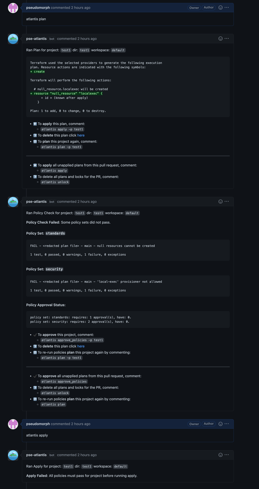
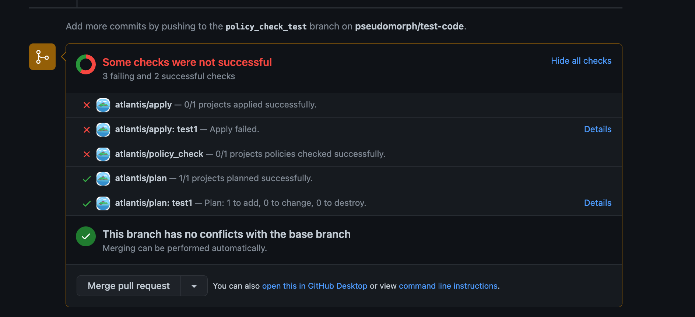
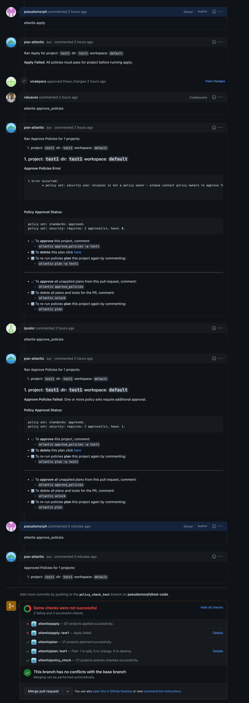

# Conftest Policy Checking

Atlantis supports running server-side [conftest](https://www.conftest.dev/) policies against the plan output. Common usecases
for using this step include:

- Denying usage of a list of modules
- Asserting attributes of a resource at creation time
- Catching unintentional resource deletions
- Preventing security risks (ie. exposing secure ports to the public)

## How it works?

Enabling "policy checking" in addition to the [mergeable apply requirement](https://www.runatlantis.io/docs/apply-requirements.html#supported-requirements) blocks applies on plans that fail any of the defined conftest policies.





Any failures need to either be addressed in a successive commit, or approved by a blessed owner. This approval is independent of the approval apply requirement which can coexist in the policy checking workflow. After an approval, the apply can proceed.



:::warning
Any plans following the approval will discard any policy approval and prompt again for it.
:::

## Getting Started

This section will provide a guide on how to get set up with a simple policy that fails creation of `null_resource`'s and requires approval from a blessed user.

### Step 1: Enable the workflow

Enable the workflow using the following server configuration flag `--enable-policy-checks`

### Step 2: Define the policy configuration

Policy Configuration is defined in the [server-side repo configuration](https://www.runatlantis.io/docs/server-side-repo-config.html#reference).

In this example we will define one policy set with one owner:

```
policies:
  owners:
    users:
      - nishkrishnan
  policy_sets:
    - name: null_resource_warning
      path: <CODE_DIRECTORY>/policies/null_resource_warning/
      source: local
```

- `name` - A name of your policy set.
- `path` - Path to a policies directory. *Note: replace `<CODE_DIRECTORY>` with absolute dir path to conftest policy/policies.*
- `source` - Tells atlantis where to fetch the policies from. Currently you can only host policies locally by using `local`.

By default conftest is configured to only run the `main` package. If you wish to run specific/multiple policies consider passing `--namespace` or `--all-namespaces` to conftest with [`extra_args`](https://www.runatlantis.io/docs/custom-workflows.html#adding-extra-arguments-to-terraform-commands) via a custom workflow as shown in the below example.

Example Server Side Repo configuration using `--all-namespaces` and a local src dir.

```
repos:
  - id: github.com/myorg/example-repo
    workflow: custom
policies:
  owners:
    users:
      - example-dev
  policy_sets:
    - name: example-conf-tests
      path: /home/atlantis/conftest_policies  # Consider separate vcs & mount into container
      source: local
workflows:
  custom:
    plan:
      steps:
        - init
        - plan
    policy_check:
      steps:
        - policy_check:
            extra_args: ["-p /home/atlantis/conftest_policies/", "--all-namespaces"]
```

### Step 3: Write the policy

Conftest policies are based on [Open Policy Agent (OPA)](https://www.openpolicyagent.org/) and written in [rego](https://www.openpolicyagent.org/docs/latest/policy-language/#what-is-rego). Following our example, simply create a `rego` file in `null_resource_warning` folder with following code, the code below a simple policy that will fail for plans containing newly created `null_resource`s.

```
package main

resource_types = {"null_resource"}

# all resources
resources[resource_type] = all {
    some resource_type
    resource_types[resource_type]
    all := [name |
        name:= input.resource_changes[_]
        name.type == resource_type
    ]
}

# number of creations of resources of a given type
num_creates[resource_type] = num {
    some resource_type
    resource_types[resource_type]
    all := resources[resource_type]
    creates := [res |  res:= all[_]; res.change.actions[_] == "create"]
    num := count(creates)
}

deny[msg] {
    num_resources := num_creates["null_resource"]

    num_resources > 0

    msg := "null resources cannot be created"
}

```

That's it! Now your Atlantis instance is configured to run policies on your Terraform plans 🎉
