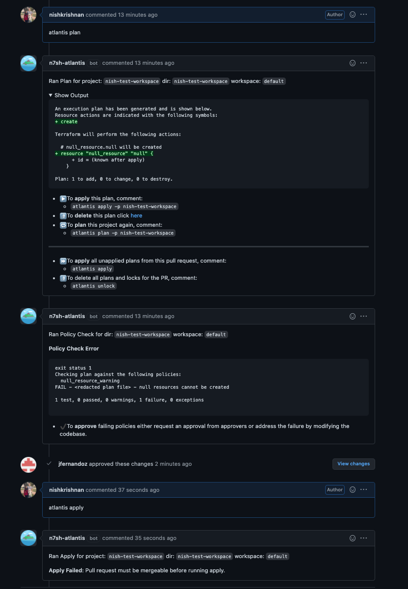
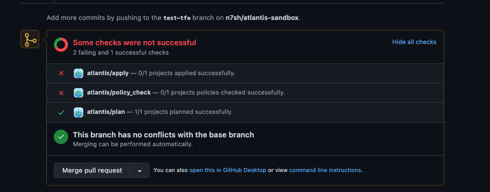

# Conftest Policy Checking

Atlantis supports running server-side [conftest](https://www.conftest.dev/) policies against the plan output. Common usecases
for using this step include:

- Denying usage of a list of modules
- Asserting attributes of a resource at creation time
- Catching unintentional resource deletions
- Preventing security risks (ie. exposing secure ports to the public)

## How it works?

Enabling "policy checking" in addition to the [mergeable apply requirement](/docs/command-requirements.html#supported-requirements) blocks applies on plans that fail any of the defined conftest policies.





Any failures need to either be addressed in a successive commit, or approved by top-level owner(s) of policies or the owner(s) of the policy set in question. Policy approvals are independent of the approval apply requirement which can coexist in the policy checking workflow. After policies are approved, the apply can proceed.


Policy approvals may be cleared either by re-planing, or by issuing the following command:
```
atlantis approve_policies --clear-policy-approval
```

::: warning
Any plans following the approval will discard any policy approval and prompt again for it.
:::

## Getting Started

This section will provide a guide on how to get set up with a simple policy that fails creation of `null_resource`'s and requires approval from a blessed user.

### Step 1: Enable the workflow

Enable the workflow using the following server configuration flag `--enable-policy-checks`

::: warning
All repositories will have policy checking enabled.
:::

### Step 2: Define the policy configuration

Policy Configuration is defined in the [server-side repo configuration](https://www.runatlantis.io/docs/server-side-repo-config.html#reference).

In this example we will define one policy set with one owner:

```
policies:
  owners:
    users:
      - nishkrishnan
  policy_sets:
    - name: deny_null_resource
      path: <CODE_DIRECTORY>/policies/deny_null_resource/
      source: local
    - name: deny_local_exec
      path: <CODE_DIRECTORY>/policies/deny_local_exec/
      source: local
      approve_count: 2
      owners:
        users:
          - pseudomorph
```

- `name` - A name of your policy set.
- `path` - Path to a policies directory. *Note: replace `<CODE_DIRECTORY>` with absolute dir path to conftest policy/policies.*
- `source` - Tells atlantis where to fetch the policies from. Currently you can only host policies locally by using `local`.
- `owners` - Defines the users/teams which are able to approve a specific policy set.
- `approve_count` - Defines the number of approvals needed to bypass policy checks. Defaults to the top-level policies configuration, if not specified.

By default conftest is configured to only run the `main` package. If you wish to run specific/multiple policies consider passing `--namespace` or `--all-namespaces` to conftest with [`extra_args`](https://www.runatlantis.io/docs/custom-workflows.html#adding-extra-arguments-to-terraform-commands) via a custom workflow as shown in the below example.

Example Server Side Repo configuration using `--all-namespaces` and a local src dir.

```
repos:
  - id: github.com/myorg/example-repo
    workflow: custom
policies:
  owners:
    users:
      - example-dev
  policy_sets:
    - name: example-conf-tests
      path: /home/atlantis/conftest_policies  # Consider separate vcs & mount into container
      source: local
workflows:
  custom:
    plan:
      steps:
        - init
        - plan
    policy_check:
      steps:
        - policy_check:
            extra_args: ["-p /home/atlantis/conftest_policies/", "--all-namespaces"]
```

### Step 3: Write the policy

Conftest policies are based on [Open Policy Agent (OPA)](https://www.openpolicyagent.org/) and written in [rego](https://www.openpolicyagent.org/docs/latest/policy-language/#what-is-rego). Following our example, simply create a `rego` file in `null_resource_warning` folder with following code, the code below a simple policy that will fail for plans containing newly created `null_resource`s.

```
package main

resource_types = {"null_resource"}

# all resources
resources[resource_type] = all {
    some resource_type
    resource_types[resource_type]
    all := [name |
        name:= input.resource_changes[_]
        name.type == resource_type
    ]
}

# number of creations of resources of a given type
num_creates[resource_type] = num {
    some resource_type
    resource_types[resource_type]
    all := resources[resource_type]
    creates := [res |  res:= all[_]; res.change.actions[_] == "create"]
    num := count(creates)
}

deny[msg] {
    num_resources := num_creates["null_resource"]

    num_resources > 0

    msg := "null resources cannot be created"
}

```

That's it! Now your Atlantis instance is configured to run policies on your Terraform plans 🎉

## Customizing the conftest command

### Pulling policies from a remote location

Conftest supports [pulling policies](https://www.conftest.dev/sharing/#pulling) from remote locations such as S3, git, OCI, and other protocols supported by the [go-getter](https://github.com/hashicorp/go-getter) library. The key [`extra_args`](https://www.runatlantis.io/docs/custom-workflows.html#adding-extra-arguments-to-terraform-commands) can be used to pass in the [`--update`](https://www.conftest.dev/sharing/#-update-flag) flag to tell `conftest` to pull the policies into the project folder before running the policy check.

```yaml
workflows:
  custom:
    plan:
      steps:
        - init
        - plan
    policy_check:
      steps:
        - policy_check:
            extra_args: ["--update", "s3::https://s3.amazonaws.com/bucket/foo"]
```

Note that authentication may need to be configured separately if pulling policies from sources that require it. For example, to pull policies from an S3 bucket, Atlantis host can be configured with a default AWS profile that has permission to `s3:GetObject` and `s3:ListBucket` from the S3 bucket.

### Running policy check against Terraform source code

By default, Atlantis runs the policy check against the [`SHOWFILE`](https://www.runatlantis.io/docs/custom-workflows.html#custom-run-command). In order to run the policy test against Terraform files directly, override the default `conftest` command used and pass in `*.tf` as one of the inputs to `conftest`. The `show` step is required so that Atlantis will generate the `SHOWFILE`.

```yaml
workflows:
  custom:
    policy_check:
      steps:
        - show
        - run: conftest test $SHOWFILE *.tf
```

### Quiet policy checks

By default, Atlantis will add a comment to all pull requests with the policy check result - both successes and failures. Version 0.21.0 added the [`--quiet-policy-checks`](server-configuration.html#quiet-policy-checks) option, which will instead only add comments when policy checks fail, significantly reducing the number of comments when most policy check results succeed.


### Data for custom run steps

When the policy check workflow runs, a file is created in the working directory which contains information about the status of each policy set tested. This data may be useful in custom run steps to generate metrics or notifications. The file contains JSON data in the following format:

```json
[
  {
    "PolicySetName":  "policy1",
    "ConftestOutput": "",
    "Passed":         false,
    "ReqApprovals":   1,
    "CurApprovals":   0
  }
]

```

## Running policy check only on some repositories

When policy checking is enabled it will be enforced on all repositories, in order to disable policy checking on some repositories first [enable policy checks](https://www.runatlantis.io/docs/policy-checking.html#getting-started) and then disable it explicitly on each repository with the `policy_check` flag.

For server side config:
```yml
# repos.yaml
repos:
- id: /.*/
  plan_requirements: [approved]
  apply_requirements: [approved]
  import_requirements: [approved]
- id: /special-repo/
  plan_requirements: [approved]
  apply_requirements: [approved]
  import_requirements: [approved]
  policy_check: false
```

For repo level `atlantis.yaml` config:
```yml
version: 3
projects:
- dir: project1
  workspace: staging
- dir: project1
  workspace: production
  policy_check: false
```
