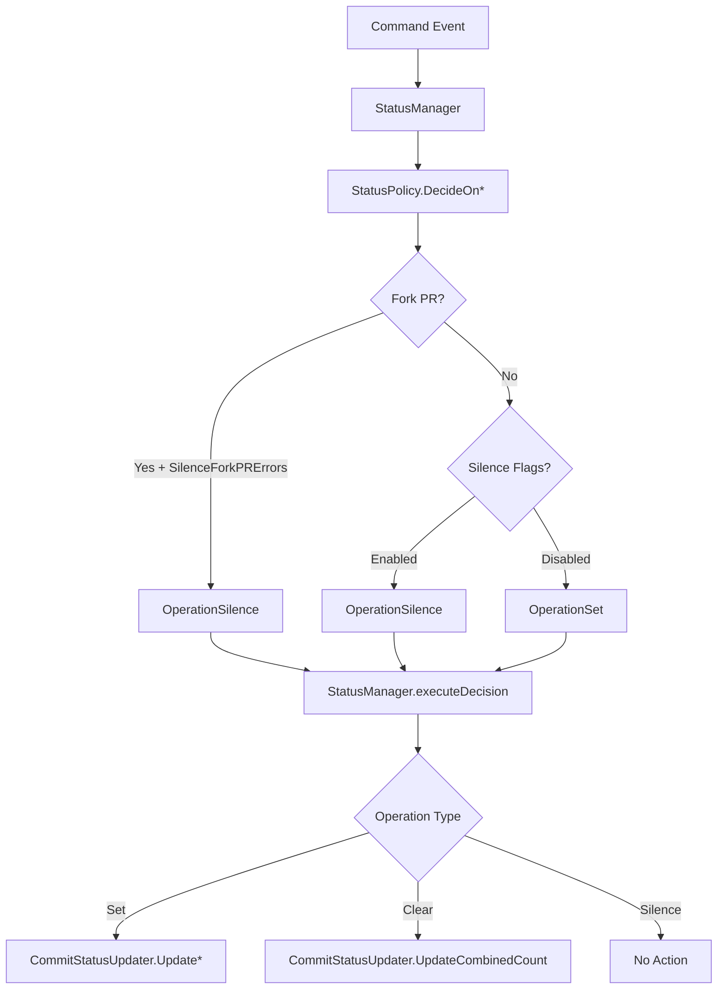

# StatusManager Architecture

## Overview

The StatusManager is the centralized system for managing VCS (Version Control System) status checks in Atlantis. It provides policy-driven decisions about when to set, clear, or silence status checks, ensuring consistent behavior across all command types while respecting user configuration preferences.

## Architecture

### Core Components

```
┌─────────────────┐    ┌──────────────────┐    ┌────────────────────┐
│ Command Runners │───▶│  StatusManager   │───▶│ CommitStatusUpdater│
└─────────────────┘    └──────────────────┘    └────────────────────┘
                              │
                              ▼
                       ┌──────────────┐
                       │ StatusPolicy │
                       └──────────────┘
```

### Components Description

#### StatusManager
- **Purpose**: Central orchestrator for all status updates
- **Responsibilities**: 
  - Receives status requests from command runners
  - Delegates decision-making to StatusPolicy
  - Executes approved status operations via CommitStatusUpdater
- **Interface**: Provides methods for command lifecycle events (start, end, no projects found)

#### StatusPolicy
- **Purpose**: Encapsulates business logic for status decisions
- **Implementation**: `SilencePolicy` - handles all silence flag combinations
- **Responsibilities**:
  - Evaluates silence flags
  - Detects fork PRs
  - Returns status decisions with clear reasoning

#### CommitStatusUpdater
- **Purpose**: Low-level interface for VCS status updates
- **Responsibilities**: Direct communication with VCS providers (GitHub, GitLab, etc.)

## Status Operations

### Operation Types

1. **OperationSet**: Set a specific status (pending, success, failed)
2. **OperationClear**: Clear/reset existing status 
3. **OperationSilence**: Do nothing (no VCS interaction)

### Decision Flow



## Command Integration

### Command Lifecycle Events

#### 1. Command Start (`HandleCommandStart`)
Called when any command begins execution.

**Triggers**: 
- Plan commands via autoplan
- Manual commands via comments

**Behavior**:
- **Normal**: Sets status to `PendingCommitStatus`
- **Fork PR + SilenceForkPRErrors**: No status set
- **SilenceVCSStatusNoProjects enabled**: No status set

#### 2. Command End (`HandleCommandEnd`) 
Called when command execution completes.

**Parameters**: Command result with success/failure information

**Behavior**:
- **Has Errors**: Sets `FailedCommitStatus`
- **Success**: Sets `SuccessCommitStatus` with project counts
- **Fork PR + SilenceForkPRErrors**: No status set
- **Silence flags enabled**: No status set

#### 3. No Projects Found (`HandleNoProjectsFound`)
Called when no projects match the command criteria.

**Behavior**:
- **SilenceNoProjects**: No comment, may set status based on other flags
- **SilenceVCSStatusNoPlans** (plan commands): No status set
- **SilenceVCSStatusNoProjects**: No status set
- **Default**: Sets `SuccessCommitStatus` with 0/0 counts

## Silence Flags Configuration

### Available Flags

| Flag | Environment Variable | Default | Purpose |
|------|---------------------|---------|---------|
| `SilenceNoProjects` | `ATLANTIS_SILENCE_NO_PROJECTS` | `false` | Suppress PR comments when no projects found |
| `SilenceVCSStatusNoPlans` | `ATLANTIS_SILENCE_VCS_STATUS_NO_PLANS` | `false` | Suppress VCS status for plan commands with no projects |
| `SilenceVCSStatusNoProjects` | `ATLANTIS_SILENCE_VCS_STATUS_NO_PROJECTS` | `false` | Suppress VCS status for all commands with no projects |
| `SilenceForkPRErrors` | `ATLANTIS_SILENCE_FORK_PR_ERRORS` | `false` | Suppress status updates for fork PRs |

### Flag Combinations

#### Complete Silence
```yaml
# atlantis.yaml or CLI flags
silence-no-projects: true
silence-vcs-status-no-plans: true  
silence-vcs-status-no-projects: true
silence-fork-pr-errors: true
```
**Result**: No VCS status checks appear when no projects are found or for fork PRs.

#### Selective Silence
```yaml
# Only silence plan commands when no projects found
silence-vcs-status-no-plans: true
```
**Result**: Plan commands don't set status when no projects found, but apply commands still do.

## Fork PR Handling

### Detection
Fork PRs are identified using: `ctx.HeadRepo.Owner != ctx.Pull.BaseRepo.Owner`

### Behavior
When `SilenceForkPRErrors` is enabled:
- No status checks are set for any command on fork PRs
- Prevents permission errors when Atlantis can't update status on forks
- Overrides all other status logic

## Migration from Legacy Status Logic

### Before StatusManager
- Status updates scattered across command runners
- Inconsistent silence flag handling
- Duplicate status setting logic
- Difficult to maintain and extend

### After StatusManager  
- Single source of truth for all status decisions
- Consistent policy application across commands
- Clean separation of concerns
- Easy to extend with new status policies

### Breaking Changes
**None** - The StatusManager maintains full backward compatibility with existing configurations.

## Implementation Details

### Key Interfaces

```go
// StatusManager - Main interface for status operations
type StatusManager interface {
    HandleCommandStart(ctx *command.Context, cmdName command.Name) error
    HandleCommandEnd(ctx *command.Context, cmdName command.Name, result *command.Result) error  
    HandleNoProjectsFound(ctx *command.Context, cmdName command.Name) error
    
    // Direct status methods (bypass policy)
    SetPending(ctx *command.Context, cmdName command.Name) error
    SetSuccess(ctx *command.Context, cmdName command.Name, numSuccess, numTotal int) error
    SetFailure(ctx *command.Context, cmdName command.Name, err error) error
}

// StatusPolicy - Decision making interface
type StatusPolicy interface {
    DecideOnStart(ctx *command.Context, cmdName command.Name) StatusDecision
    DecideOnEnd(ctx *command.Context, cmdName command.Name, result *command.Result) StatusDecision
    DecideOnNoProjects(ctx *command.Context, cmdName command.Name) StatusDecision
}
```

### Command Runner Integration

All command runners now use StatusManager instead of calling CommitStatusUpdater directly:

```go
// Before
if err := c.commitStatusUpdater.UpdateCombined(..., models.PendingCommitStatus, ...); err != nil {
    // handle error
}

// After  
if err := c.StatusManager.HandleCommandStart(ctx, command.Plan); err != nil {
    // StatusManager handles policy decisions automatically
}
```

## Debugging and Troubleshooting

### Log Messages

StatusManager provides detailed logging for debugging:

```
DEBUG status decision: set - command starting - setting pending status
DEBUG status decision: silence - silence VCS status enabled (SilenceVCSStatusNoProjects)  
DEBUG status decision: clear - resetting status for command completion
```

### Common Issues

#### Status Stuck in Pending
**Cause**: Command execution interrupted before completion
**Solution**: StatusManager prevents this by not setting pending status when silence flags are enabled

#### No Status Appearing  
**Cause**: Silence flags enabled
**Check**: Review `ATLANTIS_SILENCE_*` environment variables
**Solution**: Adjust silence flags based on desired behavior

#### Fork PR Permission Errors
**Cause**: Atlantis trying to set status on external fork
**Solution**: Enable `silence-fork-pr-errors: true`

## Best Practices

### Configuration Recommendations

1. **Production Environments**: 
   ```yaml
   silence-fork-pr-errors: true  # Prevent permission errors
   ```

2. **High-Traffic Repos**:
   ```yaml
   silence-vcs-status-no-projects: true  # Reduce noise
   ```

3. **Development/Testing**:
   ```yaml
   # Keep defaults for full visibility
   ```

### Monitoring

Monitor StatusManager behavior through:
- Atlantis debug logs (`--log-level debug`)
- VCS status check history
- PR comment patterns

## Future Enhancements

Potential improvements to the StatusManager architecture:

1. **Custom Status Policies**: Allow plugins for organization-specific logic
2. **Status Aggregation**: Combine multiple project statuses intelligently  
3. **Retry Logic**: Handle transient VCS API failures
4. **Status History**: Track status changes for debugging
5. **Conditional Status**: Set status based on file patterns or project types

## API Reference

See the [StatusManager GoDoc](https://pkg.go.dev/github.com/runatlantis/atlantis/server/events/status) for complete API documentation.