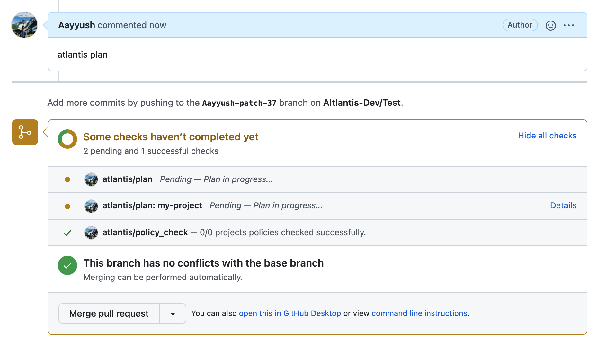
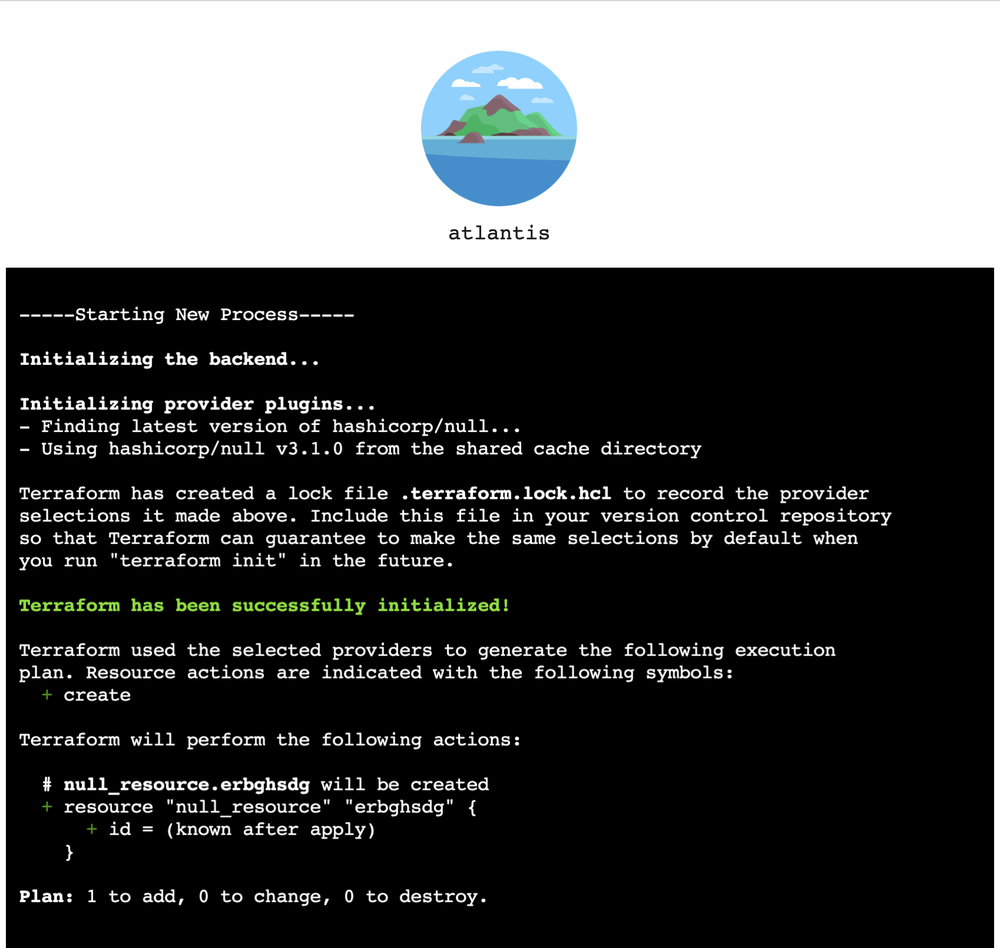

# Real-time logs

Atlantis supports streaming terraform logs in real time by default. Currently, only two commands are supported

* atlantis plan
* atlantis apply

::: warning
As of now, not all custom workflow outputs and other terraform commands are not supported.  Support for terragrunt has been added, see examples in [Custom Workflows](./custom-workflows.md#terragrunt).
:::

In order to view real-time terraform logs, a user can navigate through the *details* section of a given project's plan or apply status check.

This will link to the atlantis UI which provides real-time logging in addition to native terraform syntax highlighting.

::: warning
As of now the logs are currently stored in memory and cleared when a given pull request is closed, so this link shouldn't be persisted anywhere.
:::

