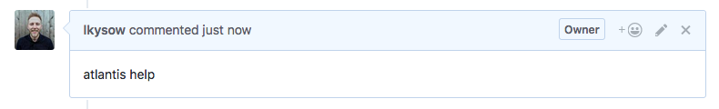
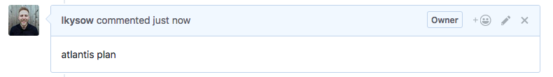
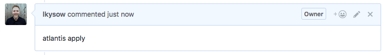

# Using Atlantis

Atlantis currently supports three commands that can be run via pull request comments:
[[toc]]

## atlantis help

```bash
atlantis help
```
### Explanation
View help

---
## atlantis plan

```bash
atlantis plan [options] -- [terraform plan flags]
```
### Explanation
Runs `terraform plan` on the pull request's branch. You may wish to re-run plan after Atlantis has already done
so if you've changed some resources manually.

### Examples
```bash
# Runs plan for any projects that Atlantis thinks were modified.
# If an `atlantis.yaml` file is specified, runs plan on the projects that
# were modified as determined by the `when_modified` config.
atlantis plan

# Runs plan in the root directory of the repo with workspace `default`.
atlantis plan -d .

# Runs plan in the `project1` directory of the repo with workspace `default`
atlantis plan -d project1

# Runs plan in the root directory of the repo with workspace `staging`
atlantis plan -w staging
```

### Options
* `-d directory` Which directory to run plan in relative to root of repo. Use `.` for root.
    * Ex. `atlantis plan -d child/dir`
* `-p project` Which project to run plan for. Refers to the name of the project configured in the repo's [`atlantis.yaml` file](repo-level-atlantis-yaml.html). Cannot be used at same time as `-d` or `-w` because the project defines this already.
* `-w workspace` Switch to this [Terraform workspace](https://www.terraform.io/docs/state/workspaces.html) before planning. Defaults to `default`. If not using Terraform workspaces you can ignore this.
* `--verbose` Append Atlantis log to comment.

### Additional Terraform flags

If you need to run `terraform plan` with additional arguments, like `-target=resource` or `-var 'foo-bar'` or `-var-file myfile.tfvars`
you can append them to the end of the comment after `--`, ex.
```
atlantis plan -d dir -- -var foo='bar'
```
If you always need to append a certain flag, see [Custom Workflow Use Cases](custom-workflows.html#adding-extra-arguments-to-terraform-commands).

---
## atlantis apply

```bash
atlantis apply [options] -- [terraform apply flags]
```
### Explanation
Runs `terraform apply` for the plan that matches the directory/project/workspace.

::: tip
If no directory/project/workspace is specified, ex. `atlantis apply`, this command will apply **all unapplied plans from this pull request**.
:::

### Examples
```bash
# Runs apply for all unapplied plans from this pull request.
atlantis apply

# Runs apply in the root directory of the repo with workspace `default`.
atlantis apply -d .

# Runs apply in the `project1` directory of the repo with workspace `default`
atlantis apply -d project1

# Runs apply in the root directory of the repo with workspace `staging`
atlantis apply -w staging
```

### Options
* `-d directory` Apply the plan for this directory, relative to root of repo. Use `.` for root.
* `-p project` Apply the plan for this project. Refers to the name of the project configured in the repo's [`atlantis.yaml` file](repo-level-atlantis-yaml.html). Cannot be used at same time as `-d` or `-w`.
* `-w workspace` Apply the plan for this [Terraform workspace](https://www.terraform.io/docs/state/workspaces.html). If not using Terraform workspaces you can ignore this.
* `--auto-merge-disabled` Disable [automerge](automerging.html) for this apply command.
* `--verbose` Append Atlantis log to comment.

### Additional Terraform flags

Because Atlantis under the hood is running `terraform apply plan.tfplan`, any Terraform options that would change the `plan` are ignored, ex:
* `-target=resource`
* `-var 'foo=bar'`
* `-var-file=myfile.tfvars`

They're ignored because they can't be specified for an already generated planfile.
If you would like to specify these flags, do it while running `atlantis plan`.

