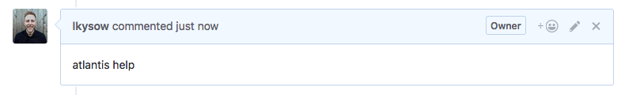

# Using Atlantis

Atlantis triggers commands via pull request comments.


::: tip
You can use the following executable names.

* `atlantis help`
  * `atlantis` is executable name. You can configure by [Executable Name](server-configuration.md#executable-name).
* `run help`
  * `run` is a global executable name.
* `@GithubUser help`
  * `@GithubUser` is the VCS host user which you connected to Atlantis by user token.
:::

Currently, Atlantis supports the following commands.

---

## atlantis help

```bash
atlantis help
```

### Explanation

View help

---

## atlantis version

```bash
atlantis version
```

### Explanation

Print the output of 'terraform version'.

---

## atlantis plan

```bash
atlantis plan [options] -- [terraform plan flags]
```

### Explanation

Runs `terraform plan` on the pull request's branch. You may wish to re-run plan after Atlantis has already done
so if you've changed some resources manually.

### Examples

```bash
# Runs plan for any projects that Atlantis thinks were modified.
# If an `atlantis.yaml` file is specified, runs plan on the projects that
# were modified as determined by the `when_modified` config.
atlantis plan

# Runs plan in the root directory of the repo with workspace `default`.
atlantis plan -d .

# Runs plan in the `project1` directory of the repo with workspace `default`
atlantis plan -p project1

# Runs plan in the root directory of the repo with workspace `staging`
atlantis plan -w staging
```

### Options

* `-d directory` Which directory to run plan in relative to root of repo. Use `.` for root.
  * Ex. `atlantis plan -d child/dir`
* `-p project` Which project to run plan for. Refers to the name of the project configured in the repo's [`atlantis.yaml` file](repo-level-atlantis-yaml.md). Cannot be used at same time as `-d` or `-w` because the project defines this already.
* `-w workspace` Switch to this [Terraform workspace](https://developer.hashicorp.com/terraform/language/state/workspaces) before planning. Defaults to `default`. Ignore this if Terraform workspaces are unused.
* `--verbose` Append Atlantis log to comment.

::: warning NOTE
An `atlantis plan` (without flags), like autoplans, discards all plans previously created with `atlantis plan` `-p`/`-d`/`-w`
:::

### Interrupted plans and durable state recovery

Atlantis records plan and apply results in durable state before posting the result comment. If Atlantis is interrupted
after the write, the stored state can be newer than the latest pull request comment.

Plan-generation transitions and their pull request status/comment publication use a durable, per-pull publication
claim. This prevents an older replica from publishing after a newer replica has started or completed a generation.
Apply holds the same claim from its final durable-plan selection through execution, result persistence, terminal
publication, and automerge, so another replica cannot replace the accepted generation while apply is running.
The claim is deliberately non-expiring: an ambiguous VCS response may still complete remotely after Atlantis loses
the response, so automatically timing out the claim would allow stale publication. Pull-close cleanup also refuses to
clear a claim held by a publisher. If a claim remains after an ambiguous publication error, first stop or otherwise
confirm the owning command and replica can no longer publish. If ownership cannot be established, stop **all** Atlantis
replicas before recovery. Do not clear a live publisher's claim.

For BoltDB, keep every Atlantis replica stopped and back up `<data-dir>/atlantis.db`. From a checkout of the same
Atlantis version, run the offline recovery utility for exactly one pull request:

```bash
go run ./cmd/plan-claim-recovery \
  --data-dir /var/lib/atlantis \
  --vcs-hostname github.com \
  --repo owner/repository \
  --pull 123 \
  --confirm-all-replicas-stopped
```

The utility refuses to open a BoltDB file that an Atlantis process still holds. Restart Atlantis only after it exits
successfully.

For Redis, stop every Atlantis replica, back up Redis according to the deployment's normal procedure, and inspect the
exact claim key before deleting it. Replace the example VCS host, repository, and pull request number; retain the braces
because they are part of the Redis key:

```bash
claim_key='plan-publication/{github.com::owner/repository::123}'
redis-cli --raw GET "$claim_key"
redis-cli DEL "$claim_key"
redis-cli EXISTS "$claim_key"
```

Use the deployment's normal `redis-cli` connection, authentication, TLS, database, and cluster (`-c`) options. The
final `EXISTS` result must be `0`. Restart Atlantis, then retry the close, unlock, or replan operation. These procedures
clear only the publication claim; they do not infer or repair plan status.

During a rolling upgrade, the strict cross-replica publication boundary is effective only after every Atlantis replica
is running a version that participates in publication claims. Complete the replica rollout before relying on this
ordering guarantee.

For convention-managed plans, a successful generation stores the plan's SHA-256 digest in the same durable update as
the successful project status. Apply verifies a local or restored plan against that accepted digest before executing.
Pull status written by an older Atlantis version may not contain this digest. During a rolling upgrade, those legacy
plans retain the previous command-start hash validation; running `atlantis plan` again creates the durable digest.
PR-backed API plan/apply requests use this same durable generation and digest boundary; synthetic non-PR API requests
continue to use their request-local plan state.

An interrupted plan generation intentionally blocks apply and policy-result updates for its projects. Run
`atlantis plan` again after the in-progress command has stopped to replace the incomplete generation. Starting a new
plan also replaces a stored pull request status that Atlantis can read from the database but cannot deserialize after
a schema change. The replacement generation cannot be applied until the new plan completes successfully. For a
genuinely stuck generation that cannot be replaced by replanning, close and reopen the pull request after Atlantis
processes the close event, then run a fresh plan. A close event waits for any publication claim; recover an orphaned
claim with the offline procedure above before relying on close/reopen. If an apply runs but its result cannot be stored, verify the
infrastructure state before retrying because one or more apply steps may already have executed.

If a newer targeted plan supersedes one project in an older multi-project generation, Atlantis cancels the remaining
projects from the older generation. Those projects are non-applyable and require a fresh plan. Results from the
superseded command do not replace the newer generation's pull request statuses or comments. Follow-on policy results
are accepted and published only while the completed plan generation that produced them remains current.

Generic plans and autoplans atomically mark prior project plans as discarded before starting their new generation.
Likewise, when automerge requires every project plan to succeed and one project fails, Atlantis makes every project in
that generation non-applyable. Physical plan-store objects may remain until later explicit cleanup; durable pull status,
not the presence of an object, determines whether apply is authorized. Generic apply ignores retained convention-plan
objects whose matching durable project status is already applied, discarded, or a no-change plan.

After a durable generation starts, Atlantis does not automatically remove its plan artifact or release its on-plan lock
from a failing or superseded command because another replica may already have reused the same plan key and pull-owned
lock. A replan from the same pull can reuse that lock. If the pull cannot replan, use `atlantis unlock` or close the pull
request to release the lock and discard the plan after confirming no plan command is still running.

### Additional Terraform flags

If `terraform plan` requires additional arguments, like `-target=resource` or `-var 'foo=bar'` or `-var-file myfile.tfvars`
you can append them to the end of the comment after `--`, ex.

```shell
atlantis plan -d dir -- -var foo='bar'
```

If you always need to append a certain flag, see [Custom Workflow Use Cases](custom-workflows.md#adding-extra-arguments-to-terraform-commands).

### Automatic Environment Variable Files

Atlantis automatically includes workspace-specific variable files if they exist in your repository. This feature helps reduce duplication across different environments and workspaces.

#### How it works

When running `atlantis plan`, Atlantis automatically checks for a file at `env/{workspace}.tfvars` relative to the project directory. If this file exists, Atlantis will automatically include it using the `-var-file` flag.

#### Examples

```plain
my-terraform-project/
├── main.tf
├── variables.tf
└── env/
    ├── default.tfvars
    ├── staging.tfvars
    └── production.tfvars
```

When you run:

* `atlantis plan` (uses default workspace) automatically includes `env/default.tfvars`
* `atlantis plan -w staging` automatically includes `env/staging.tfvars`
* `atlantis plan -w production` automatically includes `env/production.tfvars`

::: tip
This feature works for any workspace name. If you have a custom workspace called `dev-team-1`, Atlantis will look for `env/dev-team-1.tfvars`.
:::

### Using the -destroy Flag

#### Example

To perform a destructive plan that will destroy resources you can use the `-destroy` flag like this:

```bash
atlantis plan -- -destroy
atlantis plan -d dir -- -destroy
```

::: warning NOTE
The `-destroy` flag generates a destroy plan. If this plan is applied it can result in data loss or service disruptions. Ensure that you have thoroughly reviewed your Terraform configuration and intend to remove the specified resources before using this flag.
:::

---

## atlantis apply

```bash
atlantis apply [options] -- [terraform apply flags]
```

### Explanation

Runs `terraform apply` for the plan that matches the directory/project/workspace.

::: tip
If no directory/project/workspace is specified, ex. `atlantis apply`, this command will apply **all unapplied plans from this pull request**.
This includes all projects that have been planned manually with `atlantis plan` `-p`/`-d`/`-w` since the last autoplan or `atlantis plan` command.
For Atlantis commands to work,  Atlantis needs to know the location where the plan file is. For that, you can use $PLANFILE which will contain the path of the plan file to be used in your custom steps. i.e `terraform plan -out $PLANFILE`
:::

### Examples

```bash
# Runs apply for all unapplied plans from this pull request.
atlantis apply

# Runs apply in the root directory of the repo with workspace `default`.
atlantis apply -d .

# Runs apply in the `project1` directory of the repo with workspace `default`
atlantis apply -p project1

# Runs apply in the root directory of the repo with workspace `staging`
atlantis apply -w staging
```

### Options

* `-d directory` Apply the plan for this directory, relative to root of repo. Use `.` for root.
* `-p project` Apply the plan for this project. Refers to the name of the project configured in the repo's [`atlantis.yaml` file](repo-level-atlantis-yaml.md). Cannot be used at same time as `-d` or `-w`.
* `-w workspace` Apply the plan for this [Terraform workspace](https://developer.hashicorp.com/terraform/language/state/workspaces). Ignore this if Terraform workspaces are unused.
* `--auto-merge-disabled` Disable [automerge](automerging.md) for this apply command.
* `--auto-merge-method method` Specify which [merge method](automerging.md#how-to-set-the-merge-method-for-automerge) use for the apply command if [automerge](automerging.md) is enabled. Implemented only for GitHub.
* `--verbose` Append Atlantis log to comment.

### Additional Terraform flags

Because Atlantis under the hood is running `terraform apply plan.tfplan`, any Terraform options that would change the `plan` are ignored, ex:

* `-target=resource`
* `-var 'foo=bar'`
* `-var-file=myfile.tfvars`

They're ignored because they can't be specified for an already generated planfile.
If you would like to specify these flags, do it while running `atlantis plan`.

::: tip
The automatic `env/{workspace}.tfvars` file inclusion happens during the `atlantis plan` phase. Since `atlantis apply` uses the already-generated plan file, any environment-specific variables are already incorporated from when the plan was created.
:::

---

## Atlantis cancel

```bash
atlantis cancel
```

### Explanation

Cancels all **queued commands** for the current pull request.

::: warning NOTE
This command **does not** attempt to stop or interrupt commands that are already running. It only removes subsequent commands that are waiting in the queue. There is currently no mechanism in Atlantis to interrupt the currently running process.
:::

This is useful if you have multiple commands queued (e.g., atlantis apply for several projects) and you realize you made a mistake in your PR. Using cancel prevents the queued plans from executing. Especially with long-running operations, this can save time and resources.

### Examples

```bash
# An apply is currently running, and another is queued.
# This command will cancel the queued apply but not the running one.
atlantis cancel
```

---

## atlantis import

```bash
atlantis import [options] ADDRESS ID -- [terraform import flags]
```

### Explanation

Runs `terraform import` that matches the directory/project/workspace.
This command discards the terraform plan result. After an import and before an apply, another `atlantis plan` must be run again.

To allow the `import` command requires [--allow-commands](server-configuration.md#allow-commands) configuration.

### Examples

```bash
# Runs import
atlantis import ADDRESS ID

# Runs import in the root directory of the repo with workspace `default`
atlantis import -d . ADDRESS ID

# Runs import in the `project1` directory of the repo with workspace `default`
atlantis import -p project1 ADDRESS ID

# Runs import in the root directory of the repo with workspace `staging`
atlantis import -w staging ADDRESS ID
```

::: tip

* When importing `for_each` resources, a single quoted address is required.
  * ex. `atlantis import 'aws_instance.example["foo"]' i-1234567890abcdef0`
:::

### Options

* `-d directory` Import a resource for this directory, relative to root of repo. Use `.` for root.
* `-p project` Import a resource for this project. Refers to the name of the project configured in the repo's [`atlantis.yaml`](repo-level-atlantis-yaml.md) repo configuration file. This cannot be used at the same time as `-d` or `-w`.
* `-w workspace` Import a resource for a specific [Terraform workspace](https://developer.hashicorp.com/terraform/language/state/workspaces). Ignore this if Terraform workspaces are unused.

### Additional Terraform flags

If `terraform import` requires additional arguments, like `-var 'foo=bar'` or `-var-file myfile.tfvars`
append them to the end of the comment after `--`, e.g.

```shell
atlantis import -d dir 'aws_instance.example["foo"]' i-1234567890abcdef0 -- -var foo='bar'
```

If a flag is needed to be always appended, see [Custom Workflow Use Cases](custom-workflows.md#adding-extra-arguments-to-terraform-commands).

---

## atlantis state rm

```bash
atlantis state [options] rm ADDRESS... -- [terraform state rm flags]
```

### Explanation

Runs `terraform state rm` that matches the directory/project/workspace.
This command discards the terraform plan result. After running `state rm` and before an apply, another `atlantis plan` must be run again.

To allow the `state` command requires [--allow-commands](server-configuration.md#allow-commands) configuration.

### Examples

```bash
# Runs state rm
atlantis state rm ADDRESS1 ADDRESS2

# Runs state rm in the root directory of the repo with workspace `default`
atlantis state -d . rm ADDRESS

# Runs state rm in the `project1` directory of the repo with workspace `default`
atlantis state -p project1 rm ADDRESS

# Runs state rm in the root directory of the repo with workspace `staging`
atlantis state -w staging rm ADDRESS
```

::: tip

* When running `state rm` on `for_each` resources, a single quoted address is required.
  * ex. `atlantis state rm 'aws_instance.example["foo"]'`
:::

### Options

* `-d directory` Run state rm a resource for this directory, relative to root of repo. Use `.` for root.
* `-p project` Run state rm a resource for this project. Refers to the name of the project configured in the repo's [`atlantis.yaml`](repo-level-atlantis-yaml.md) repo configuration file. This cannot be used at the same time as `-d` or `-w`.
* `-w workspace` Run state rm a resource for a specific [Terraform workspace](https://developer.hashicorp.com/terraform/language/state/workspaces). Ignore this if Terraform workspaces are unused.

### Additional Terraform flags

If `terraform state rm` requires additional arguments, like `-lock=false'`
append them to the end of the comment after `--`, e.g.

```shell
atlantis state -d dir rm 'aws_instance.example["foo"]' -- -lock=false
```

If a flag is needed to be always appended, see [Custom Workflow Use Cases](custom-workflows.md#adding-extra-arguments-to-terraform-commands).

---

## atlantis unlock

```bash
atlantis unlock
```

### Explanation

Removes all atlantis locks and discards all plans for this PR.
To unlock a specific plan you can use the Atlantis UI.

---

## atlantis approve_policies

```bash
atlantis approve_policies
```

### Explanation

Approves all current policy checking failures for the PR.

See also [policy checking](policy-checking.md).

### Options

* `--verbose` Append Atlantis log to comment.

---

## API-Based Workflows

In addition to pull request comments, Atlantis supports API-based workflows for plan, apply, and drift detection. These endpoints allow external tools and automation to interact with Atlantis programmatically.

Key capabilities:

* **Plan and Apply** without a pull request (`POST /api/plan`, `POST /api/apply`)
* **Drift Detection** to identify infrastructure changes outside of Terraform (`POST /api/drift/detect`)
* **Drift Status** to view cached drift results (`GET /api/drift/status`)
* **Drift Remediation** to fix detected drift (`POST /api/drift/remediate`)

See [API Endpoints](api-endpoints.md) for full documentation and [Server Configuration](server-configuration.md) for the `--enable-drift-detection` flag.
