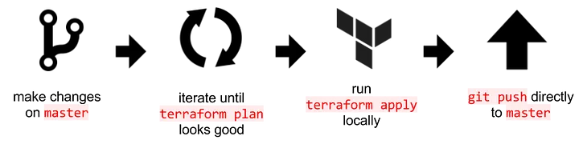
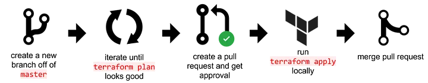
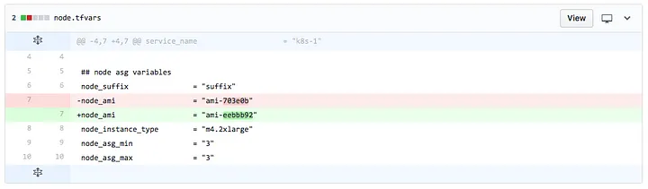
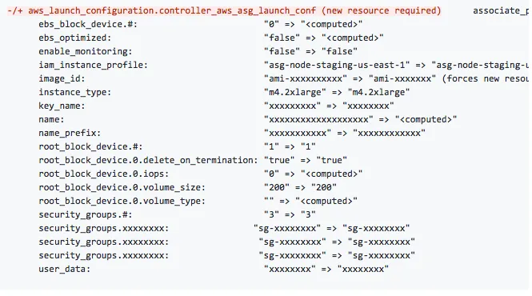
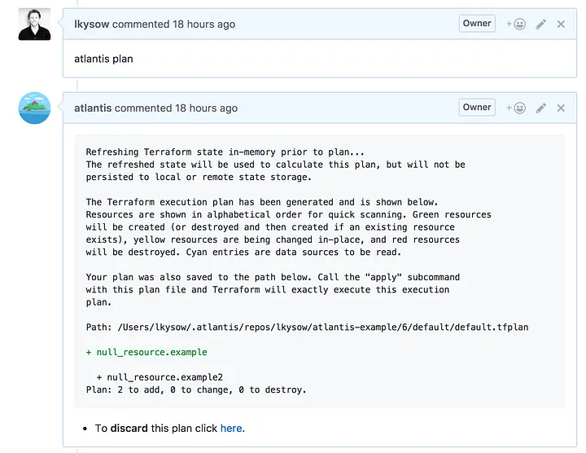
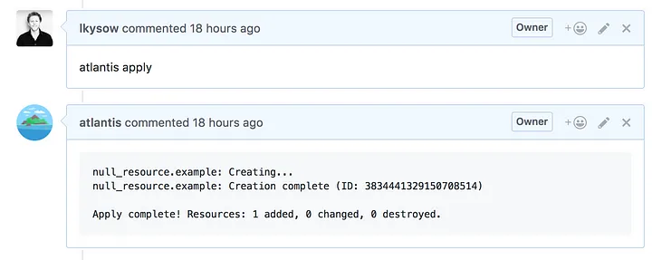
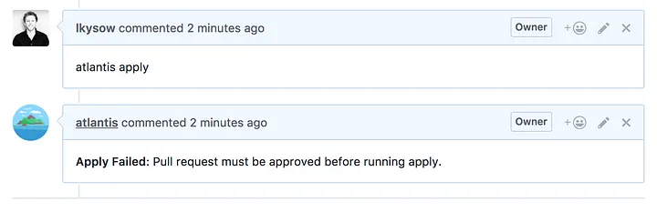

# Presentando Atlantis

::: info
Esta publicación fue escrita originalmente el 11 de septiembre de 2017

Publicación original: <https://medium.com/runatlantis/introducing-atlantis-6570d6de7281>
:::

¡Estamos muy emocionados de anunciar el lanzamiento open source de Atlantis! Atlantis es una herramienta para
colaborar en Terraform que ha estado en uso en Hootsuite durante más de un año. La funcionalidad
principal de Atlantis permite a desarrolladores y operadores ejecutar `terraform plan` y
`apply` directamente desde pull requests de Terraform. Atlantis luego comenta de vuelta en el pull
request con la salida de los comandos:

Esta es una funcionalidad simple, sin embargo ha tenido un efecto masivo en cómo nuestro equipo escribe Terraform.
Al llevar un workflow de Terraform a los pull requests, Atlantis ayudó a nuestro equipo de Ops a colaborar
mejor en Terraform y también permitió a todo nuestro equipo de desarrollo escribir y ejecutar Terraform de manera segura.

Atlantis fue construido para resolver dos problemas que surgieron en Hootsuite cuando adoptamos Terraform:

### 1. Colaboración efectiva

¿Cuál es la mejor manera de colaborar en Terraform en un entorno de equipo?

### 2. Desarrolladores escribiendo Terraform

¿Cómo podemos permitir que nuestros desarrolladores escriban y apliquen Terraform de manera segura?

## Colaboración efectiva

Al escribir Terraform, hay varios workflows que puedes seguir. El workflow más simple es solo usar `master`:

En este workflow, trabajas en `master` y ejecutas `terraform` localmente.
El problema con este workflow es que no hay colaboración ni revisión de código.
Así que empezamos a usar pull requests:

Seguimos ejecutando `terraform plan` localmente, pero una vez que estamos satisfechos con los cambios creamos un pull request para revisión. Cuando el pull request es aprobado, ejecutamos `apply` localmente.

Este workflow es una mejora, pero todavía hay problemas. El primer problema es que es difícil revisar solo el diff en el pull request. Para revisar correctamente un cambio, realmente necesitas ver la salida de `terraform plan`.

Lo que parece un cambio pequeño...

...puede tener un plan grande

El segundo problema es que ahora es fácil que `master` se desincronice de lo que realmente ha sido aplicado. Esto puede pasar si haces merge de un pull request sin ejecutar `apply` o si el `apply` tiene un error a mitad del proceso, olvidas corregirlo y luego haces merge a `master`. Ahora lo que está en `master` no es realmente lo que está ejecutándose en producción. En el mejor de los casos, esto causa confusión la próxima vez que alguien ejecute `terraform plan`. En el peor de los casos, causa una caída cuando alguien asume que lo que está en `master` realmente se está ejecutando, y depende de ello.

Con el workflow de Atlantis, estos problemas se resuelven:

Ahora es fácil revisar cambios porque ves la salida de `terraform plan` en el pull request.

Los pull requests son fáciles de revisar ya que puedes ver el plan

También es fácil asegurar que el pull request haya sido `terraform apply` antes de hacer merge a master porque puedes ver la salida real de `apply` en el pull request.

Entonces, Atlantis hace que trabajar en Terraform dentro de un equipo de operaciones sea mucho más fácil, pero ¿cómo ayuda con lograr que todo tu equipo escriba Terraform?

## Desarrolladores escribiendo Terraform

Terraform usualmente comienza siendo usado por el equipo de Ops. Como resultado de usar Terraform, el equipo de Ops se vuelve mucho más rápido al hacer cambios de infraestructura, pero la forma en que los desarrolladores solicitan esos cambios sigue siendo la misma: usan un sistema de tickets o chat para pedir ayuda a operaciones, la solicitud entra en una cola y más tarde Ops responde que la tarea está completa.

Sin embargo, pronto el equipo de Ops empieza a darse cuenta de que es posible que los desarrolladores hagan algunos de estos cambios de Terraform ellos mismos. Sin embargo, surgen algunos problemas:

- Los desarrolladores no tienen las credenciales para realmente ejecutar comandos de Terraform
- Si les das credenciales, es difícil revisar lo que realmente se está aplicando

Con Atlantis, estos problemas se resuelven. Todos los comandos `terraform plan` y `apply` se ejecutan desde el pull request. Esto significa que los desarrolladores no necesitan tener ninguna credencial para ejecutar Terraform localmente. Por supuesto, esto puede ser peligroso: ¿cómo puedes asegurar que los desarrolladores (que podrían ser nuevos en Terraform) no estén aplicando cosas que no deberían? La respuesta es revisiones de código y aprobaciones.

Dado que Atlantis comenta de vuelta con la salida de `plan` directamente en el pull request, es fácil para un ingeniero de operaciones revisar exactamente qué cambios serán aplicados. Y Atlantis puede ejecutarse en modo `require-approval`, que requerirá una aprobación de pull request de GitHub antes de permitir que `apply` se ejecute:

Con Atlantis, los desarrolladores pueden escribir y aplicar Terraform de manera segura. Envían pull requests, pueden ejecutar `atlantis plan` hasta que su cambio se vea bien y luego obtener aprobación de Ops para `apply`.

Desde la introducción de Atlantis en Hootsuite, hemos tenido **78** contribuidores a nuestros repositorios de Terraform, **58** de los cuales son desarrolladores (**75%**).

## Dónde estamos ahora

Desde la introducción de Atlantis en Hootsuite hemos crecido a 144 repositorios de Terraform [^1] que gestionan miles de recursos de Amazon. Atlantis se usa para cada cambio de Terraform en toda nuestra organización.

## Comenzar con Atlantis

Si te gustaría probar Atlantis para tu equipo, puedes descargar la última release desde <https://github.com/runatlantis/atlantis/releases>. Si ejecutas `atlantis testdrive` puedes comenzar en menos de 5 minutos. Para leer más sobre Atlantis ve a <https://www.runatlantis.io/>.

Mira nuestro video para más información:

<iframe src="https://cdn.embedly.com/widgets/media.html?src=https%3A%2F%2Fwww.youtube.com%2Fembed%2FTmIPWda0IKg%3Ffeature%3Doembed&amp;url=http%3A%2F%2Fwww.youtube.com%2Fwatch%3Fv%3DTmIPWda0IKg&amp;image=https%3A%2F%2Fi.ytimg.com%2Fvi%2FTmIPWda0IKg%2Fhqdefault.jpg&amp;key=a19fcc184b9711e1b4764040d3dc5c07&amp;type=text%2Fhtml&amp;schema=youtube" allowfullscreen="" frameborder="0" height="480" width="640" title="Atlantis Walkthrough" class="fr n gh dv bg" scrolling="no"></iframe>

[^1]: Dividimos nuestro Terraform en múltiples states, cada uno con su propio repositorio (ver [1], [2], [3]).

[1]: https://blog.gruntwork.io/how-to-manage-terraform-state-28f5697e68fa
[2]: https://charity.wtf/2016/03/30/terraform-vpc-and-why-you-want-a-tfstate-file-per-env/
[3]: https://www.nclouds.com/blog/terraform-multi-state-management/
