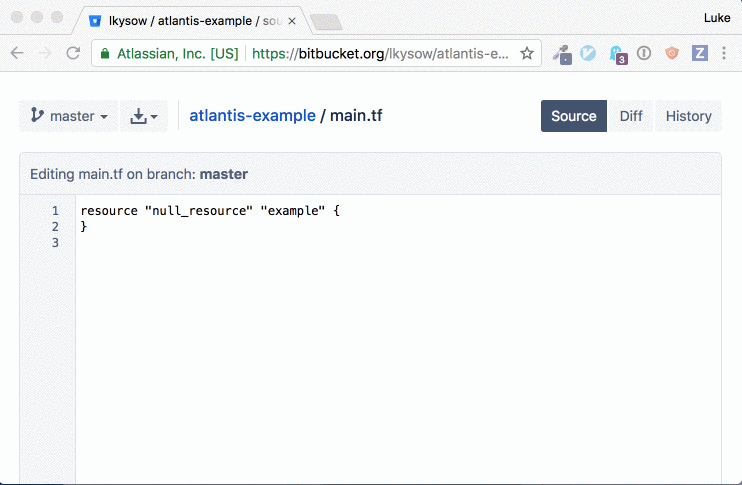
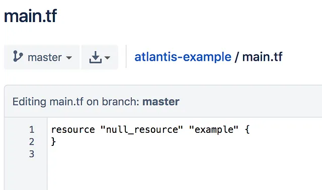
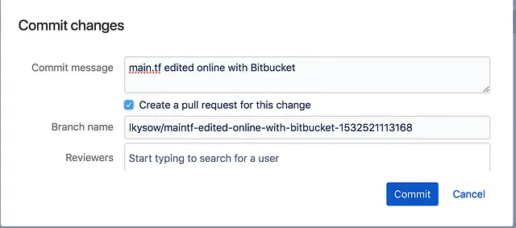
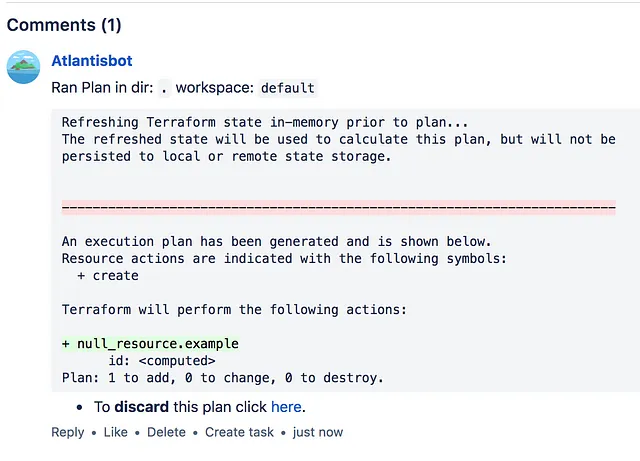
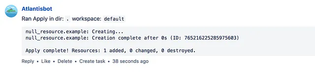
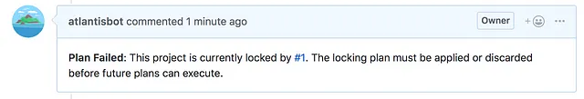

# Atlantis 0.4.4 Now Supports Bitbucket

::: info
Esta publicación fue escrita originalmente el 25 de julio de 2018

Publicación original: <https://medium.com/runatlantis/atlantis-0-4-4-now-supports-bitbucket-86c53a550b45>
:::


Atlantis es una plataforma de [código abierto](https://github.com/runatlantis/atlantis) para usar Terraform en equipos. Me complace anunciar que la [última versión](https://github.com/runatlantis/atlantis/releases) de Atlantis (0.4.4) ahora es compatible tanto con Bitbucket Cloud (bitbucket.org) **como** con Bitbucket Server (también conocido como Stash).



Atlantis ahora es compatible con los tres principales hosts de Git: GitHub, GitLab y Bitbucket. El resto de esta publicación hablará sobre cómo usar Atlantis con Bitbucket.

## ¿Qué es Atlantis?

Atlantis es una aplicación autoalojada que escucha eventos de pull request de Terraform a través de webhooks. Ejecuta `terraform plan` e `apply` de forma remota y comenta de vuelta en el pull request con la salida.

Con Atlantis, colaboras en el propio pull request de Terraform en lugar de ejecutar `terraform apply` desde tus propias computadoras, lo cual puede ser peligroso:

Consulta <www.runatlantis.io> para más información.

## Primeros pasos

La forma más fácil de probar Atlantis con Bitbucket es ejecutar Atlantis localmente en tu propia computadora. Eventualmente querrás desplegarlo como una aplicación independiente, pero esta es la forma más fácil de probarlo. Sigue [estas instrucciones](https://www.runatlantis.io/guide/getting-started.html) para hacer que Atlantis se ejecute localmente.

Crear un Pull Request
Si tienes el webhook de Atlantis configurado para tu repositorio y Atlantis se está ejecutando, es hora de crear un nuevo pull request. Recomiendo agregar un `null_resource` a uno de tus archivos de Terraform para el pull request de prueba. En realidad no creará nada, así que es seguro usarlo como prueba.

Usando el editor web, abre uno de tus archivos de Terraform y agrega:

```tf
resource "null_resource" "example" {}
```



Haz clic en Commit y selecciona **Create a pull request for this change**.



Espera unos segundos y luego actualiza. Atlantis debería haber ejecutado automáticamente `terraform plan` y comentado de vuelta en el pull request:



Ahora es más fácil para tus colegas revisar el pull request porque pueden ver la salida de `terraform plan`.

### Terraform Apply

Como todo lo que estamos haciendo es agregar un recurso nulo, creo que es seguro ejecutar `terraform apply`. Para hacerlo, agrego un comentario al pull request: `atlantis apply`:


Atlantis está escuchando comentarios del pull request y ejecutará `terraform apply` de forma remota y comentará de vuelta con la salida:



### Aprobaciones de Pull Request

Si no quieres que cualquiera pueda `terraform apply`, puedes ejecutar Atlantis con `--require-approval` o agregar esa configuración a tu archivo [atlantis.yaml](https://www.runatlantis.io/docs/command-requirements.html#approved).

Esto garantizará que el pull request haya sido aprobado antes de que alguien pueda ejecutar `apply`.

## Otras características

### Comandos personalizables

Además de poder `plan` e `apply` desde el pull request, Atlantis también te permite personalizar los comandos exactos que se ejecutan mediante un archivo de configuración `atlantis.yaml`. Por ejemplo, para usar la bandera `-var-file`:

```yaml{14}
# atlantis.yaml
version: 2
projects:
- name: staging
  dir: "."
  workflow: staging

workflows:
  staging:
    plan:
      steps:
      - init
      - plan:
          extra_args: ["-var-file", "staging.tfvars"]
```

### Bloqueo para coordinación



Atlantis evitará que otros pull requests se ejecuten contra el mismo directorio que un pull request abierto para que cada plan se aplique atómicamente. Una vez que el primer pull request se fusiona, los otros pull requests se desbloquean.

## Próximos pasos

Si estás interesado en usar Atlantis con Bitbucket, consulta nuestra documentación de primeros pasos. ¡Feliz Terraforming!
