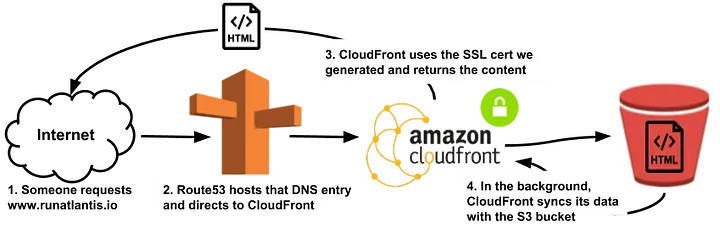
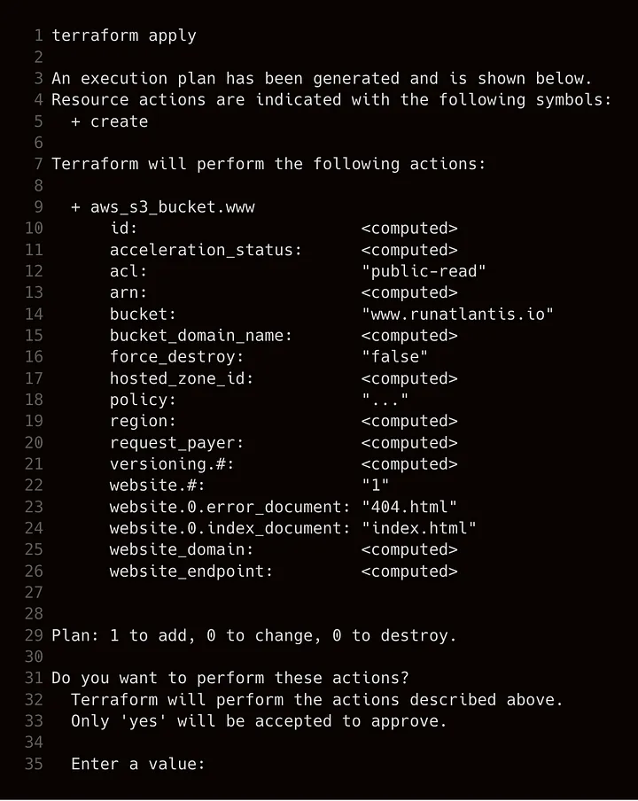

# Alojar nuestro sitio estático sobre SSL con S3, ACM, CloudFront y Terraform

::: info
Esta publicación fue escrita originalmente el 4 de marzo de 2018

Publicación original: <https://medium.com/runatlantis/hosting-our-static-site-over-ssl-with-s3-acm-cloudfront-and-terraform-513b799aec0f>
:::

En esta publicación cubro cómo alojé <www.runatlantis.io> usando

- S3 — para almacenar el sitio estático
- CloudFront — para servir el sitio estático sobre SSL
- AWS Certificate Manager — para generar los certificados SSL
- Route53 — para enrutar el nombre de dominio <www.runatlantis.io> a la ubicación correcta

Elegí Terraform en este caso porque Atlantis es una herramienta para automatizar y colaborar en Terraform en un equipo (ver github.com/runatlantis/atlantis), y por lo tanto obviamente tenía sentido alojar nuestra página principal usando Terraform, pero también porque ahora es mucho más fácil de gestionar. No tengo que entrar en la consola de AWS y hacer clic por todos lados para encontrar qué configuraciones quiero cambiar. En su lugar, simplemente puedo mirar ~100 líneas de código, hacer un cambio, y ejecutar `terraform apply`.

::: info
NOTA: 4 meses después de este escrito, moví el sitio a [Netlify](https://www.netlify.com/) porque construye automáticamente desde mi rama master ante cualquier cambio, actualiza más rápido ya que no necesito esperar a que expire la caché de Cloudfront y me da [deploy previews](https://www.netlify.com/blog/2016/07/20/introducing-deploy-previews-in-netlify/) de los cambios. Los registros DNS todavía están alojados en AWS.
:::

# Resumen

Hay una cantidad sorprendente de componentes requeridos para que todo esto funcione, así que voy a empezar con un resumen de para qué se necesitan todos. Así es como se ve la arquitectura final:



Así es como se ve el producto final, pero empecemos con los pasos requeridos para llegar allí.

## Paso 1 — Generar el sitio

El primer paso es tener un sitio generado. Nuestro sitio usa [Hugo](https://gohugo.io/), un generador de sitios en Golang. Una vez que está configurado, solo necesitas ejecutar `hugo` y generará un directorio con HTML y todo tu contenido listo para alojar.

## Paso 2 — Alojar el contenido

Una vez que tienes un sitio web, necesitas que sea accesible en internet. Usé S3 para esto porque es muy barato y se integra bien con todos los demás componentes necesarios. Simplemente subo la carpeta de mi sitio web al bucket de S3.

## Paso 3 — Generar un certificado SSL

Necesitaba generar un certificado SSL para <https://www.runatlantis.io>. Usé AWS Certificate Manager para esto porque es gratis y se integra fácilmente con el resto del sistema.

## Paso 4 — Configurar DNS

Debido a que voy a alojar el sitio en servicios de AWS, necesito que las solicitudes a <www.runatlantis.io> sean enrutadas a esos servicios. Route53 es la solución obvia.

## Paso 5 — Alojar con CloudFront

En este punto, hemos generado un certificado SSL para <www.runatlantis.io> y nuestro sitio web está disponible en internet a través de su url de S3, así que ¿no podemos simplemente hacer un CNAME al bucket de S3 y darlo por terminado? Desafortunadamente no.

Dado que generamos nuestro propio certificado, necesitaríamos que S3 firme sus respuestas usando nuestro certificado. S3 no soporta esto y por lo tanto necesitamos CloudFront. CloudFront soporta usar nuestro propio certificado SSL y simplemente obtendrá sus datos del bucket de S3.

# Tiempo de Terraform

Ahora que sabemos cómo debería verse nuestra arquitectura, simplemente es cuestión de escribir el Terraform.

## Configuración inicial

Crea un nuevo archivo `main.tf`:

@include: ./publichosting-our-static-site/code/main.tf

## Bucket de S3

Asumiendo que ya hemos generado el contenido de nuestro sitio, necesitamos crear un bucket de S3 para alojar el contenido.

@include: /publichosting-our-static-site/code/s3-bucket.tf

Ahora deberíamos poder ejecutar Terraform para crear el bucket de S3

```sh
terraform init
`terraform apply`
```



Ahora queremos subir nuestro contenido al bucket de S3:

```sh
$ cd dir/with/website
# generate the HTML
$ hugo -d generated
$ cd generated
# send it to our S3 bucket
$ aws s3 sync . s3://www.runatlantis.io/ # change this to your bucket
```

Ahora necesitamos la url de S3 para ver nuestro contenido:

```sh
$ terraform state show aws_s3_bucket.www | grep website_endpoint
website_endpoint                       = www.runatlantis.io.s3-website-us-east-1.amazonaws.com
```

¡Deberías ver tu sitio alojado en esa url!

## Certificado SSL

Usemos AWS Certificate Manager para crear nuestro certificado SSL.

@include hosting-our-static-site/code/ssl-cert.tf

Antes de ejecutar `terraform apply`, asegúrate de estar reenviando cualquiera de

- `administrator@your_domain_name`
- `hostmaster@your_domain_name`
- `postmaster@your_domain_name`
- `webmaster@your_domain_name`
- `admin@your_domain_name`

A una dirección de correo electrónico a la que puedas acceder. Luego, ejecuta `terraform apply` y deberías recibir un correo de AWS para confirmar que eres dueño de este dominio, donde necesitarás hacer clic en el enlace.

## CloudFront

Ahora estamos listos para que CloudFront aloje nuestro sitio web usando el bucket de S3 para el contenido y usando nuestro certificado SSL. ¡Advertencia! Hay mucho código más adelante pero la mayor parte son solo valores predeterminados.

@include: hosting-our-static-site/code/cloudfront.tf

Aplica los cambios con `terraform apply` y luego encuentra el nombre de dominio que CloudFront nos da:

```sh
$ terraform state show aws_cloudfront_distribution.www_distribution | grep ^domain_name
domain_name                                                                                          = d1l8j8yicxhafq.cloudfront.net
```

Probablemente obtendrás un error si vas a esa URL de inmediato. Necesitas esperar un par de minutos para que CloudFront se configure. A mí me tomó 10 minutos. Puedes ver su progreso en la consola: <https://console.aws.amazon.com/cloudfront/home>

## DNS

¡Ya casi terminamos! Tenemos CloudFront alojando nuestro sitio, ahora necesitamos apuntar nuestro DNS hacia él.

@include: hosting-our-static-site/code/dns.tf

Si compraste tu dominio en algún otro lugar como Namecheap, necesitarás apuntar tu DNS a los nameservers listados en el state para la zona de Route53 que creaste. Primero `terraform apply` (lo cual puede tardar un rato), luego averigua tus nameservers.

```sh
$ terraform state show aws_route53_zone.zone
id             = Z2FNAJGFW912JG
comment        = Managed by Terraform
force_destroy  = false
name           = runatlantis.io
name_servers.# = 4
name_servers.0 = ns-1349.awsdns-40.org
name_servers.1 = ns-1604.awsdns-08.co.uk
name_servers.2 = ns-412.awsdns-51.com
name_servers.3 = ns-938.awsdns-53.net
tags.%         = 0
zone_id        = Z2FNAJGFW912JG
```

Luego mira la documentación de tu dominio para cómo cambiar tus nameservers a los 4 listados.

## ¿Eso es todo...?

Una vez que el DNS se propague deberías ver tu sitio en `https://www.yourdomain`. Pero, ¿qué pasa con `https://yourdomain`? Es decir, ¿sin el `www.`? ¿No debería esto redirigir a `https://www.yourdomain`?

## Dominio raíz

Resulta que necesitamos crear un bucket de S3, una distribución de CloudFront y un registro de Route53 completamente nuevos solo para lograr que esto ocurra. Eso es porque aunque S3 puede servir una redirección a la versión www de tu sitio, no puede alojar certificados SSL y por lo tanto necesitas CloudFront. He incluido abajo todo el terraform necesario para eso.

¡Felicidades! ¡Terminaste!

<iframe src="https://cdn.embedly.com/widgets/media.html?src=https%3A%2F%2Fgiphy.com%2Fembed%2Fl0MYt5jPR6QX5pnqM%2Ftwitter%2Fiframe&amp;display_name=Giphy&amp;url=https%3A%2F%2Fmedia.giphy.com%2Fmedia%2Fl0MYt5jPR6QX5pnqM%2Fgiphy.gif&amp;image=https%3A%2F%2Fi.giphy.com%2Fmedia%2Fl0MYt5jPR6QX5pnqM%2Fgiphy.gif&amp;key=d04bfffea46d4aeda930ec88cc64b87c&amp;type=text%2Fhtml&amp;schema=giphy" allowfullscreen="" frameborder="0" height="244" width="435" title="The Office Party Hard GIF - Find &amp; Share on GIPHY" class="fr n gh dv bg" scrolling="no"></iframe>

Si estás usando Terraform en un equipo, revisa Atlantis: <https://github.com/runatlantis/atlantis> para automatización y colaboración para hacer a tu equipo más feliz.

Aquí está el Terraform necesario para redirigir tu dominio raíz:

@include: hosting-our-static-site/code/full.tf
