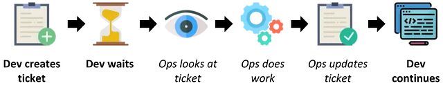
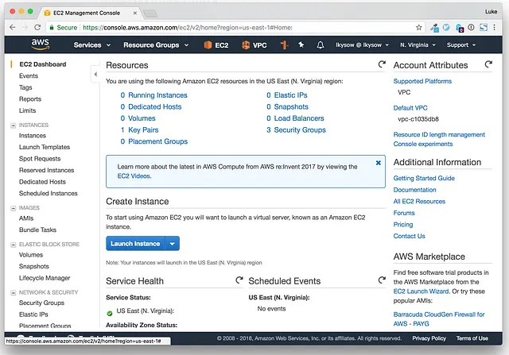
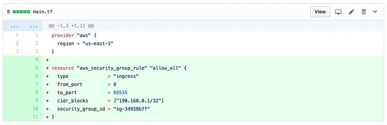
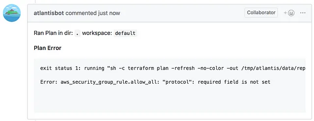
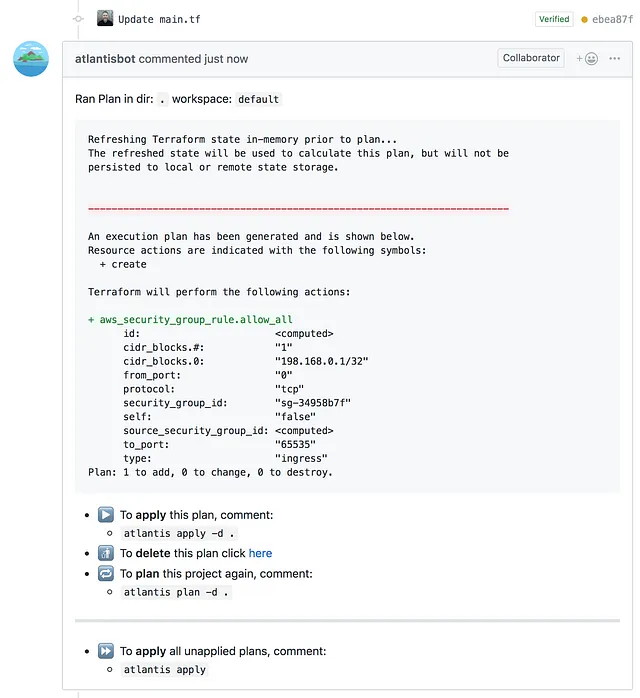
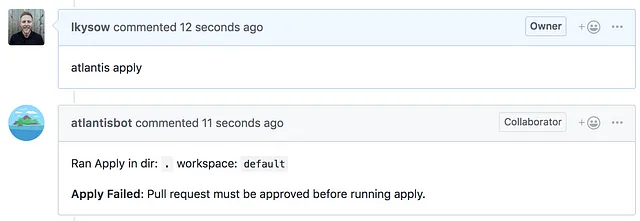
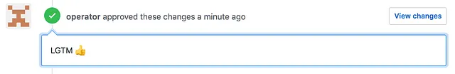
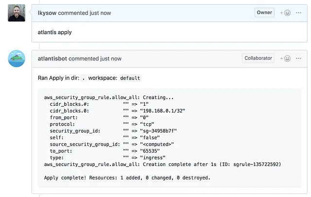

# Poniendo el Dev en DevOps: Por qué tus desarrolladores también deberían escribir Terraform

::: info
Esta publicación fue escrita originalmente el 29 de agosto de 2018

Publicación original: <https://medium.com/runatlantis/putting-the-dev-into-devops-why-your-developers-should-write-terraform-too-d3c079dfc6a8>
:::

[Terraform](https://www.terraform.io/) es una herramienta increíble para aprovisionar infraestructura. Terraform permite a tus operadores realizar su trabajo más rápido y de forma más confiable.

**Pero si solo tu equipo de ops está escribiendo Terraform, te lo estás perdiendo.**

Terraform no es solo una herramienta que hace a los equipos de ops más eficaces. Adoptar Terraform es una oportunidad para convertir a todos tus desarrolladores en operadores (al menos para tareas más pequeñas). Esto puede hacer a todo tu equipo de ingeniería más eficaz y crear una mejor relación entre desarrolladores y operadores.

### Breve aparte — ¿Qué es Terraform?

Terraform son dos cosas. Es un lenguaje para describir infraestructura:

```tf
resource "aws_instance" "example" {
  ami           = "ami-2757f631"
  instance_type = "t2.micro"
}
```

Y es una herramienta CLI que lee código Terraform y hace llamadas API a AWS (o a cualquier otro proveedor de nube) para aprovisionar esa infraestructura.

En este ejemplo, estamos usando la CLI para ejecutar `terraform apply` que creará una instancia EC2:

```sh
$ terraform apply

Terraform will perform the following actions:

  # aws_instance.example
  + aws_instance.example
      ami:              "ami-2757f631"
      instance_type:    "t2.micro"
      ...

Plan: 1 to add, 0 to change, 0 to destroy.

Do you want to perform these actions?
  Terraform will perform the actions described above.
  Only 'yes' will be accepted to approve.

  Enter a value: yes

aws_instance.example: Creating...
  ami:              "" => "ami-2757f631"
  instance_type:    "" => "t2.micro"
  ...

aws_instance.example: Still creating... (10s elapsed)
aws_instance.example: Creation complete

Apply complete! Resources: 1 added, 0 changed, 0 destroyed.
```

## Adopción de Terraform desde la perspectiva de un dev

Adoptar Terraform es genial para la eficacia de tu equipo de operaciones, pero no cambia mucho para los devs. Antes de la adopción de Terraform, los devs normalmente interactuaban con un equipo de ops así:



1. **Dev: Crea un ticket solicitando algo de trabajo de ops**
2. **Dev: Espera**
3. _Ops: Mira el ticket cuando está en la cola_
4. _Ops: Hace el trabajo_
5. _Ops: Actualiza el ticket_
6. **Dev: Continúa su trabajo**

Después de que el equipo de Ops adopta Terraform, ¡el workflow desde la perspectiva de un dev es el mismo!


1. **Dev: Crea un ticket solicitando algo de trabajo de ops**
2. **Dev: Espera**
3. _Ops: Mira el ticket cuando está en la cola_
4. _Ops: Hace el trabajo. Esta vez usando Terraform (TF)_
5. _Ops: Actualiza el ticket_
6. **Dev: Continúa su trabajo**

Con Terraform, hay menos del Paso 2 (Dev: Espera), pero aparte de eso, no ha cambiado mucho.

> Si solo ops está escribiendo Terraform, la experiencia de tus desarrolladores es la misma.

## Los devs quieren ayudar

A los desarrolladores les encantaría ayudar con trabajo de operaciones. Saben que para cambios pequeños deberían poder hacer el trabajo ellos mismos (con una revisión de ops). Por ejemplo:

- Agregar una nueva regla de security group
- Aumentar el tamaño de un autoscaling group
- Usar una instancia más grande porque su app necesita más memoria

Los desarrolladores podrían hacer todos estos cambios porque son pequeños y están bien definidos. Además, ejemplos previos de hacer lo mismo pueden guiarlos.

## ...Pero a menudo no se les permite

En muchas organizaciones, los devs están excluidos de la consola de nube.



Podrían estar excluidos por buenas razones:

- Seguridad — Puedes hacer mucho daño con acceso completo a una consola de nube
- Cumplimiento — Tal vez tu cumplimiento requiere que solo ciertos grupos tengan acceso
- Costo — Los devs podrían crear algunos recursos costosos y luego olvidarse de ellos

Incluso si tienen acceso, las operaciones pueden ser complicadas:

- A menudo es difícil hacer cosas aparentemente simples (piensa en agregar una regla de security group que también requiere VPCs con peering). Esto significa que simplemente tener acceso a veces no es suficiente. Los devs podrían necesitar ayuda de un experto para hacer las cosas.

## Entra Terraform

Con Terraform, todo cambia. O al menos puede cambiar.

Ahora los devs pueden ver en el código cómo se construye la infraestructura. Pueden ver el lugar exacto donde se configuran las reglas de security group:

```tf
resource "aws_security_group_rule" "allow_all" {
  type              = "ingress"
  from_port         = 0
  to_port           = 65535
  protocol          = "tcp"
  cidr_blocks       = ["0.0.0.0/0"]
  security_group_id = "sg-123456"
}

resource "aws_security_group_rule" "allow_office" {
  ...
}
```

O donde se establece el tamaño del autoscaling group:

```tf
resource "aws_autoscaling_group" "asg" {
  name               = "my-asg"
  max_size           = 5
  desired_capacity   = 4
  min_size           = 2
  ...
}
```

Los devs entienden el código (¡sorpresa!) así que es mucho más fácil para ellos hacer esos cambios pequeños.

Aquí está el nuevo workflow:


1. **Dev: Escribe código Terraform**
2. **Dev: Crea pull request**
3. _Ops: Revisa pull request_
4. **Dev: Aplica el cambio con Terraform (TF)**
5. **Dev: Continúa su trabajo**

Ahora:

- Los devs están haciendo cambios pequeños ellos mismos. Esto ahorra tiempo y aumenta la velocidad de toda la organización de ingeniería.
- Los devs pueden ver exactamente qué se requiere para hacer el cambio. Esto significa que hay menos ida y vuelta sobre un ticket: “Bien, entonces sé que necesitas que el security group esté abierto entre el servidor A y B, ¿pero en qué puertos y con qué protocolo?”
- Los devs empiezan a ver cómo se construye la infraestructura. Esto aumenta la cooperación entre dev y ops porque pueden entender el trabajo del otro.

¡Genial! Pero hay otro problema.

## Los devs también están excluidos de Terraform

¡Para ejecutar Terraform necesitas tener credenciales de nube! Es realmente difícil escribir Terraform sin poder ejecutar `terraform init` e `terraform plan`, por la misma razón por la que sería difícil escribir código si nunca pudieras ejecutarlo localmente.

Entonces, ¿volvimos al punto de partida?

## Entra Atlantis

[Atlantis](https://www.runatlantis.io/) es una herramienta de [código abierto](https://github.com/runatlantis/atlantis) para ejecutar Terraform desde pull requests. Con Atlantis, Terraform se ejecuta en un servidor separado (Atlantis es self-hosted), así que no necesitas entregar credenciales a todos. El acceso se controla a través de aprobaciones de pull request.

Así es como se ve el workflow:

### Paso 1 — Crear un Pull Request

Un desarrollador crea un pull request con su cambio para agregar una regla de security group.



### Paso 2 — Atlantis ejecuta Terraform Plan

Atlantis ejecuta automáticamente `terraform plan` y comenta de vuelta en el pull request con la salida. Ahora los desarrolladores pueden corregir sus errores de Terraform antes de pedir una revisión.



### Paso 3 — Corregir el Terraform

El desarrollador envía un nuevo commit que corrige su error y Atlantis comenta de vuelta con la salida válida de `terraform plan`. Ahora el desarrollador puede verificar que la salida del plan se vea bien.



### Paso 4 — Obtener aprobación

Probablemente querrás ejecutar Atlantis con la bandera --require-approval que requiere que los pull requests estén Approved antes de ejecutar atlantis apply.



### Paso 4a — Realmente obtener aprobación

Un operador ahora puede venir y revisar los cambios y la salida de `terraform plan`. Esto es mucho más rápido que hacer el cambio ellos mismos.



### Paso 5 — Apply

Para aplicar los cambios, el desarrollador o el operador comenta “atlantis apply”.



## Éxito

Ahora tenemos un workflow que hace feliz a todos:

- Los devs pueden escribir Terraform e iterar en el pull request hasta que el `terraform plan` se vea bien
- Los operadores pueden revisar pull requests y aprobar los cambios antes de que se apliquen

Ahora los desarrolladores pueden hacer pequeños cambios de operaciones y aprender más sobre cómo se construye la infraestructura. Todos pueden trabajar de manera más efectiva y con un entendimiento compartido que mejora la colaboración.

## ¿Funciona en la práctica?

Atlantis ha sido usado por mi empresa anterior, Hootsuite, durante más de 2 años. ¡Es usado diariamente por 20 operadores pero también es usado ocasionalmente por más de 60 desarrolladores!
Otra empresa usa Atlantis para gestionar más de 600 repos de Terraform en los que colaboran más de 300 desarrolladores y operadores.

## Próximos pasos

- Si quieres aprender más sobre Terraform, revisa la [Introducción a Terraform](https://developer.hashicorp.com/terraform/intro) de HashiCorp
- Si quieres probar Atlantis, ve a <www.runatlantis.io>
- Si tienes alguna pregunta, contáctame en Twitter ([at]lkysow) o en los comentarios abajo.

## Créditos

- Gracias a [Seth Vargo](https://medium.com/@sethvargo) por su charla [Version-Controlled Infrastructure with GitHub](https://www.youtube.com/watch?v=2TWqi7dLSro) que inspiró gran parte de esta publicación.
- Gracias a Isha por leer borradores de esta publicación.
- Iconos en gráficos hechos por [Freepik](https://www.freepik.com/) de [Flaticon](https://www.flaticon.com/) y con licencia [CC 3.0](https://creativecommons.org/licenses/by/3.0/)
