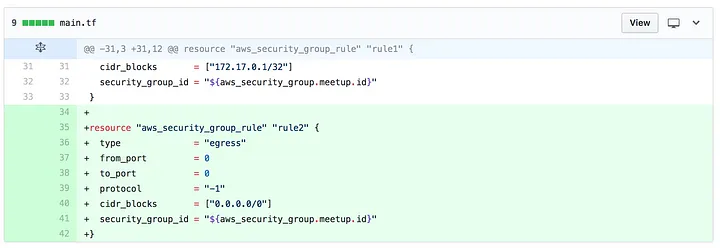
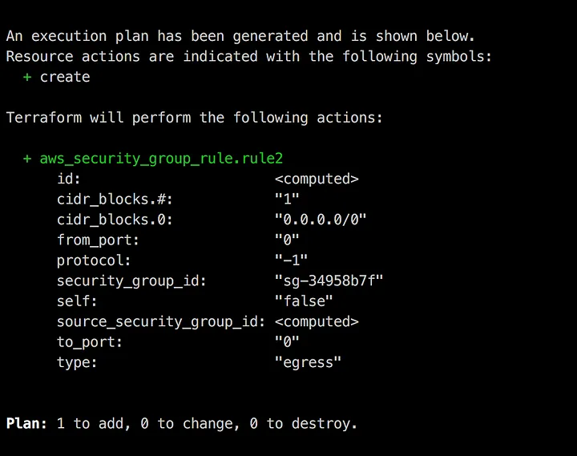
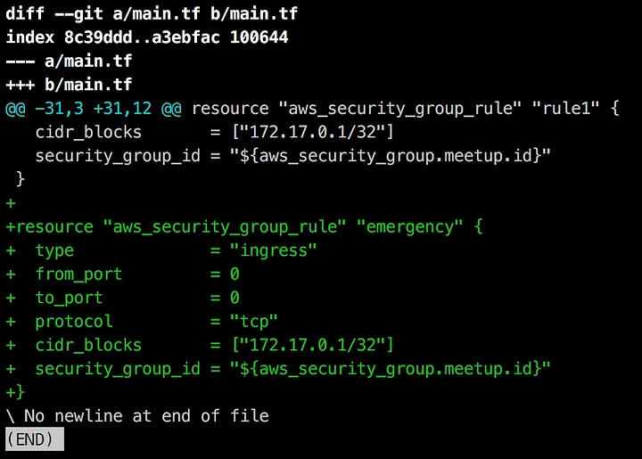
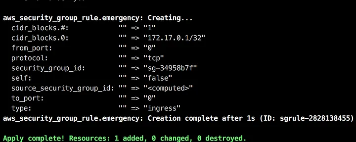
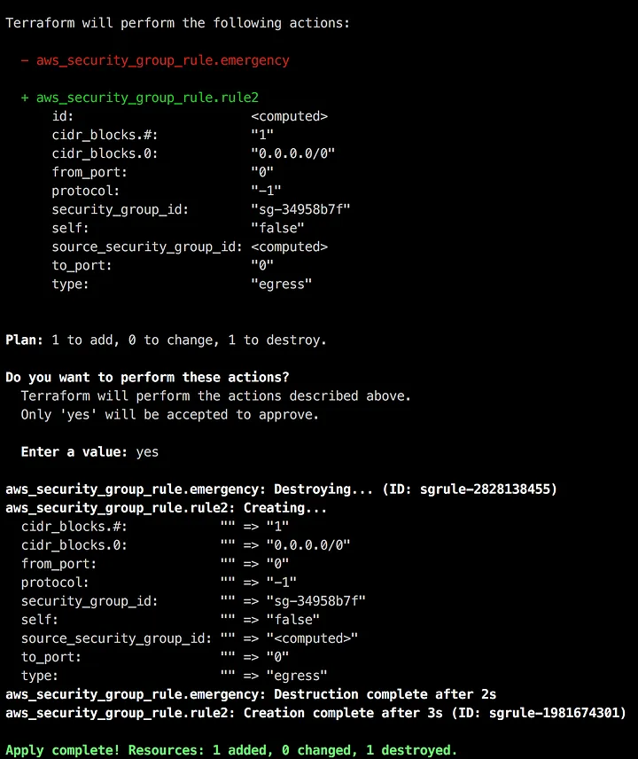
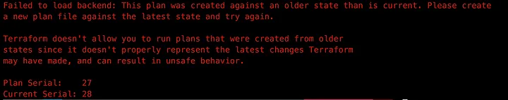
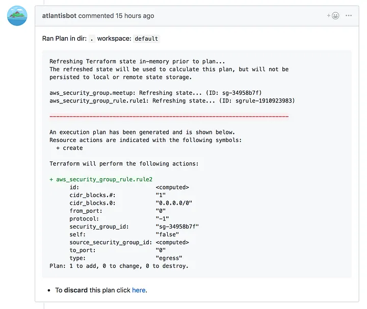
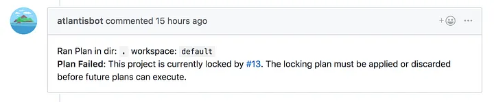
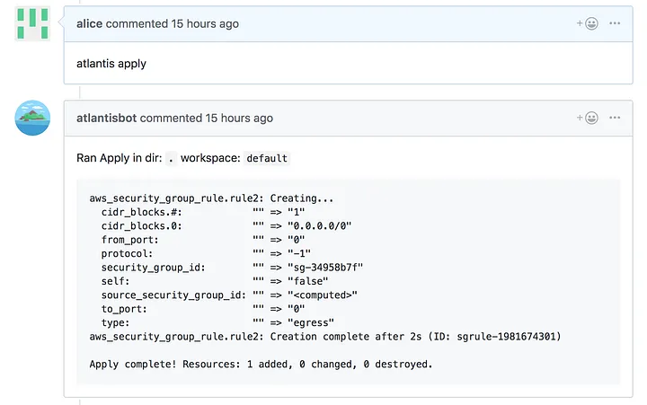
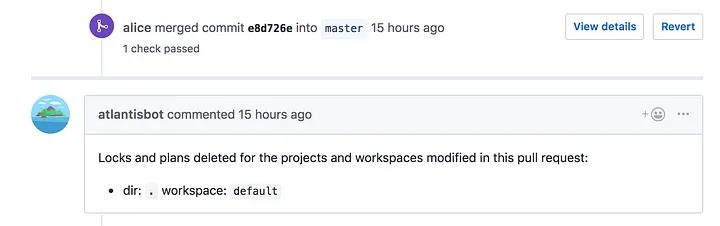

# Terraform y los peligros de hacer apply localmente

::: info
Esta publicación fue escrita originalmente el 13 de julio de 2018

Publicación original: <https://medium.com/runatlantis/terraform-and-the-dangers-of-applying-locally-543563782a73>
:::

Si estás usando Terraform, entonces en algún momento probablemente ejecutaste un `terraform apply` que revirtió el cambio de otra persona.

Así es como eso tiende a suceder:

## La preparación

Digamos que tenemos dos desarrolladores: Alice y Bob. Alice necesita agregar una nueva regla de grupo de seguridad. Ella hace checkout de una nueva rama, agrega su regla y crea un pull request:

Cuando ejecuta `terraform plan` localmente ve lo que espera.

Mientras tanto, Bob está trabajando en una corrección de emergencia. Hace checkout de una nueva rama y agrega una regla de grupo de seguridad diferente llamada `emergency`:

Y, porque es una emergencia, **ejecuta apply inmediatamente**:

Ahora volvamos a Alice. Acaba de recibir aprobación sobre el cambio de su pull request y entonces ejecuta `terraform apply`:

¿Viste lo que pasó? ¿Notaste que el `apply` eliminó la regla de Bob?

En este ejemplo, no fue demasiado difícil verlo. Sin embargo, si el plan es mucho más largo, o si el cambio es menos obvio, entonces puede ser fácil pasarlo por alto.

## Posibles soluciones

Hay algunas maneras de evitar esto:

### Usar terraform plan `-out`

Si Alice hubiera ejecutado `terraform plan -out plan.tfplan`, entonces cuando ejecutara `terraform apply plan.tfplan` vería:

¡El problema con esta solución es que hoy en día poca gente ejecuta `terraform plan`, y mucho menos `terraform plan -out`!

<iframe src="https://cdn.embedly.com/widgets/media.html?type=text%2Fhtml&amp;key=a19fcc184b9711e1b4764040d3dc5c07&amp;schema=twitter&amp;url=https%3A//twitter.com/sethvargo/status/989979940098424832&amp;image=https%3A//i.embed.ly/1/image%3Furl%3Dhttps%253A%252F%252Fpbs.twimg.com%252Fprofile_images%252F808025120296013825%252FfrGuc14s_400x400.jpg%26key%3Da19fcc184b9711e1b4764040d3dc5c07" allowfullscreen="" frameborder="0" height="249" width="680" title="Seth Vargo on Twitter" class="fr n gh dv bg" scrolling="no"></iframe>

Es más fácil simplemente ejecutar `terraform apply` y los humanos tomarán el camino más fácil la mayoría del tiempo.

### Envolver `terraform apply` para asegurar estar actualizado con `master`

Otra solución posible es escribir un script wrapper que asegure que nuestra rama esté actualizada con `master`. Pero esto no resuelve el problema de que Bob ejecute `apply` localmente y todavía no haga merge a `master`. En este caso, la rama de Alice habría estado actualizada con `master` pero no con el estado más reciente sobre el que se hizo apply.

### Ser más disciplinados

¿Qué pasaría si todos:

- SIEMPRE crearan una rama, obtuvieran una revisión de pull request, hicieran merge a `master` y luego ejecutaran apply. Y también todos
- SIEMPRE verificaran para asegurar que su rama fue rebasada desde `master`. Y también todos
- SIEMPRE inspeccionaran cuidadosamente la salida de `terraform plan` y se aseguraran de que fuera exactamente lo que esperaban

...¡entonces no tendríamos un problema!

Desafortunadamente, esta no es una solución real. Todos somos humanos y todos vamos a cometer errores. Confiar en que las personas sigan un proceso complicado el 100% del tiempo no es una solución porque no funciona.

## Problema central

El problema central es que todos están haciendo apply desde sus propias estaciones de trabajo y depende de ellos asegurarse de que están actualizados y de mantener `master` actualizado. Esto es como desarrolladores desplegando a producción desde sus laptops.

### ¿Qué pasaría si, en lugar de hacer apply localmente, un sistema remoto hiciera los apply?

Por eso construimos [Atlantis](https://www.runatlantis.io/): un proyecto open source para automatización de Terraform por pull request. También podrías lograr esto con tu propio sistema de CI o con [Terraform Enterprise](https://www.hashicorp.com/products/terraform). Así es como Atlantis resuelve este problema:

Cuando Alice hace su cambio, crea un pull request y Atlantis ejecuta automáticamente `terraform plan` y comenta en el pull request.

Cuando Bob hace su cambio, crea un pull request y Atlantis ejecuta automáticamente `terraform plan` y comenta en el pull request.

Atlantis también **bloquea el directorio** para asegurar que nadie más pueda ejecutar `plan` o `apply` hasta que el plan de Alice haya sido eliminado intencionalmente o ella haga merge del pull request.

Si Bob crea un pull request para su cambio de emergencia vería este error:

Alice puede entonces comentar `atlantis apply` y Atlantis ejecutará el apply por sí mismo:

Finalmente, ella hace merge del pull request y desbloquea la rama de Bob:

### ¿Pero qué pasa si Bob ejecutó `apply` localmente?

En ese caso, Alice todavía está bien porque cuando Atlantis ejecutó `terraform plan` usó `-out`. Si Alice intenta aplicar ese plan, Terraform dará un error porque el plan fue generado contra un estado antiguo.

### ¿Por qué Atlantis ejecuta `apply` en la rama y no después de un merge a `master`?

Hacemos esto porque `terraform apply` falla bastante a menudo, a pesar de que `terraform plan` tenga éxito. Usualmente es por un problema de dependencia entre recursos o porque el proveedor de nube requiere un cierto formato o que un cierto campo esté establecido. De todos modos, en la práctica hemos encontrado que `apply` falla mucho.

Al bloquear el directorio, esencialmente estamos asegurando que la rama sobre la que se hace `apply` está `"master"` ya que nadie más puede modificar ese estado. Luego obtenemos el beneficio de poder iterar sobre el pull request y hacer push de pequeñas correcciones hasta estar seguros de que el conjunto de cambios está `apply`. Si `apply` fallara después de hacer merge a `master`, tendríamos que abrir nuevos pull requests una y otra vez. Definitivamente hay un tradeoff aquí, sin embargo creemos que es el tradeoff correcto.

## Conclusión

En conclusión, ejecutar `terraform apply` cuando trabajas con un equipo de operadores puede ser peligroso. Recurre a soluciones como tu propio CI, Atlantis o Terraform Enterprise para asegurar que siempre estás trabajando sobre el código más reciente sobre el que se hizo `apply`.

Si quieres probar Atlantis, puedes comenzar aquí: <https://www.runatlantis.io/guide/>
