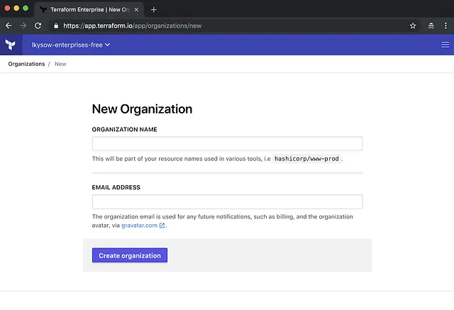
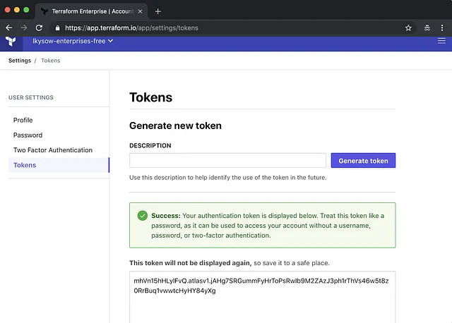
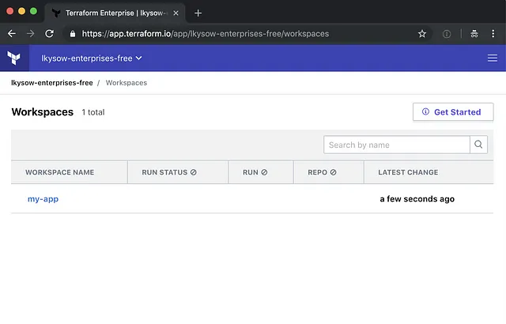
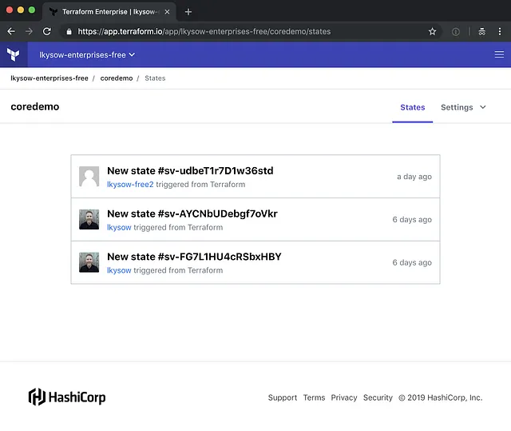
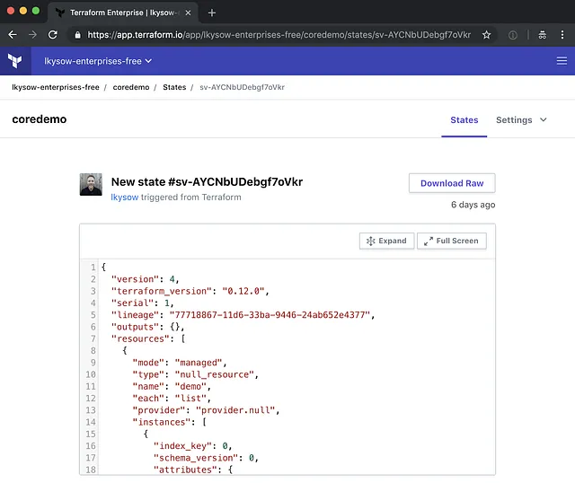
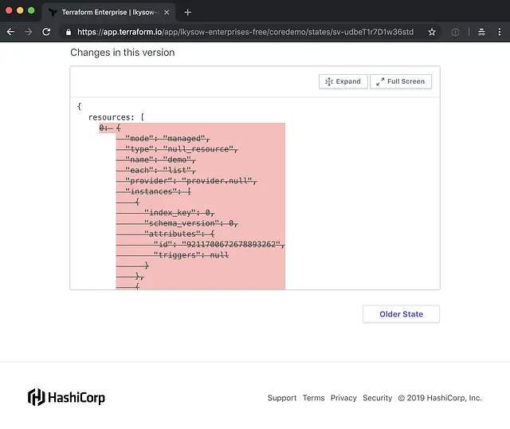
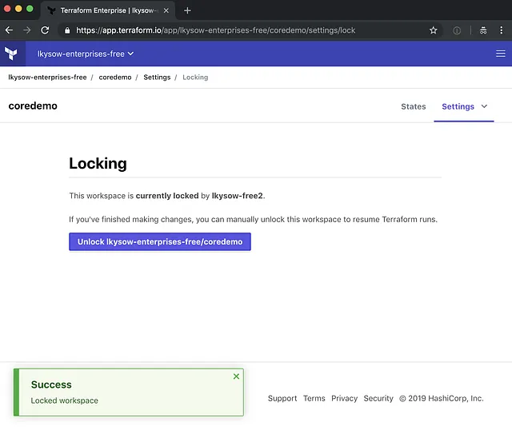
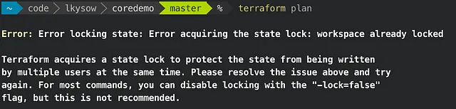

# 4 razones para probar el nuevo almacenamiento remoto de state gratuito de Terraform de HashiCorp

::: info
Esta publicación fue escrita originalmente el 2 de abril de 2019

Publicación original: <https://medium.com/runatlantis/4-reasons-to-try-hashicorps-new-free-terraform-remote-state-storage-b03f01bfd251>
:::

Actualización (20 de mayo de 2019) — Free State Storage ahora se llama Terraform Cloud y ya salió de Beta, lo que significa que cualquiera puede registrarse.

HashiCorp planea ofrecer almacenamiento remoto de state gratuito de Terraform y tienen una versión beta disponible ahora. En este artículo, hablo de 4 razones por las que deberías probarlo (Divulgación: trabajo en HashiCorp).

> _[Regístrate en Terraform Cloud](https://goo.gl/X5t5EM)._

## ¿Qué es Terraform State?

Antes de entrar en por qué deberías usar el nuevo almacenamiento remoto de state, hablemos de qué queremos decir exactamente con state en Terraform.

Terraform usa _state_ para mapear tu código de Terraform a los recursos del mundo real que aprovisiona. Por ejemplo, si tengo código de Terraform para crear una instancia EC2 de AWS:

```tf
resource "aws_instance" "web" {
  ami           = "ami-e6d9d68c"
  instance_type = "t2.micro"
}
```

Cuando ejecuto `terraform apply`, Terraform hará una llamada API de “crear instancia EC2” a AWS y AWS devolverá el ID único de esa instancia (p. ej. `i-0ad17607e5ee026d0`). Terraform necesita registrar ese ID en algún lugar para que más tarde pueda hacer llamadas API para cambiar o eliminar la instancia.

Para almacenar esta información, Terraform usa un archivo de state. Para el código anterior, el archivo de state se verá algo así:

```json{4,7}
{
    ...
    "resources": {
      "aws_instance.web": {
        "type": "aws_instance",
        "primary": {
          "id": "i-0ad17607e5ee026d0",
     ...
}
```

Aquí puedes ver que el recurso `aws_instance.web` de nuestro código de Terraform está mapeado al ID de instancia `i-0ad17607e5ee026d0`.

Entonces, si el state de Terraform es solo un archivo, ¿qué es el state remoto?

## State remoto

Por defecto, Terraform escribe su archivo de state en tu sistema de archivos local. Esto está bien para proyectos personales, pero una vez que empiezas a trabajar con un equipo, las cosas se complican. En un equipo, necesitas asegurarte de que todos tengan una versión actualizada del archivo de state **y** asegurarte de que dos personas no estén haciendo cambios concurrentes.

¡Aquí entra el state remoto! El state remoto es simplemente almacenar el archivo de state de forma remota, en lugar de hacerlo en tu sistema de archivos. Con state remoto, solo hay una copia, por lo que Terraform puede asegurar que siempre estás actualizado. Para evitar que los miembros del equipo modifiquen el state al mismo tiempo, Terraform puede bloquear el state remoto.

> El state remoto es simplemente almacenar el archivo de state de forma remota, en lugar de hacerlo en tu sistema de archivos.

Muy bien, entonces el state remoto es genial, pero desafortunadamente configurarlo puede ser un poco complicado. En AWS, puedes almacenarlo en un bucket de S3, pero necesitas crear el bucket, configurarlo correctamente, establecer sus permisos correctamente, crear una tabla de DynamoDB para el locking y luego asegurarte de que todos tengan las credenciales adecuadas para escribir en él. Es prácticamente la misma historia en las otras nubes.

Como resultado, configurar state remoto puede ser un obstáculo molesto cuando los equipos adoptan Terraform.

Esto nos lleva a la primera razón para probar el Free Remote State Storage de HashiCorp...

## Razón #1 — Fácil de configurar

A diferencia de otras soluciones de state remoto que requieren una configuración complicada para hacerlo bien, configurar almacenamiento remoto de state gratuito es fácil.

> Configurar el almacenamiento remoto de state gratuito de HashiCorp es fácil

Paso 1 — Regístrate para obtener tu cuenta [gratuita de Terraform Cloud](https://app.terraform.io/signup)

Paso 2 — Cuando inicies sesión, llegarás a esta página donde crearás tu organización:



Paso 3 — A continuación, ve a User Settings y genera un token:



Paso 4 — Toma este token y crea un archivo local ~/.terraformrc:

```tf
credentials "app.terraform.io" {
  token = "mhVn15hHLylFvQ.atlasv1.jAH..."
}
```

Paso 5 — ¡Eso es todo! Ahora estás listo para almacenar tu state.

En tu proyecto de Terraform, agrega un bloque `terraform`:

```tf{3,5}
terraform {
  backend "remote" {
    organization = "my-org" # org name from step 2.
    workspaces {
      name = "my-app" # name for your app's state.
    }
  }
}
```

Ejecuta `terraform init` y ¡listo! Tu state ahora se está almacenando en Terraform Enterprise. Puedes ver el state en la UI:



Hablando de ver el state en una UI...

## Razón #2 — Visualizador de state con todas las funciones

La segunda razón para probar Terraform Cloud es su visualizador de state con todas las funciones:



Si alguna vez has estropeado tu state de Terraform y has necesitado descargar una versión anterior o has querido un registro de auditoría para saber quién cambió qué, entonces te encantará esta funcionalidad.

Puedes ver el archivo de state completo en cada punto en el tiempo:



También puedes ver el diff de lo que cambió:



Por supuesto, puedes encontrar una forma de obtener esta información de algunos de los otros backends de state, pero es difícil. Con el almacenamiento remoto de state de HashiCorp, lo obtienes gratis.

## Razón #3 — Locking manual

La tercera razón para probar Terraform Cloud es la capacidad de bloquear manualmente tu state.

¿Alguna vez has estado trabajando en una parte de infraestructura y has querido asegurarte de que nadie pudiera hacer cambios en ella al mismo tiempo?

Terraform Cloud incluye la capacidad de bloquear y desbloquear states desde la UI:



Mientras el state está bloqueado, las operaciones de `terraform` recibirán un error:



Esto te ahorra muchas de estas:


## Razón #4 — Funciona con Atlantis

La razón final para probar Terraform Cloud es que funciona perfectamente con [Atlantis](https://www.runatlantis.io/).

Establece una variable de entorno `ATLANTIS_TFE_TOKEN` en un token de TFE y estarás listo. Ve a <https://www.runatlantis.io/docs/terraform-cloud.html> para saber más.

Conclusión
Te animo encarecidamente a probar el nuevo backend gratuito de almacenamiento remoto de state. Es una oferta convincente frente a otros backends de state gracias a su facilidad de configuración, su visualizador de state con todas las funciones y sus capacidades de locking.

Si no estás en la lista de espera, regístrate aquí: <https://app.terraform.io/signup>.
