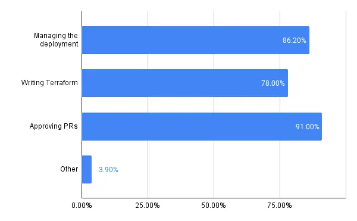
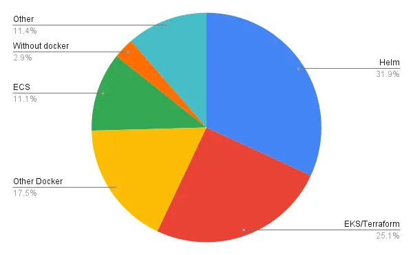
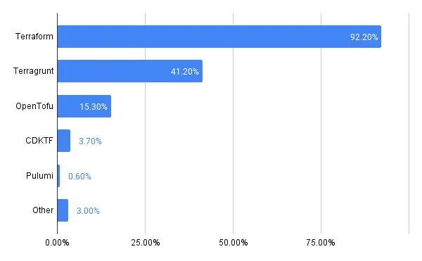
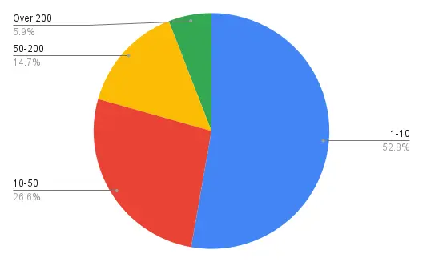
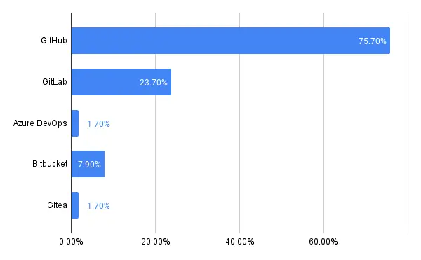
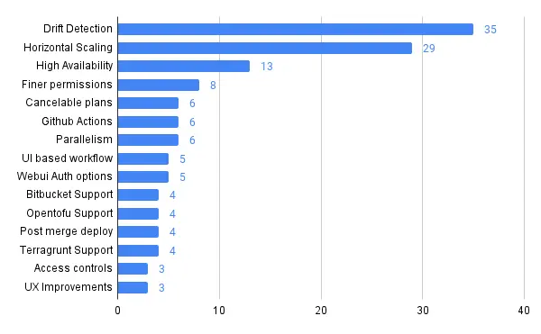

# Resultados de la encuesta de usuarios de Atlantis

En abril de 2024, el Core Atlantis Team lanzó una encuesta anónima para nuestros usuarios. Durante los dos meses que la encuesta estuvo abierta recibimos 354 respuestas, que usaremos para comprender mejor las necesidades de nuestra comunidad y ayudar a priorizar nuestra hoja de ruta.

En general, los resultados a continuación muestran que tenemos un conjunto diverso de usuarios entusiastas, y que aunque muchos siguen con la configuración clásica de Atlantis (un puñado de repos que ejecutan terraform contra AWS en GitHub), hay muchos casos de uso y direcciones diferentes hacia los que la comunidad va y le gustaría ver que Atlantis soporte.

Estamos agradecidos con todos los que se tomaron el tiempo para compartir sus experiencias con Atlantis. Planeamos realizar este tipo de encuesta de forma semirregular, ¡mantente atento!

## Resultados anonimizados

### ¿Cómo interactúas con Atlantis?

Como era de esperar, la mayoría de los usuarios de Atlantis desempeñan múltiples roles, involucrados en todo el proceso de desarrollo.

### Cómo despliegas Atlantis tú/tu organización

La mayoría de los usuarios de terraform despliegan usando Kubernetes y/o AWS. "Other Docker" usa docker pero no usa EKS ni Helm directamente, mientras que una minoría usa alguna otra combinación de tecnologías.

### ¿Qué herramienta(s) de Infrastructure as Code (IaC) usas con Atlantis?

La gran mayoría de los usuarios de Atlantis todavía están usando terraform como alguna parte de su despliegue. Aproximadamente la mitad de ellos además están usando Terragrunt, y OpenTofu parece estar ganando algo de terreno.

### ¿Cuántos repositorios gestiona tu Atlantis?

La mayoría de los usuarios tienen huellas relativamente modestas para gestionar con Atlantis (aunque algunos monorepos grandes podrían estar ocultos en los números).

### ¿Qué sistemas de control de versiones (VCSs) usas?

La mayoría de los usuarios de Atlantis están usando GitHub, con una porción considerable en GitLab, seguido por Bitbucket y otros. Esto es análogo al soporte y las solicitudes de funcionalidades que los maintainers ven para los varios VCSs en la base de código.

### ¿Cuál es la funcionalidad más importante que consideras que falta en Atlantis?

Como esta es una pregunta de respuesta libre, hubo una larga cola de respuestas, por lo que lo anterior solo muestra respuestas después de normalizar que tenían tres o más instancias.

Drift Detection así como las mejoras de infraestructura fueron los ganadores obvios aquí. Después de eso, los usuarios se enfocaron en varias integraciones y mejoras de la UI.

## Conclusión

Siempre es interesante y emocionante para el equipo central ver la amplitud del uso de Atlantis, y esperamos usar esta información para comprender las necesidades de la comunidad. Atlantis siempre ha sido un esfuerzo liderado por la comunidad, y esperamos continuar llevando ese espíritu hacia adelante!
