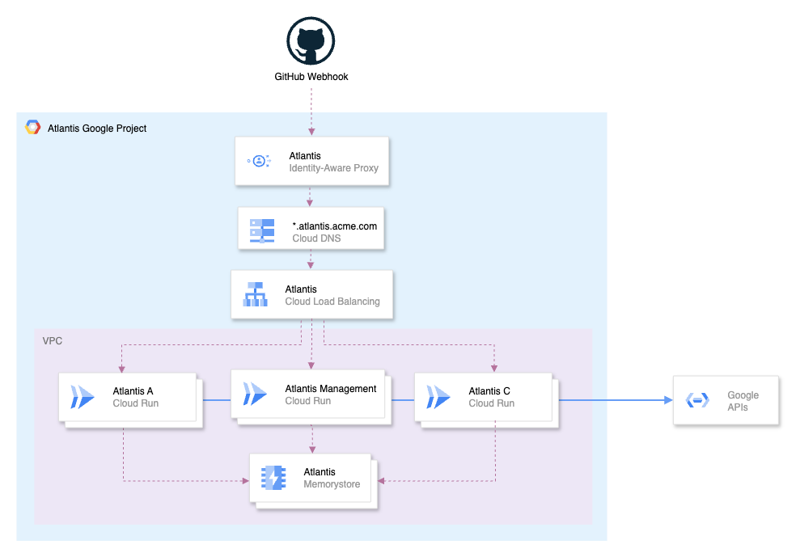

# Atlantis en Google Cloud Run

::: info
Aunque está escrita para Google Cloud Run, esta arquitectura de despliegue también aplica a AWS Fargate, Azure Container Instances y Kubernetes.
:::

::: info
Esta entrada del blog cubre las partes más importantes del código de Terraform. Para un ejemplo completo y funcional, consulta nuestro [atlantis-on-gcp-cloud-run example](https://github.com/runatlantis/atlantis-contrib/tree/main/atlantis-on-cloud-run).
:::

La mayoría de los despliegues de Atlantis se ejecutan en VMs autogestionadas. Aunque esta es una opción conocida y sencilla, viene con desafíos. Las identidades a menudo se vuelven demasiado poderosas, con acceso directo o indirecto —mediante impersonation— a muchos recursos y proyectos. La alta disponibilidad también falta: Atlantis escribe su backend de locking directamente en disco, así que si la VM deja de funcionar, Atlantis queda no disponible. En resumen, las VMs autogestionadas crean un único punto de falla, no ofrecen escalado horizontal y exigen mantenimiento continuo —desde parchado y actualizaciones del SO hasta respaldos.

En esta entrada del blog, mostraremos cómo ejecutar Atlantis en plataformas serverless de contenedores como Google Cloud Run. En lugar de una sola instancia, usaremos una base de datos central para locking y desplegaremos múltiples instancias de Atlantis detrás de un balanceador de carga. Cada instancia se ejecuta con su propia identidad y permisos limitados, gestionando solo sus propios proyectos. Esta arquitectura elimina el único punto de falla, permite escalado horizontal y habilita un modelo de seguridad de mínimo privilegio.

## Lo que construiremos

Aquí hay una vista general de alto nivel de la arquitectura que construiremos:



1. Un balanceador de carga HTTP(S) externo para enrutar solicitudes a múltiples instancias de Atlantis.
2. Múltiples instancias de Atlantis ejecutándose en Google Cloud Run.
3. Una instancia de Memorystore for Redis para proporcionar un backend central de locking.

::: info
Si quieres ir directamente al grano, puedes encontrar el código de Terraform para esta arquitectura en nuestro [atlantis-on-gcp-cloud-run example](https://github.com/runatlantis/atlantis-contrib/tree/main/atlantis-on-cloud-run).

Sin embargo, recomendamos leer el resto de esta entrada del blog para entender cómo funciona todo.
:::

## Dejamos cosas afuera

Para mantener esta publicación en una longitud razonable, hemos dejado afuera algunos detalles importantes. Por ejemplo, no cubrimos la configuración de red, DNS, cómo obtener una imagen de Docker o certificados TLS wildcard, ni profundizamos en cada perilla e interruptor de Atlantis; nuestro enfoque aquí está en las partes más relevantes para la arquitectura. Dicho eso, recomendamos firmemente ejecutar Atlantis en una VPC aislada con [Private Service Access](https://cloud.google.com/vpc/docs/configure-private-services-access) habilitado. Esto garantiza que Atlantis solo hable con las APIs de Google para hacer su trabajo, sin alcanzar nunca tu otra infraestructura.

## BoltDB: excelente, si solo tienes un escritor

Atlantis usa [BoltDB](https://github.com/boltdb/bolt) como su backend de locking predeterminado. BoltDB es un almacén simple de clave-valor embebido que escribe directamente en disco. Esto funciona bien para despliegues de una sola instancia, pero BoltDB fija a Atlantis en una arquitectura de un solo nodo. Para lograr alta disponibilidad y escalado horizontal, necesitas reemplazarlo con una base de datos gestionada y distribuida que múltiples instancias de Atlantis puedan compartir de forma segura.

## Un Atlantis para gobernarlos a todos

Para facilitar la creación y gestión de múltiples instancias de Atlantis, también desplegaremos una instancia dedicada de Atlantis de “gestión”. Esta instancia será responsable de gestionar el ciclo de vida de las otras instancias de Atlantis, incluyendo crearlas, actualizarlas y eliminarlas según sea necesario. Usualmente mantengo esto en un proyecto separado de Google Cloud llamado `atlantis-mgmt`, junto con un repositorio Git dedicado para este propósito.

Una vez que tengas una instancia configurada, es sencillo replicarla y colocarla detrás de un balanceador de carga compartido.

## Redis: un backend distribuido de locking

Desde Atlantis v0.19.0, Redis es un backend de locking soportado. Redis es un almacén en memoria de estructuras de datos que usaremos para proporcionar un backend central de locking para múltiples instancias de Atlantis. Cada instancia se conectará a la misma instancia de Redis, lo que les permitirá coordinar locks y evitar conflictos.

Redis también soporta persistencia, mediante RDB (Redis Database), que realiza snapshots point-in-time del conjunto de datos en intervalos especificados, y AOF (Append Only File), que registra cada operación de escritura recibida por el servidor Redis. Esto significa que incluso si la instancia de Redis deja de funcionar, no perdemos nuestros locks.

Nuestro primer recurso a crear es una instancia de Redis:

```tf
resource "google_redis_instance" "atlantis" {
  name               = "atlantis"
  tier               = "STANDARD_HA"
  redis_version      = "REDIS_7_2"
  memory_size_gb     = 1
  region             = "your-region"
  authorized_network = "your-network-id"
  connect_mode       = "PRIVATE_SERVICE_ACCESS"
  persistence_config {
    persistence_mode    = "RDB"
    rdb_snapshot_period = "TWENTY_FOUR_HOURS"
  }
  maintenance_policy {
    # ...
  }
  project = "your-project-id"
  lifecycle {
    prevent_destroy = true
  }
}
```

Esto crea una instancia de Redis con 1 GiB de memoria y habilita RDB, tomando snapshots cada 24 horas. El `connect_mode` está configurado en `PRIVATE_SERVICE_ACCESS`, por lo que la instancia de Redis solo es accesible desde dentro de tu VPC. Asegúrate de que [Private Service Access](https://cloud.google.com/vpc/docs/configure-private-services-access) esté configurado en tu VPC antes de crear la instancia.

## Despliegue en Cloud Run

Cloud Run es una plataforma serverless de contenedores que escala automáticamente tus aplicaciones, maneja solicitudes HTTP y abstrae la infraestructura. Pagas solo por el cómputo que usas, y cada servicio se ejecuta bajo una única service account que define sus permisos. Esto lo hace una gran opción para una o más instancias de Atlantis.

Comenzaremos creando una configuración de Atlantis del lado del servidor, `atlantis/management.yaml`:

```yaml
repos:
  - id: github.com/acme/example
    apply_requirements: [approved, mergeable]
    import_requirements: [approved, mergeable]
    allowed_overrides: ["workflow"]
    allowed_workflows: ["example"]
    delete_source_branch_on_merge: true

workflows:
  example:
    plan:
      steps:
        - init
        - plan
    apply:
      steps:
        - apply
```

::: info
La siguiente configuración de Terraform resalta solo las variables de entorno de Atlantis que son relevantes para esta entrada del blog. Para un ejemplo completo y funcional, consulta nuestro [atlantis-on-gcp-cloud-run example](https://github.com/runatlantis/atlantis-contrib/tree/main/atlantis-on-cloud-run).
:::

Comienza creando la instancia de Atlantis de gestión. Debajo de esta configuración de Terraform, encontrarás detalles sobre las opciones de configuración —como variables de entorno y otros ajustes importantes— que configuran Atlantis para esta arquitectura.

```tf
resource "google_cloud_run_v2_service" "atlantis_management" {
  provider             = google-beta
  name                 = "atlantis-management"
  location             = "your-region"
  deletion_protection  = false
  ingress              = "INGRESS_TRAFFIC_INTERNAL_LOAD_BALANCER"
  invoker_iam_disabled = true
  launch_stage         = "GA"

  template {
    scaling {
      min_instance_count = 1
      max_instance_count = 1
    }
    execution_environment = "EXECUTION_ENVIRONMENT_GEN2"
    service_account       = google_service_account.atlantis_management.email
    containers {
      image = "ghcr.io/runatlantis/atlantis:v0.35.1"
      resources {
        limits = {
          cpu    = "1"
          memory = "2Gi"
        }
      }
      volume_mounts {
        name       = "atlantis"
        mount_path = "/app/atlantis"
      }
      env {
        name  = "ATLANTIS_PORT"
        value = "8080"
      }
      env {
        name  = "ATLANTIS_DATA_DIR"
        value = "/app/atlantis"
      }
      env {
        name  = "ATLANTIS_USE_TF_PLUGIN_CACHE"
        value = "true"
      }
      env {
        name  = "ATLANTIS_LOCKING_DB_TYPE"
        value = "redis"
      }
      env {
        name  = "ATLANTIS_REDIS_HOST"
        value = google_redis_instance.atlantis.host
      }
      env {
        name  = "ATLANTIS_REDIS_DB"
        value = "0"
      }
      env {
        name  = "ATLANTIS_ATLANTIS_URL"
        value = "https://management.atlantis.acme.com"
      }
      env {
        name  = "ATLANTIS_REPO_CONFIG_JSON"
        value = jsonencode(yamldecode(file("${path.module}/atlantis/management.yaml")))
      }
    }
    vpc_access {
      egress = "ALL_TRAFFIC"
      network_interfaces {
        network    = "your-network-id"
        subnetwork = "your-subnetwork-id"
      }
    }
    volumes {
      name = "atlantis"
      empty_dir {
        medium     = "MEMORY"
        size_limit = "5Gi"
      }
    }
  }
  project = "your-project-id"
}
```

## Almacenamiento efímero

Atlantis es intensivo en I/O: hace checkout de repositorios, ejecuta comandos de Terraform, descarga providers y obtiene módulos. Esto requiere un sistema de archivos escribible para almacenar datos temporales. En Cloud Run, esto se maneja con almacenamiento efímero, que se limpia cada vez que una instancia de contenedor se detiene o reinicia.

Debido a cómo opera Atlantis, sus requisitos de almacenamiento efímero son limitados: los datos de pull request se eliminan del sistema de archivos una vez que se hace merge o se cierra, los providers pueden almacenarse en caché usando `ATLANTIS_USE_TF_PLUGIN_CACHE`, y los binarios de Terraform ya están incluidos en la imagen del contenedor. Por esta razón, configuramos un volumen `empty_dir` en memoria de 5 GiB, montado en `/app/atlantis` y establecido como el `ATLANTIS_DATA_DIR`.

```tf
    # ...
    volumes {
      name = "atlantis"
      empty_dir {
        medium     = "MEMORY"
        size_limit = "5Gi"
      }
    }
    # ...
    volume_mounts {
      name       = "atlantis"
      mount_path = "/app/atlantis"
    }
   # ...
    env {
      name  = "ATLANTIS_DATA_DIR"
      value = "/app/atlantis"
    }
    env {
      name  = "ATLANTIS_USE_TF_PLUGIN_CACHE"
      value = "true"
    }
```

## Mantener una instancia caliente

Las instancias de Cloud Run pueden escalar a cero cuando no están en uso, lo que puede provocar cold starts y pérdida del almacenamiento efímero en memoria. Para evitar esto, configuramos `min_instance_count` en 1, asegurando que al menos una instancia siempre esté ejecutándose y lista para manejar solicitudes.

```tf
    scaling {
      min_instance_count = 1
      max_instance_count = 1
    }
```

## Impersonation y mínimo privilegio

Cada servicio Atlantis de Cloud Run desplegado se ejecuta bajo una service account que define su identidad. En lugar de dar a esta cuenta acceso amplio, usamos una service account que solo tiene permiso para hacer impersonation de otras service accounts más restringidas.

Esto no es algo que necesites hacer para la instancia de Atlantis de gestión, ya que esa se despliega contra un solo proyecto de todos modos, pero es importante para las otras instancias de Atlantis que gestionarán múltiples proyectos y entornos. Al usar impersonation, podemos asegurar que cada instancia de Atlantis solo tenga los permisos que necesita para gestionar sus proyectos específicos.

Por ejemplo, puedes crear una service account base de Atlantis (`atlantis-example`) y service accounts separadas para cada entorno (p. ej. `atlantis-example-dev`, `atlantis-example-prod`). A la cuenta base se le concede el rol `roles/iam.serviceAccountTokenCreator` en esas cuentas de entorno, y hace impersonation de ellas cuando Atlantis ejecuta comandos de Terraform.

A su vez, a estas service accounts específicas de entorno se les conceden solo los permisos requeridos sobre los proyectos que gestionan. Esto garantiza que si una instancia de Atlantis se ve comprometida, el radio de impacto se limite solo a los recursos que esa instancia gestiona.

Aquí hay un ejemplo de cómo configurar esto en Terraform:

```tf
locals {
  atlantis_network_service_accounts = [
    "atlantis-example-dev",
    "atlantis-example-prod",
  ]
}

# Base Atlantis service account
resource "google_service_account" "atlantis_example" {
  account_id = "atlantis-example"
  project    = local.project_id
}

# Per-environment service accounts
resource "google_service_account" "atlantis_example_service_accounts" {
  for_each   = toset(local.atlantis_example_service_accounts)
  account_id = each.value
  project    = local.project_id
}

# Allow base SA to impersonate the env-specific ones
resource "google_service_account_iam_member" "atlantis_example_impersonation" {
  for_each           = google_service_account.atlantis_example_service_accounts
  service_account_id = each.value.name
  role               = "roles/iam.serviceAccountTokenCreator"
  member             = "serviceAccount:${google_service_account.atlantis_example.email}"
}
```

La impersonation en sí se habilita estableciendo la variable de entorno `GOOGLE_IMPERSONATE_SERVICE_ACCOUNT` dentro de un workflow `atlantis/example.yaml`. En esta configuración, Atlantis gestiona dos entornos separados: `dev` y `prod` — cambiando identidades a la service account específica del entorno correspondiente durante las operaciones `plan` y `apply`.

```yaml
repos:
  - id: github.com/acme/example
    apply_requirements: [approved, mergeable]
    import_requirements: [approved, mergeable]
    delete_source_branch_on_merge: true
    allowed_overrides: ["workflow"]
    allowed_workflows: ["example-dev", "example-prod"]

workflows:
  example-dev:
    plan:
      steps:
        - env:
            name: GOOGLE_IMPERSONATE_SERVICE_ACCOUNT
            value: example-dev@acme-atlantis-mgmt.iam.gserviceaccount.com
        - run: rm -rf .terraform
        - init:
            extra_args:
              ["-lock=false", "-backend-config=env/dev/backend-config.tfvars"]
        - plan:
            extra_args: ["-lock=false", "-var-file=env/dev/vars.tfvars"]
    apply:
      steps:
        - env:
            name: GOOGLE_IMPERSONATE_SERVICE_ACCOUNT
            value: example-dev@acme-atlantis-mgmt.iam.gserviceaccount.com
        - apply:
            extra_args: ["-lock=false"]

  example-prod:
    plan:
      steps:
        - env:
            name: GOOGLE_IMPERSONATE_SERVICE_ACCOUNT
            value: example-prod@acme-atlantis-mgmt.iam.gserviceaccount.com
        - run: rm -rf .terraform
        - init:
            extra_args:
              ["-lock=false", "-backend-config=env/prod/backend-config.tfvars"]
        - plan:
            extra_args: ["-lock=false", "-var-file=env/prod/vars.tfvars"]
    apply:
      steps:
        - env:
            name: GOOGLE_IMPERSONATE_SERVICE_ACCOUNT
            value: example-prod@acme-atlantis-mgmt.iam.gserviceaccount.com
        - apply:
            extra_args: ["-lock=false"]
```

## El balanceador de carga compartido

Al ejecutar múltiples instancias de Atlantis—cada una responsable de un conjunto diferente de proyectos o entornos—es importante enrutar el tráfico a la instancia correcta de Atlantis. En lugar de dar a cada instancia su propio endpoint público, centralizamos el tráfico a través de un único balanceador de carga HTTPS global.

El siguiente balanceador de carga usa enrutamiento basado en host para dirigir solicitudes a la instancia de Atlantis apropiada según el subdominio. Por ejemplo, las solicitudes a `network.atlantis.acme.com` se enrutan a la instancia de Atlantis que gestiona los proyectos de red, mientras que las solicitudes a `workloads.atlantis.acme.com` van a la instancia de Atlantis que gestiona los proyectos de workload.

```tf
resource "google_compute_url_map" "atlantis" {
  name = "atlantis"
  default_url_redirect {
    host_redirect          = "atlantis.acme.com"
    https_redirect         = true
    redirect_response_code = "MOVED_PERMANENTLY_DEFAULT"
    strip_query            = false
  }
  host_rule {
    hosts        = ["network.atlantis.acme.com"]
    path_matcher = "atlantis-network-webhooks"
  }
  host_rule {
    hosts        = ["workloads.atlantis.acme.com"]
    path_matcher = "atlantis-workloads-webhooks"
  }
  host_rule {
    hosts        = ["management.atlantis.acme.com"]
    path_matcher = "atlantis-management-webhooks"
  }
  path_matcher {
    name            = "atlantis-network-webhooks"
    default_service = google_compute_backend_service.atlantis_network.id
    path_rule {
      paths   = ["/events"]
      service = google_compute_backend_service.atlantis_network_webhooks.id
    }
  }
  path_matcher {
    name            = "atlantis-workloads-webhooks"
    default_service = google_compute_backend_service.atlantis_workloads.id
    path_rule {
      paths   = ["/events"]
      service = google_compute_backend_service.atlantis_workloads_webhooks.id
    }
  }
  path_matcher {
    name            = "atlantis-management-webhooks"
    default_service = google_compute_backend_service.atlantis_management.id
    path_rule {
      paths   = ["/events"]
      service = google_compute_backend_service.atlantis_management_webhooks.id
    }
  }
  project = "your-project-id"
}

resource "google_compute_ssl_policy" "restricted" {
  name            = "restricted"
  profile         = "RESTRICTED"
  min_tls_version = "TLS_1_2"
  project         = "your-project-id"
}

resource "google_compute_target_https_proxy" "atlantis" {
  name    = "atlantis"
  url_map = google_compute_url_map.atlantis.id
  ssl_certificates = [
    google_compute_managed_ssl_certificate.atlantis_network.id,
    google_compute_managed_ssl_certificate.atlantis_workloads.id,
    google_compute_managed_ssl_certificate.atlantis_management.id,
  ]
  ssl_policy = google_compute_ssl_policy.restricted.id
  project    = "your-project-id"
}

resource "google_compute_global_forwarding_rule" "atlantis" {
  name                  = "atlantis"
  target                = google_compute_target_https_proxy.atlantis.id
  port_range            = "443"
  ip_address            = google_compute_global_address.atlantis.address
  load_balancing_scheme = "EXTERNAL_MANAGED"
  project               = "your-project-id"
}
```

Cada instancia de Atlantis se registra como un servicio backend en el balanceador de carga. De forma importante, cada instancia requiere dos backends separados: uno para el endpoint HTTP principal de Atlantis y otro para el endpoint de webhook `/events`. Esta separación nos permite proteger la interfaz principal de Atlantis detrás de [Identity-Aware Proxy](https://cloud.google.com/iap/docs/concepts-overview) (IAP), asegurando que solo los usuarios autorizados puedan acceder a ella, mientras mantenemos el endpoint de webhook accesible públicamente para que GitHub o GitLab puedan entregar eventos sin restricción.

Recomendamos encarecidamente proteger el endpoint `/events` con una [security policy](https://registry.terraform.io/providers/hashicorp/google/latest/docs/resources/compute_security_policy) para bloquear tráfico no deseado. Como mínimo, restringe el acceso a los rangos de IP usados por tu proveedor Git, y a algunos patrones comunes de vulnerabilidades web. Consulta [Cloud Armor preconfigured WAF rules](https://cloud.google.com/armor/docs/waf-rules).

```tf
resource "google_compute_backend_service" "atlantis_workloads" {
  name                  = "atlantis-workloads"
  protocol              = "HTTP"
  port_name             = "http"
  timeout_sec           = 30
  load_balancing_scheme = "EXTERNAL_MANAGED"
  security_policy       = google_compute_security_policy.atlantis.id
  backend {
    group = google_compute_region_network_endpoint_group.atlantis_workloads.id
  }
  iap {
    enabled = true
  }
  project = "your-project-id"
}

resource "google_compute_backend_service" "atlantis_workloads_webhooks" {
  name                  = "atlantis-workloads-webhooks"
  protocol              = "HTTP"
  port_name             = "http"
  timeout_sec           = 30
  load_balancing_scheme = "EXTERNAL_MANAGED"
  security_policy       = google_compute_security_policy.atlantis_events_webhook.id
  backend {
    group = google_compute_region_network_endpoint_group.atlantis_workloads.id
  }
  project = "your-project-id"
}
```

## Conclusión

Al desplegar Atlantis en Google Cloud Run con un backend compartido de locking en Redis y un balanceador de carga compartido, proporcionamos un despliegue de Atlantis altamente disponible, escalable horizontalmente y seguro. Cada instancia de Atlantis se ejecuta con su propia identidad y permisos limitados, gestionando solo sus propios proyectos.

Como hay muchísimo que cubrir, y queremos mantener esta publicación en una longitud razonable, no hemos cubierto todo. Para un ejemplo completo y funcional, consulta nuestro [atlantis-on-gcp-cloud-run example](https://github.com/runatlantis/atlantis-contrib/tree/main/atlantis-on-cloud-run).

Si tienes alguna pregunta o comentario, únete al canal de Slack #atlantis en el espacio de trabajo de Slack de Cloud Native Computing Foundation, o abre un issue en el [atlantis-on-gcp-cloud-run example](https://github.com/runatlantis/atlantis-contrib/tree/main/atlantis-on-cloud-run).

También dimos una charla sobre esta arquitectura; las diapositivas están disponibles aquí: [Atlantis on Cloud Run](https://speakerdeck.com/bschaatsbergen/atlantis-on-cloud-run).
