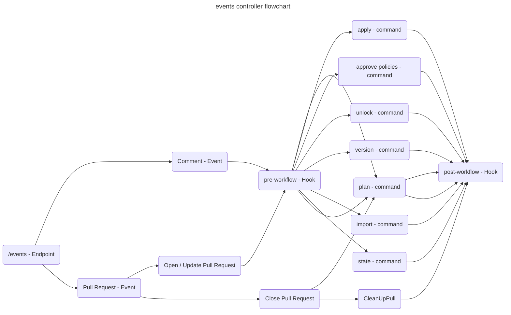

# Controlador de eventos

Los Webhooks son la interacción principal entre el Version Control System (VCS)
y Atlantis. Cada VCS envía las solicitudes al endpoint `/events`. La
implementación de este endpoint se puede encontrar en el archivo
[events_controller.go](https://github.com/runatlantis/atlantis/blob/main/server/controllers/events/events_controller.go).
Este archivo contiene la función Post `func (e *VCSEventsController)
Post(w http.ResponseWriter, r *http.Request`)` que analiza la solicitud
de acuerdo con el VCS configurado.

Atlantis actualmente maneja uno de los siguientes eventos:

- Evento de comentario
- Evento de Pull Request

Todos los demás eventos son ignorados.

## Evento de comentario

Este evento se activa cada vez que un usuario ingresa un comentario en el Pull Request,
Merge Request, o como sea que se llame para el VCS respectivo. Después de analizar la
solicitud específica del VCS, el código llama a la función `handleCommentEvent`, que
luego pasa el procesamiento a la función `handleCommentEvent` en el archivo
[command_runner.go](https://github.com/runatlantis/atlantis/blob/main/server/events/command_runner.go).
Esta función primero llama a los hooks pre-workflow, luego ejecuta uno de los
comandos listados abajo y, al final, los hooks post-workflow.

- [plan_command_runner.go](https://github.com/runatlantis/atlantis/blob/main/server/events/plan_command_runner.go)
- [apply_command_runner.go](https://github.com/runatlantis/atlantis/blob/main/server/events/apply_command_runner.go)
- [approve_policies_command_runner.go](https://github.com/runatlantis/atlantis/blob/main/server/events/approve_policies_command_runner.go)
- [unlock_command_runner.go](https://github.com/runatlantis/atlantis/blob/main/server/events/unlock_command_runner.go)
- [version_command_runner.go](https://github.com/runatlantis/atlantis/blob/main/server/events/version_command_runner.go)
- [import_command_runner.go](https://github.com/runatlantis/atlantis/blob/main/server/events/import_command_runner.go)
- [state_command_runner.go](https://github.com/runatlantis/atlantis/blob/main/server/events/state_command_runner.go)

## Evento de Pull Request

Para manejar eventos de comentario en Pull Requests, primero deben ser creados. Atlantis
también permite la ejecución de comandos para ciertos eventos de Pull Requests.

  
Webhooks de Pull Request

La lista de abajo enlaza a los VCS soportados y a su documentación de Webhook
de Pull Request.

- [Azure DevOps Pull Request Created](https://learn.microsoft.com/en-us/azure/devops/service-hooks/events?view=azure-devops#pull-request-created)
- [BitBucket Pull Request](https://support.atlassian.com/bitbucket-cloud/docs/event-payloads/#Pull-request-events)
- [GitHub Pull Request](https://docs.github.com/en/webhooks/webhook-events-and-payloads#pull_request)
- [GitLab Merge Request](https://docs.gitlab.com/user/project/integrations/webhook_events/#merge-request-events)
- [Gitea Webhooks](https://docs.gitea.com/usage/webhooks)

La siguiente lista muestra los eventos soportados:

- Pull Request abierto
- Pull Request actualizado
- Pull Request cerrado
- Otro evento de Pull Request

La función `RunAutoPlanCommand` en el archivo
[command_runner.go](https://github.com/runatlantis/atlantis/blob/main/server/events/command_runner.go)
es llamada para los eventos de Pull Request _Open_ y _Update_. Cuando está habilitada en
el proyecto, esto ejecuta automáticamente el `plan` para el repositorio específico.

Siempre que un Pull Request se cierra, la función `CleanUpPull` en el archivo
[instrumented_pull_closed_executor.go](https://github.com/runatlantis/atlantis/blob/main/server/events/instrumented_pull_closed_executor.go)
es llamada. Esta función limpia todos los archivos, locks y otra información relacionada
del Pull Request cerrado.
