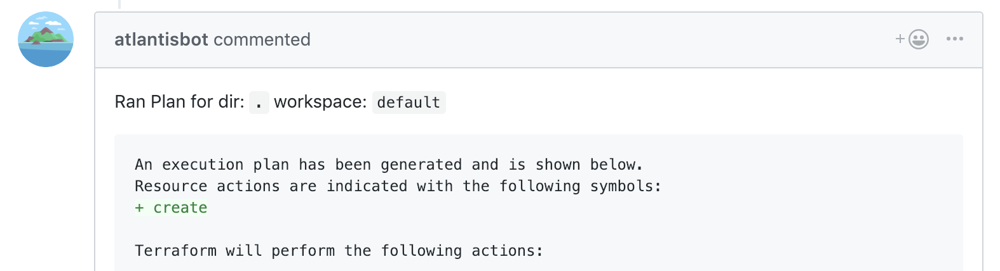
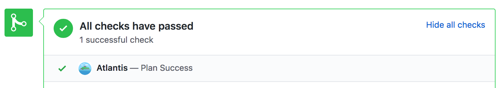

# Credenciales de acceso del host Git

Esta página describe cómo crear credenciales para su host Git (GitHub, GitLab, Gitea, Bitbucket, o Azure DevOps)

que Atlantis usará para hacer llamadas a la API.

## Crear un usuario de Atlantis (opcional)

Recomendamos crear un nuevo usuario llamado **@atlantis** (o algo parecido) o usar un usuario de CI dedicado.

Esto no es obligatorio (puede usar un usuario existente o credenciales de github app), sin embargo todos los comentarios que Atlantis escribe
vendrán de ese usuario, por lo que podría ser confuso si vienen de una cuenta personal.

<i>Un comentario de ejemplo que viene del usuario @atlantisbot</i>

## Generar un token de acceso

Una vez que haya creado un nuevo usuario (o haya decidido usar uno existente), necesita
generar un token de acceso. Continúe leyendo para ver las instrucciones para su host Git específico:

* [GitHub](#github-user)
* [GitHub app](#github-app)
* [GitLab](#gitlab)
* [Gitea](#gitea)
* [Bitbucket Cloud (bitbucket.org)](#bitbucket-cloud-bitbucket-org)
* [Bitbucket Server (aka Stash)](#bitbucket-server-aka-stash)
* [Azure DevOps](#azure-devops)

### GitHub user

* Cree un [Personal Access Token](https://docs.github.com/en/authentication/keeping-your-account-and-data-secure/creating-a-personal-access-token#creating-a-fine-grained-personal-access-token)
* Cree el token con alcance **repo**
  * Los siguientes permisos de repositorio son el mínimo requerido:
    * Commit statuses: lectura y escritura (para actualizar el PR con indicadores de estados de trabajos de plan/apply/policy)
    * Contents: solo lectura (para obtener los archivos cambiados y clonar el repositorio)
    * Metadata: solo lectura (esto se seleccionará automáticamente como obligatorio cuando Contents se establezca como solo lectura)
    * Pull requests: lectura y escritura (para comentar y reaccionar en el PR)
* Registre el token de acceso
::: warning
Su usuario de Atlantis también debe tener "Write permissions" (para repos en una organización) o ser un "Collaborator" (para repos en una cuenta de usuario) para poder establecer commit statuses:

:::

### GitHub app

#### Crear la GitHub App usando Atlantis

::: warning
Disponible en versiones de Atlantis **posteriores** a 0.13.0.
:::

* Inicie Atlantis con nombre de usuario y token falsos de github (`atlantis server --gh-user fake --gh-token fake --repo-allowlist 'github.com/your-org/*' --atlantis-url https://$ATLANTIS_HOST`). Si instala como una **Organization**, recuerde agregar `--gh-org your-github-org` a este comando.
* Visite `https://$ATLANTIS_HOST/github-app/setup` y haga clic en **Setup** para crear la app en GitHub. Será redirigido de vuelta a Atlantis
* Un enlace para instalar su app, junto con sus secretos, se mostrará en la pantalla. Registre las credenciales de su app e instale su app para su usuario/org siguiendo dicho enlace.
* Cree un archivo con el contenido de la GitHub App Key, p. ej. `atlantis-app-key.pem`
* Reinicie Atlantis con nuevas flags: `atlantis server --gh-app-id <your id> --gh-app-key-file atlantis-app-key.pem --gh-webhook-secret <your secret> --write-git-creds --repo-allowlist 'github.com/your-org/*' --atlantis-url https://$ATLANTIS_HOST`.

  NOTE: En lugar de usar un archivo para la GitHub App Key, también puede pasar el valor de la clave directamente usando `--gh-app-key`. También puede crear un archivo de configuración en lugar de usar flags. Vea [Server Configuration](server-configuration.md#config-file).

::: warning
Actualmente solo se admite una única instalación por GitHub App.
:::

::: tip NOTE
GitHub App maneja por sí misma las llamadas del webhook, por lo tanto no hay necesidad de crear webhooks por separado. Si los webhooks se crearon manualmente, se pueden eliminar cuando se usa GitHub App. De lo contrario, habría 2 llamadas a Atlantis que resultarían en errores de bloqueo en path/workspace.

Los webhooks pueden crearse manualmente o ser administrados por la GitHub App para los repositorios que activan Atlantis. Si se crean manualmente (vea la [sección abajo](access-credentials.md#manually-creating-the-github-app)), no especifique detalles del webhook en la configuración de la GitHub app. En ambos casos, se recomienda fuertemente proteger los webhooks usando un secreto. Vea [Webhook Secrets](webhook-secrets.md#webhook-secrets)
:::

#### Crear manualmente la GitHub app

* Cree la GitHub app como un administrador
  * Asegúrese de que la app esté registrada / instalada con la organización / usuario
  * Vea la [documentación](https://docs.github.com/en/apps/creating-github-apps/about-creating-github-apps/about-creating-github-apps) de GitHub app
* Cree un archivo con el contenido de la GitHub App Key, p. ej. `atlantis-app-key.pem`
* Inicie Atlantis con las siguientes flags: `atlantis server --gh-app-id <your id> --gh-installation-id <installation id> --gh-app-key-file atlantis-app-key.pem --gh-webhook-secret <your secret> --write-git-creds --repo-allowlist 'github.com/your-org/*' --atlantis-url https://$ATLANTIS_HOST`.

  NOTE: En lugar de usar un archivo para la GitHub App Key, también puede pasar el valor de la clave directamente usando `--gh-app-key`. También puede crear un archivo de configuración en lugar de usar flags. Vea [Server Configuration](server-configuration.md#config-file).

::: tip NOTE
Instalar manualmente la GitHub app significa que las credenciales pueden ser compartidas por muchas instalaciones de Atlantis. Esto tiene el beneficio de centralizar el acceso al repositorio para módulos / código compartidos.
:::

::: tip NOTE
Los repositorios deben registrarse manualmente con la GitHub app creada para permitir que Atlantis interactúe con Pull Requests.
:::

::: tip NOTE
Pasar la flag adicional `--gh-app-slug` modificará el nombre de la App al publicar comentarios en un Pull Request.
:::

#### Permisos

GitHub App necesita estos permisos. Estos se establecen automáticamente cuando se crea una GitHub app.

::: tip NOTE
Desde v0.19.7, se ha agregado un nuevo permiso para `Administration`. Si ya ha creado una GitHub app, actualizar Atlantis a v0.19.7 no agregará automáticamente este permiso, por lo que deberá establecerlo manualmente.

Desde v0.22.3, se ha agregado un nuevo permiso para `Members`, que es necesario para funciones que aplican permisos a miembros del equipo de una organización en lugar de usuarios individuales. Al igual que el permiso `Administration` anterior, actualizar Atlantis no agregará automáticamente este permiso, por lo que si desea usar funciones que dependen de verificar membresía de equipo, deberá agregarlo manualmente.

Desde v0.30.0, se ha agregado un nuevo permiso para `Actions`, que es necesario para verificar si un pull request puede fusionarse mientras se omite la verificación de apply. Actualizar Atlantis no agregará automáticamente este permiso, por lo que deberá agregarlo manualmente.
:::

| Type            | Access              |
| --------------- | ------------------- |
| Administration  | Read-only           |
| Checks          | Read and write      |
| Commit statuses | Read and write      |
| Contents        | Read and write      |
| Issues          | Read and write      |
| Metadata        | Read-only (default) |
| Pull requests   | Read and write      |
| Webhooks        | Read and write      |
| Members         | Read-only           |
| Actions         | Read-only           |

### GitLab

* Siga: [GitLab: Create a personal access token](https://docs.gitlab.com/user/profile/personal_access_tokens/#create-a-personal-access-token)
* Cree un token con alcance **api**
* Registre el token de acceso

### Gitea

* Vaya a "Profile and Settings" > "Settings" en Gitea (arriba a la derecha)
* Vaya a "Applications" bajo "User Settings" en Gitea
* Cree un token bajo "Manage Access Tokens" con los siguientes permisos:
  * issue: Read and Write
  * repository: Read and Write
  * user: Read
* Registre el token de acceso

### Bitbucket Cloud (bitbucket.org)

* Cree una App Password siguiendo [BitBucket Cloud: Create an app password](https://support.atlassian.com/bitbucket-cloud/docs/create-an-app-password/)
* Etiquete la contraseña como "atlantis"
* Seleccione **Pull requests**: **Read** y **Write** para que Atlantis pueda leer sus pull requests y escribir comentarios en ellos. Si quiere habilitar la función [hide-prev-plan-comments](server-configuration.md#hide-prev-plan-comments) y así eliminar comentarios antiguos, agregue también **Account**: **Read**.
* Registre el token de acceso

### Bitbucket Server (aka Stash)

* Haga clic en su avatar en la esquina superior derecha y seleccione **Manage account**
* Haga clic en **Personal access tokens** en la barra lateral
* Haga clic en **Create a token**
* Nombre el token **atlantis**
* Dé al token permisos de proyecto **Read** y permisos de Pull request **Write**
* Haga clic en **Create** y registre el token de acceso

  NOTE: Atlantis enviará el token como un [Bearer Auth a la API de Bitbucket](https://confluence.atlassian.com/bitbucketserver/http-access-tokens-939515499.html#HTTPaccesstokens-UsingHTTPaccesstokens) en lugar de usar Basic Auth.

### Azure DevOps

* Cree un Personal access token siguiendo [Azure DevOps: Use personal access tokens to authenticate](https://docs.microsoft.com/en-us/azure/devops/organizations/accounts/use-personal-access-tokens-to-authenticate?view=azure-devops)
* Etiquete la contraseña como "atlantis"
* Los alcances mínimos requeridos para este token son:
  * Code (Read & Write)
  * Code (Status)
  * Member Entitlement Management (Read)
* Registre el token de acceso

## Próximos pasos

Una vez que tenga su usuario y token de acceso, está listo para crear un secreto de webhook. Vea [Creating a Webhook Secret](webhook-secrets.md).
