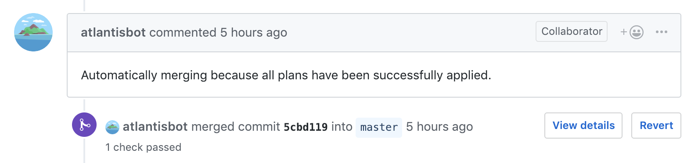

# Automerging
Atlantis can be configured to automatically merge a pull request after all plans have
been successfully applied.




## How To Enable
Automerging can be enabled either by:
1. Passing the `--automerge` flag to `atlantis server`. This will cause all
   pull requests to be automerged and any repo config will be ignored.
1. Setting `automerge: true` in the repo's `atlantis.yaml` file:
    ```yaml
    version: 3
    automerge: true
    projects:
    - dir: .
    ```
    :::tip NOTE
    If a repo has an `atlantis.yaml` file, then each project in the repo needs
    to be configured under the `projects` key.
    :::

## How to Disable
If automerge is enabled, you can disable it for a single `atlantis apply`
command with the `--auto-merge-disabled` option.

## All Plans Must Succeed
When automerge is enabled, **all plans** in a pull request **must succeed** before
**any** plans can be applied.

For example, imagine this scenario:
1. I open a pull request that makes changes to two Terraform projects, in `dir1/`
   and `dir2/`.
1. The plan for `dir2/` fails because my Terraform syntax is wrong.

In this scenario, I can't run
```
atlantis apply -d dir1
```
Even though that plan succeeded, because **all** plans must succeed for **any** plans
to be saved.

Once I fix the issue in `dir2`, I can push a new commit which will trigger an
autoplan. Then I will be able to apply both plans.

## Permissions
The Atlantis VCS user must have the ability to merge pull requests.
