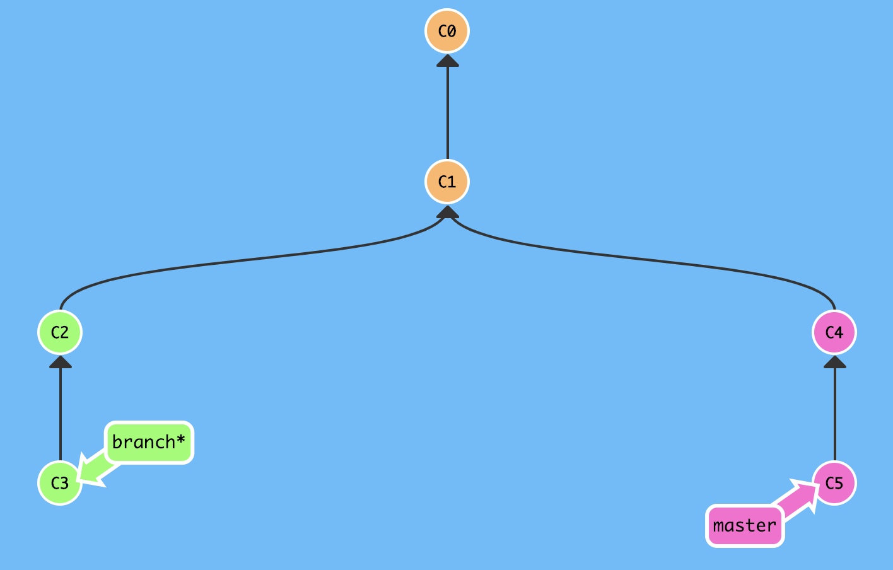
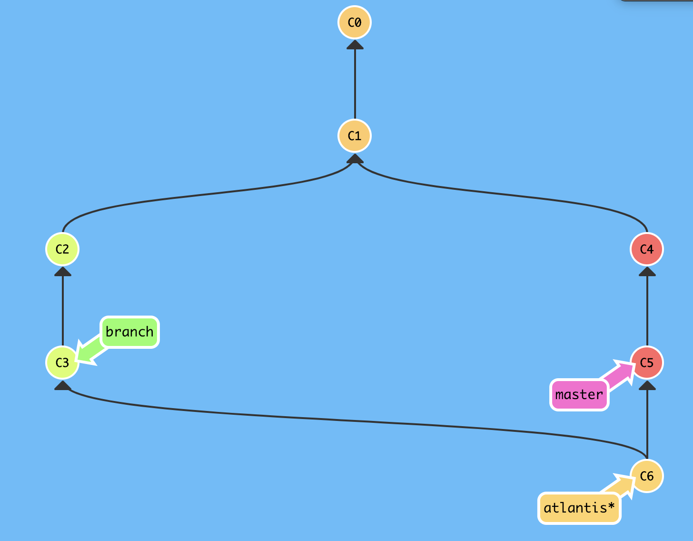

# Estrategia de checkout

Puede configurar cómo Atlantis hace checkout del código de su pull request mediante
la bandera `--checkout-strategy` o la variable de entorno `ATLANTIS_CHECKOUT_STRATEGY` que se pasan al comando `atlantis server`.

Atlantis soporta las estrategias `branch` e `merge`.

## Branch

Si se establece en `branch` (la predeterminada), Atlantis hará checkout de la branch de origen
del pull request.

Por ejemplo, dado el siguiente historial de git:

Si el pull request estuviera solicitando hacer merge de `branch` en `main`,
Atlantis haría checkout de `branch` en el commit `C3`.

## Merge

El problema con la estrategia `branch` es que, si los usuarios hacen push de branches que están
desactualizadas respecto de `main`, entonces su `terraform plan` podría estar eliminando
algunos recursos que fueron configurados en la branch principal.

Por ejemplo, en el diagrama anterior, si los commits `C4` y `C5` han modificado el
estado de Terraform y agregado nuevos recursos, entonces cuando Atlantis ejecuta `terraform plan`
en el commit `C3`, debido a que el código no tiene los cambios de `C4` y `C5`,
Terraform intentará eliminar esos recursos.

Para corregir esto, los usuarios podrían hacer merge de `main` en su branch, *o* puede ejecutar
Atlantis con `--checkout-strategy=merge`. Con esta estrategia, Atlantis
intentará realizar un merge localmente mediante:

* Hacer checkout de la branch de destino del pull request (p. ej. `main`)
* Realizar localmente un `git merge {source branch}`
* Luego ejecutar sus comandos de Terraform

En este ejemplo, el código sobre el que Atlantis estaría operando se vería así:

Donde Atlantis está usando su commit local `C6`.

:::tip NOTE
Atlantis en realidad no hace commit de este merge en ningún lugar. Solo lo usa localmente.
:::

:::tip NOTE
En el caso de errores transitorios al actualizar la branch mergeada, Atlantis
producirá un error por seguridad para evitar usar una branch obsoleta.
:::

:::tip NOTE
Cuando Atlantis se autentica como una GitHub App y usa la estrategia de checkout `merge`
para un pull request de GitHub, obtiene el head del pull request desde la
ref `pull/<PR number>/head` del repositorio base en `origin`. No crea ni
actualiza un remote `source` separado para el repositorio head del pull request. Esto
evita obtener forks a los que la instalación de GitHub App no puede acceder. La
ruta de checkout que no usa GitHub App todavía usa el remote `source`.
:::

:::warning
Atlantis solo realiza este merge durante la fase de `terraform plan`. Si otro
commit se hace push a `main` **después** de que Atlantis ejecute `plan`, no sucederá nada.
:::

Para optimizar el tiempo de clonación, Atlantis puede realizar un clon superficial especificando la bandera `--checkout-depth`. La clonación se realiza de la siguiente manera:

* Se realiza un clon superficial de la branch predeterminada con una profundidad de valor `--checkout-depth` de cero (clon completo).
* Se recupera `branch`, incluyendo la misma cantidad de commits.
* Se comprueba la existencia de la base de merge de la branch predeterminada e `branch` en el clon superficial.
* Si la base de merge no está presente, significa que cualquiera de las branches está por delante de la base de merge por más de `--checkout-depth` commits. En este caso se obtiene el historial completo del repositorio.

Si el historial de commits a menudo diverge por más que la profundidad de checkout predeterminada, entonces la bandera `--checkout-depth` debe ajustarse para evitar fetches completos.
