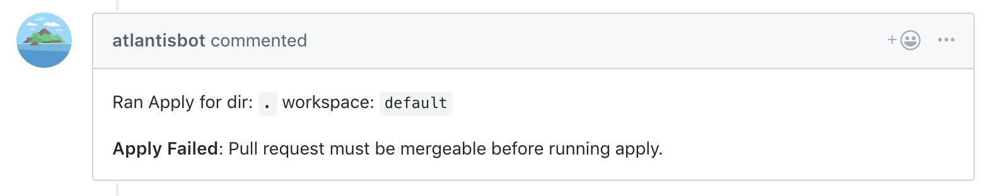

# Requisitos de comandos

## Introducción

Atlantis requiere que se cumplan ciertas condiciones **antes** de `atlantis apply` y `atlantis import`
se puedan ejecutar los comandos:

* [Approved](#approved) – requiere que los pull requests sean aprobados por al menos un usuario distinto del autor
* [Mergeable](#mergeable) – requiere que los pull requests puedan ser fusionados
* [UnDiverged](#undiverged) - requiere que los archivos del proyecto en los pull requests estén por delante de la rama base

## ¿Qué sucede si no se cumple el requisito?

Si no se cumple el requisito, los usuarios verán un error si intentan ejecutar `atlantis apply`:



## Requisitos soportados

### Approved

El requisito `approved` evitará los applies a menos que el pull request sea aprobado
por al menos una persona distinta del autor.

#### Uso

Establezca el requisito `approved` mediante:

1. Crear un archivo `repos.yaml` con la clave `apply_requirements`:

   ```yaml
   repos:
   - id: /.*/
     apply_requirements: [approved]
   ```

1. O permitiendo que un archivo `atlantis.yaml` especifique la clave `apply_requirements` en la configuración de `repos.yaml`:

    **repos.yaml**

    ```yaml
    repos:
    - id: /.*/
      allowed_overrides: [apply_requirements]
    ```

    **atlantis.yaml**

    ```yaml
    version: 3
    projects:
    - dir: .
      apply_requirements: [approved]
    ```

#### Significado

Cada proveedor de VCS tiene reglas diferentes sobre quién puede aprobar:

* **GitHub** – **Cualquier usuario con permisos de lectura** en el repo puede aprobar un pull request
* **GitLab** – El usuario que puede aprobar se puede establecer en la [configuración del repo](https://docs.gitlab.com/user/project/merge_requests/approvals/)
* **Bitbucket Cloud (bitbucket.org)** – Un usuario puede aprobar su propio pull request, pero
  Atlantis no cuenta eso como una aprobación y requiere una aprobación de al menos un usuario que
  no sea el autor del pull request
* **Azure DevOps** – **Todos los grupos integrados incluyen el permiso "Contribute to pull requests"** y pueden aprobar un pull request

:::tip Tip
Para requerir que **ciertas personas** aprueben el pull request, consulte el requisito
[mergeable](#mergeable).
:::

### Mergeable

El requisito `mergeable` evitará los applies a menos que un pull request pueda ser fusionado.

#### Uso

Establezca el requisito `mergeable` mediante:

1. Crear un archivo `repos.yaml` con la clave `apply_requirements`:

   ```yaml
   repos:
   - id: /.*/
     apply_requirements: [mergeable]
   ```

1. O permitiendo que un archivo `atlantis.yaml` especifique las claves `plan_requirements`, `apply_requirements` y `import_requirements` en la configuración de `repos.yaml`:

    **repos.yaml**

    ```yaml
    repos:
    - id: /.*/
      allowed_overrides: [plan_requirements, apply_requirements, import_requirements]
    ```

    **atlantis.yaml**

    ```yaml
    version: 3
    projects:
    - dir: .
      plan_requirements: [mergeable]
      apply_requirements: [mergeable]
      import_requirements: [mergeable]
    ```

#### Significado

Cada proveedor de VCS tiene un concepto diferente de "mergeability":

::: warning
Algunos proveedores de VCS tienen una función de protección de ramas para controlar la "mergeability". Para usarla,
limite la rama base para no omitir la protección de ramas.
Consulte también la palabra clave `branch` en [Server Side Repo Config](server-side-repo-config.md#reference) para más detalles.
:::

#### GitHub

En GitHub, si no está usando [Protected Branches](https://docs.github.com/en/repositories/configuring-branches-and-merges-in-your-repository/defining-the-mergeability-of-pull-requests/about-protected-branches), entonces
todos los pull requests son fusionables a menos que haya un conflicto.

Si configura Protected Branches, entonces puede aplicar:

* Requerir que ciertas verificaciones de estado pasen
* Requerir que ciertas personas hayan revisado y aprobado el pull request
* Requerir que `CODEOWNERS` haya revisado y aprobado el pull request
* Requerir que la rama esté actualizada con `main`

Consulte [GitHub: About protected branches](https://docs.github.com/en/repositories/configuring-branches-and-merges-in-your-repository/defining-the-mergeability-of-pull-requests/about-protected-branches)
para más detalles.

::: warning
Si tiene el requisito **Restrict who can push to this branch**, entonces
el usuario de Atlantis debe ser parte de esa lista para que considere
un pull request como fusionable.
:::

::: warning
Si establece `atlantis/apply` en el requisito mergeable, use la bandera `--gh-allow-mergeable-bypass-apply` o establezca la variable de entorno `ATLANTIS_GH_ALLOW_MERGEABLE_BYPASS_APPLY=true`. Esta bandera y variable de entorno permiten que la verificación mergeable antes de ejecutar `atlantis apply` omita verificar el estado de `atlantis/apply`.
:::

#### GitLab

Para GitLab, un merge request será fusionado si todos los siguientes son verdaderos:

* No hay conflictos
* No hay discusiones sin resolver, si es un requisito del proyecto
* Todos los aprobadores necesarios han aprobado el pull request
* No está detrás de la rama en la que se está fusionando, si los [Merge Methods](https://docs.gitlab.com/user/project/merge_requests/methods/) del proyecto son "Fast-forward merge" o "Merge commit with semi-linear history"

Para pipelines, si el proyecto requiere que los pipelines deban tener éxito, se verificarán todos los builds excepto el estado del comando apply.

Para Jobs con la configuración allow_failure establecida en true, se ignorarán. Si el pipeline ha sido omitido y el proyecto permite fusionar, se marcará como fusionable.

Para comandos `atlantis apply` por proyecto, Atlantis limita el requisito `mergeable` de GitLab al proyecto que se está aplicando cuando GitLab informa estados de commit bloqueantes. Atlantis ignora los estados bloqueantes de Atlantis plan de otros proyectos en el mismo merge request, pero el propio estado plan del proyecto y cualquier otro bloqueador que no sea Atlantis aún impiden el apply.

#### Bitbucket.org (Bitbucket Cloud) and Bitbucket Server (Stash)

Para Bitbucket, solo verificamos si hay un conflicto que impide una
fusión. No verificamos nada más porque la API de Bitbucket no lo soporta.

Si necesita una verificación específica, por favor
[abra un issue](https://github.com/runatlantis/atlantis/issues/new).

#### Azure DevOps

En Azure DevOps, todos los pull requests son fusionables a menos que haya un conflicto. Puede establecer un pull request en "Complete" de inmediato, o establecer "Auto-Complete", que fusionará después de que se cumplan todas las políticas de rama. Consulte [Review code with pull requests](https://docs.microsoft.com/en-us/azure/devops/repos/git/pull-requests?view=azure-devops).

Las [Branch policies](https://docs.microsoft.com/en-us/azure/devops/repos/git/branch-policies?view=azure-devops) pueden:

* Requerir un número mínimo de revisores
* Permitir que los usuarios aprueben sus propios cambios
* Permitir completar incluso si algunos revisores votan "Waiting" o "Reject"
* Restablecer los votos de los revisores de código cuando hay cambios nuevos
* Requerir una estrategia de fusión específica (squash, rebase, etc.)

::: warning
En este momento, el cliente de Azure DevOps solo soporta fusionar usando la estrategia predeterminada 'no fast-forward'. Asegúrese de que sus políticas de rama permitan este tipo de fusión.
:::

### UnDiverged

Evita los applies si hay cualquier cambio en la rama base desde el plan más reciente.
Se aplica solo a la estrategia de checkout `merge` que necesita establecer mediante la bandera `--checkout-strategy`.

#### Uso

Puede establecer el requisito `undiverged` mediante:

1. Crear un archivo `repos.yaml` con las claves `plan_requirements`, `apply_requirements` y `import_requirements`:

   ```yaml
   repos:
   - id: /.*/
     plan_requirements: [undiverged]
     apply_requirements: [undiverged]
     import_requirements: [undiverged]
   ```

1. O permitiendo que un archivo `atlantis.yaml` especifique las claves `plan_requirements`, `apply_requirements` y `import_requirements` en su configuración `repos.yaml`:

    **repos.yaml**

    ```yaml
    repos:
    - id: /.*/
      allowed_overrides: [plan_requirements, apply_requirements, import_requirements]
    ```

    **atlantis.yaml**

    ```yaml
    version: 3
    projects:
    - dir: .
      plan_requirements: [undiverged]
      apply_requirements: [undiverged]
      import_requirements: [undiverged]
    ```

#### Significado

La estrategia de checkout `merge` crea un commit de fusión temporal y ejecuta el `plan` en la versión local del PR
fuente y rama de destino de Atlantis. La rama de destino local puede quedar desactualizada ya que los cambios a la rama de destino no se recuperan
si no hay cambios en la rama fuente. `undiverged` exige que la versión local de Atlantis de main esté actualizada
con el remoto para que el estado de la fuente durante el `apply` sea idéntico a como sería si fusionara el PR en ese
momento. En el caso de un error transitorio, Atlantis asume divergencia por seguridad y produce un error.

Cuando un proyecto tiene patrones `autoplan.when_modified` configurados, el requisito `undiverged` usa automáticamente esos
patrones para realizar una verificación de divergencia **dirigida**. En lugar de fallar cuando **cualquier** archivo en la rama base ha cambiado,
solo falla cuando han cambiado archivos que coinciden con los patrones `when_modified` del proyecto. Esto es especialmente útil en
monorepos donde cambios no relacionados en otros proyectos no deberían bloquear sus applies.

Las verificaciones dirigidas de `undiverged` también siguen la selección de proyectos de Atlantis para:

* proyectos configurados en el repo afectados a través de [module autoplanning](server-configuration.md#autoplan-modules)
* proyectos auto-descubiertos seleccionados por las reglas predeterminadas de `autoplan-file-list`

Si Atlantis no puede determinar el impacto del proyecto para un repositorio, `undiverged` recurre a verificar todos los archivos.

**Escenario de ejemplo:**

```text
monorepo/
  project1/        # Has when_modified: ["project1/**"]
  project2/        # Has when_modified: ["project2/**"]
```

* El PR modifica `project1/main.tf`
* Después de crear el PR, alguien fusiona cambios en `project2/main.tf`
* El requisito `undiverged` para project1 **pasa** porque el cambio en la rama base solo afectó a `project2/`

## Establecer requisitos de comandos

Como se mencionó arriba, puede establecer requisitos de comandos mediante banderas, en `repos.yaml`, o en `atlantis.yaml` si `repos.yaml`
permite la anulación.

### Anulación de banderas

Las banderas **anulan** cualquier configuración de `repos.yaml` o `atlantis.yaml`, por lo que son equivalentes a
siempre tener establecido ese requisito de apply.

### Configuraciones específicas del proyecto

Si solo desea que algunos proyectos/repos tengan requisitos de apply, entonces debe

1. Especificar qué repos tienen qué requisitos mediante el archivo `repos.yaml`.

   ```yaml
   repos:
   - id: /.*/
     plan_requirements: [approved]
     apply_requirements: [approved]
     import_requirements: [approved]
   # Regex that defaults all repos to requiring approval
   - id: /github.com/runatlantis/.*/
     # Regex to match any repo under the atlantis namespace, and not require approval
     # except for repos that might match later in the chain
     plan_requirements: []
     apply_requirements: []
     import_requirements: []
   - id: github.com/runatlantis/atlantis
     plan_requirements: [approved]
     apply_requirements: [approved]
     import_requirements: [approved]
     # Exact string match of the github.com/runatlantis/atlantis repo
     # that sets apply_requirements to approved
   ```

1. Especificar qué proyectos tienen qué requisitos mediante un archivo `atlantis.yaml`, y permitir que
   `plan_requirements`, `apply_requirements` y `import_requirements` se establezcan en `atlantis.yaml` mediante la configuración `repos.yaml`
   del lado del servidor.

   Por ejemplo, si tengo dos directorios, `staging` y `production`, podría usar:

   **repos.yaml:**

   ```yaml
   repos:
   - id: /.*/
     allowed_overrides: [plan_requirements, apply_requirements, import_requirements]
     # Allow any repo to specify apply_requirements in atlantis.yaml
   ```

   **atlantis.yaml:**

   ```yaml
   version: 3
   projects:
   - dir: staging
     # By default, plan_requirements, apply_requirements and import_requirements are empty so this
     # isn't strictly necessary.
     plan_requirements: []
     apply_requirements: []
     import_requirements: []
   - dir: production
     # This requirement will only apply to the
     # production directory.
     plan_requirements: [mergeable]
     apply_requirements: [mergeable]
     import_requirements: [mergeable]
   ```

### Múltiples requisitos

Puede establecer cualquiera o todos los requisitos `approved`, `mergeable` y `undiverged`.

## ¿Quién puede hacer apply?

Una vez que se cumple el requisito de apply, **cualquiera** que pueda comentar en el pull
request puede ejecutar el comando `atlantis apply` real.

## Próximos pasos

* Para más información sobre revisiones y aprobaciones de pull requests en GitHub, consulte: [GitHub: About pull request reviews](https://docs.github.com/en/pull-requests/collaborating-with-pull-requests/reviewing-changes-in-pull-requests/about-pull-request-reviews)
* Para más información sobre revisiones y aprobaciones de merge requests en GitLab (solo soportado en GitLab Enterprise), consulte: [GitLab: Merge request approvals](https://docs.gitlab.com/user/project/merge_requests/approvals/).
* Para más información sobre revisiones y aprobaciones de pull requests en Bitbucket, consulte: [BitBucket: Use pull requests for code review](https://confluence.atlassian.com/bitbucket/pull-requests-and-code-review-223220593.html)
* Para más información sobre revisiones y aprobaciones de pull requests en Azure DevOps, consulte: [Azure DevOps: Create pull requests](https://docs.microsoft.com/en-us/azure/devops/repos/git/pull-requests?view=azure-devops&tabs=browser)
