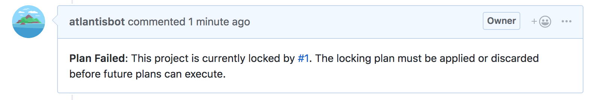
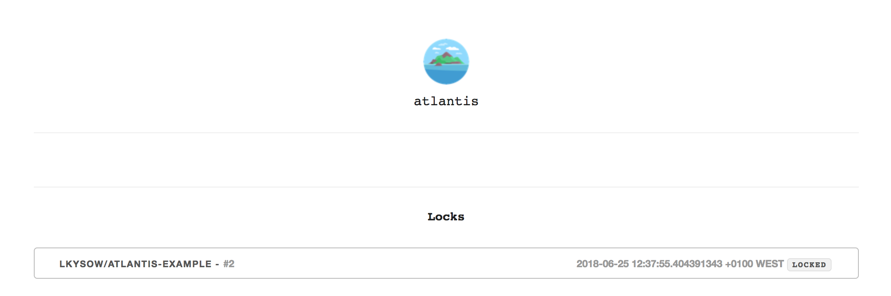
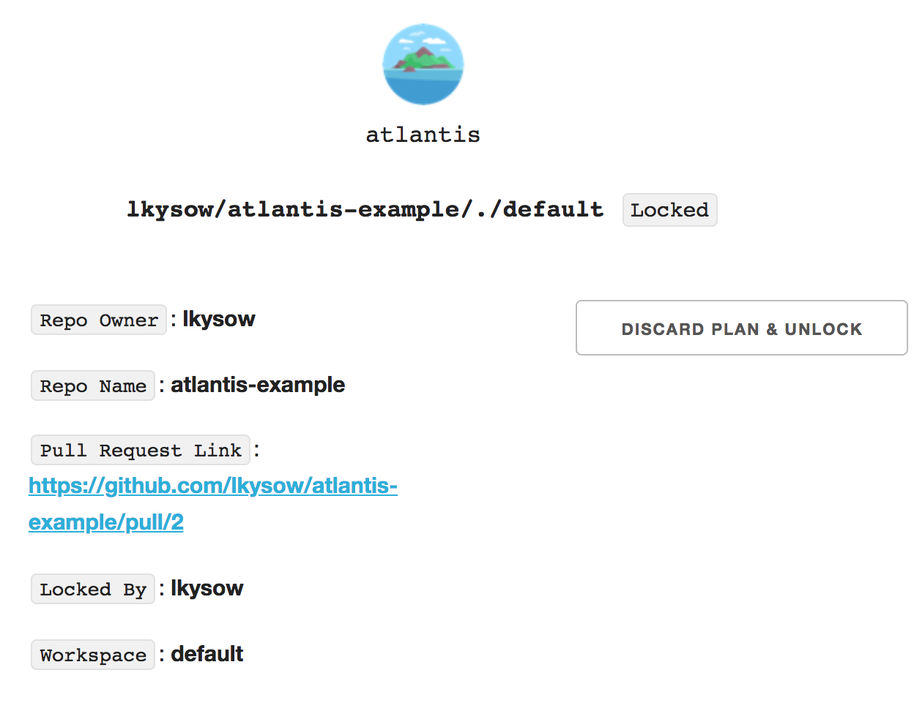
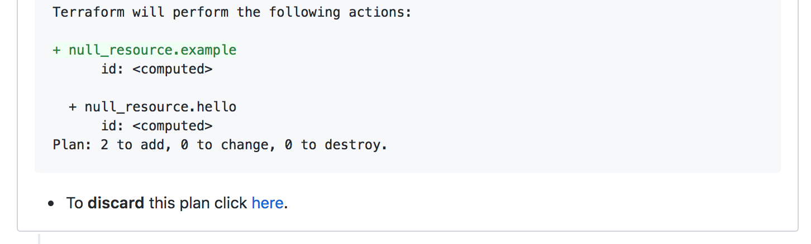

# Bloqueo

Cuando se ejecuta `plan`, el directorio y el workspace de Terraform quedan **Bloqueados** hasta que el pull request se fusiona o se cierra, o el plan se elimina manualmente.

Si otro usuario intenta `plan` para el mismo directorio y workspace en un pull request diferente
verá este error:

Esto les enlaza al pull request que mantiene el bloqueo.

::: warning NOTE
Solo se bloquean el directorio en el repo y el workspace de Terraform, no todo el repo.
:::

Atlantis también verifica el bloqueo global de apply antes de ejecutar `atlantis apply`. Si Atlantis no puede alcanzar el backend de bloqueo mientras verifica ese bloqueo global, falla en cerrado y rechaza el apply hasta que el backend vuelva a estar accesible.

## Por qué

1. Debido a que `atlantis apply` se hace antes de que el pull request se fusione, después de
un apply tu rama `main` ya no representa la versión más actualizada de tu infraestructura.
Con el bloqueo, puedes asegurar que no se harán otros cambios hasta que el
pull request se fusione.

::: tip Why not apply on merge?
A veces `terraform apply` falla. Si el apply fallara después de que el pull
request se hubiera fusionado, necesitarías crear un nuevo pull request para corregirlo.
Con bloqueo + aplicar en la rama, efectivamente imitas fusionar a main
pero con la capacidad adicional de volver a plan/apply múltiples veces si las cosas no funcionan.
:::
2. Si ya hay un `plan` en progreso, otros usuarios no verán un plan que
quedará invalidado después de que el plan en progreso se aplique.

## Ver bloqueos

Para ver los bloqueos, ve a la URL donde está alojado Atlantis:

Puedes hacer clic en un bloqueo para ver sus detalles:

    

## Desbloqueo

El proyecto y el workspace se desbloquearán automáticamente cuando el PR se fusione o se cierre.

Para desbloquear el proyecto y el workspace sin completar un `apply` y fusionar, comenta `atlantis unlock` en el PR,
o haz clic en el enlace en la parte inferior del comentario del plan para descartar el plan y eliminar el bloqueo donde
dice **"To discard this plan click here"**:

El enlace te llevará a la vista de detalle del bloqueo, donde puedes hacer clic en **Discard Plan and Unlock**
para eliminar el bloqueo.

    

Una vez que se descarta un plan, necesitarás ejecutar `plan` de nuevo antes de ejecutar `apply` cuando regreses a ese pull request.

## Relación con Terraform State Locking

Atlantis no entra en conflicto con [Terraform State Locking](https://developer.hashicorp.com/terraform/language/state/locking). Internamente, todo lo que
hace Atlantis es ejecutar `terraform plan` y `apply`, y por lo tanto todo el
bloqueo incorporado en esos comandos por Terraform no se ve afectado.

Con más detalle, Terraform state locking bloquea el state mientras ejecutas `terraform apply`
para que múltiples applies no puedan ejecutarse concurrentemente. El bloqueo de Atlantis está en un nivel superior
porque evita que múltiples pull requests trabajen sobre el mismo state.

## Bloqueo y Drift Detection

Cuando drift detection o remediation se ejecuta mediante la [API](api-endpoints.md) con `PR: 0` (workflow no PR), Atlantis aún adquiere y libera bloqueos del directorio de trabajo para prevenir operaciones concurrentes en el mismo proyecto. Sin embargo, como estas operaciones no están asociadas con un pull request, no crean bloqueos a nivel de PR visibles en la UI de Locks. El bloqueo del directorio de trabajo se libera automáticamente después de que cada operación de drift detection o remediation se completa.
