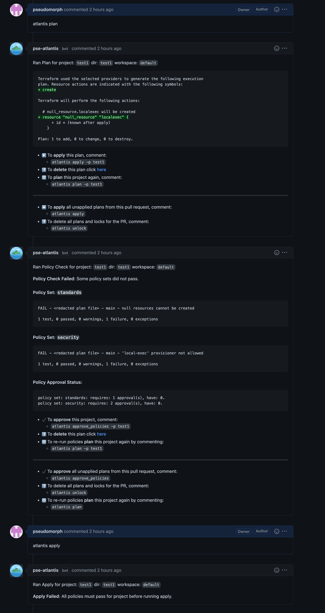
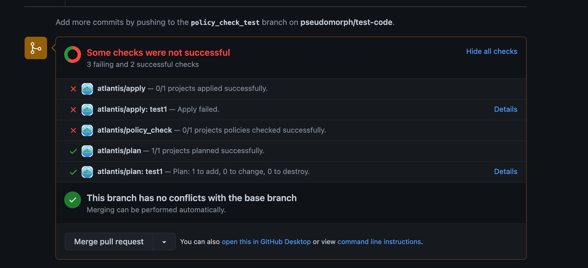
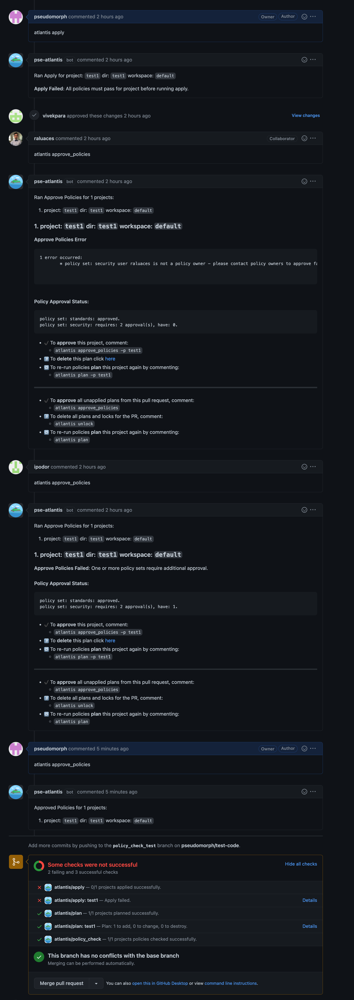

# Verificación de políticas de Conftest

Atlantis admite ejecutar políticas de [conftest](https://www.conftest.dev/) del lado del servidor contra la salida del plan. Casos de uso comunes
para usar este paso incluyen:

- Denegar el uso de una lista de módulos
- Afirmar atributos de un recurso en el momento de la creación
- Detectar eliminaciones no intencionales de recursos
- Prevenir riesgos de seguridad (es decir, exponer puertos seguros al público)

## ¿Cómo funciona?

Habilitar "policy checking" además del [requisito de apply mergeable](command-requirements.md#supported-requirements) bloquea los applys en planes que fallan cualquiera de las políticas de conftest definidas.





Cualquier fallo necesita ser abordado ya sea en un commit sucesivo, o aprobado por los owner(s) de nivel superior de las políticas o los owner(s) del conjunto de políticas en cuestión. Las aprobaciones de políticas son independientes del requisito de aprobación para apply, el cual puede coexistir en el workflow de policy checking. Después de que las políticas sean aprobadas, el apply puede continuar.



Las aprobaciones de políticas pueden limpiarse ya sea volviendo a planificar, o emitiendo el siguiente comando:

```shell
atlantis approve_policies --clear-policy-approval
```

::: warning
Por defecto, cualquier plan siguiente a la aprobación descartará todas las aprobaciones de políticas y las solicitará de nuevo. Para cambiar este comportamiento, vea [Sticky Policy Approvals](#sticky-policy-approvals).
:::

## Primeros pasos

Esta sección proporcionará una guía sobre cómo configurarse con una política simple que falla la creación de `null_resource` y requiere aprobación de un usuario autorizado.

### Paso 1: Habilitar el workflow

Habilite el workflow usando la siguiente bandera de configuración del servidor `--enable-policy-checks`

::: warning
Todos los repositorios tendrán policy checking habilitado.
:::

::: warning NOTE
Si está usando la bandera [`--gh-team-allowlist`](server-configuration.md#gh-team-allowlist) para restringir qué equipos pueden ejecutar comandos, **debe** también poner en allowlist el comando `policy_check` para que las verificaciones de políticas funcionen en comandos manuales `atlantis plan`.

Por ejemplo:

```bash
atlantis server --gh-team-allowlist="*:plan,*:policy_check,*:unlock,myteam:apply"
```

Alternativamente, puede usar `allowed_overrides: [policy_check]` en su [configuración de repo del lado del servidor](server-side-repo-config.md).

**¿Por qué se necesita esto?**

- `policy_check` es un comando interno que se ejecuta automáticamente después de `plan`
- Al usar team allowlists, Atlantis verifica si el usuario está autorizado para ejecutar `policy_check`
- Los autoplans omiten esta verificación (no tienen un usuario), por eso funcionan sin esta configuración
- Sin poner `policy_check` en allowlist, los comandos manuales `atlantis plan` planificarán correctamente pero omitirán las verificaciones de políticas

Vea [Permisos de Repo y Proyecto](repo-and-project-permissions.md#server-option-gh-team-allowlist) para más información sobre team allowlists.
:::

### Paso 2: Definir la configuración de políticas

La configuración de políticas se define en la [configuración de repo del lado del servidor](server-side-repo-config.md#reference).

En este ejemplo definiremos un conjunto de políticas con un owner:

```yaml
policies:
  owners:
    users:
      - nishkrishnan
  policy_sets:
    - name: deny_null_resource
      path: <CODE_DIRECTORY>/policies/deny_null_resource/
      source: local
    - name: deny_local_exec
      path: <CODE_DIRECTORY>/policies/deny_local_exec/
      source: local
      approve_count: 2
      owners:
        users:
          - pseudomorph
```

- `name` - Un nombre de su conjunto de políticas.
- `path` - Ruta a un directorio de políticas. *Nota: reemplace `<CODE_DIRECTORY>` con la ruta absoluta del directorio a la política/políticas de conftest.*
- `source` - Le dice a atlantis de dónde obtener las políticas. Actualmente solo puede alojar políticas localmente usando `local`.
- `owners` - Define los usuarios/equipos que pueden aprobar un conjunto de políticas específico.
- `approve_count` - Define el número de aprobaciones necesarias para omitir las verificaciones de políticas. Por defecto toma la configuración de políticas de nivel superior, si no se especifica.
- `prevent_self_approve` - Define si el autor del PR puede aprobar políticas.
- `sticky_policy_approvals` - Cuando `true`, las aprobaciones sobreviven a los re-plans siempre que no se introduzcan nuevos elementos en la salida de políticas (según coincidan con `policy_item_regex`). Vea [Sticky Policy Approvals](#sticky-policy-approvals).
- `policy_item_regex` - Regex usado para extraer elementos comparables de la salida de políticas para el seguimiento de aprobación persistente. Vea [Sticky Policy Approvals](#sticky-policy-approvals).

Por defecto, conftest está configurado para ejecutar solo el paquete `main`. Si desea ejecutar políticas específicas/múltiples considere pasar `--namespace` o `--all-namespaces` a conftest con [`extra_args`](custom-workflows.md#adding-extra-arguments-to-terraform-commands) mediante un workflow personalizado como se muestra en el ejemplo de abajo.

Ejemplo de configuración de repo del lado del servidor usando `--all-namespaces` y un directorio src local.

```yaml
repos:
  - id: github.com/myorg/example-repo
    workflow: custom
policies:
  owners:
    users:
      - example-dev
  policy_sets:
    - name: example-conf-tests
      path: /home/atlantis/conftest_policies  # Consider separate vcs & mount into container
      source: local
workflows:
  custom:
    plan:
      steps:
        - init
        - plan
    policy_check:
      steps:
        - policy_check:
            extra_args: ["-p /home/atlantis/conftest_policies/", "--all-namespaces"]
```

::: tip Note
Conftest se ejecuta con un vector de argumentos en lugar de a través de un shell. Un conjunto de políticas
`path` y cada entrada `extra_args` todavía se dividen por espacios en blanco, por lo que un valor
que contiene más de un argumento, como `"-p /home/atlantis/conftest_policies/"`
de arriba, sigue funcionando. Los operadores del shell y la sustitución de comandos se pasan
como texto ordinario. Para usar una ruta que genuinamente contiene un espacio, póngala entre comillas,
por ejemplo
`"'/home/atlantis/my policies'"`. Las referencias de entorno en texto sin comillas o entre
comillas dobles se expanden desde el entorno de policy-check sin dividir el valor expandido. Use comillas simples o una barra invertida antes de `$` cuando
la referencia deba permanecer literal.
:::

### Paso 3: Escribir la política

Las políticas de Conftest están basadas en [Open Policy Agent (OPA)](https://www.openpolicyagent.org/) y escritas en [rego](https://www.openpolicyagent.org/docs/latest/policy-language/#what-is-rego). Siguiendo nuestro ejemplo, simplemente cree un archivo `rego` en la carpeta `null_resource_warning` con el siguiente código; el código de abajo es una política simple que fallará para planes que contengan `null_resource` creados recientemente.

```rego
package main

resource_types = {"null_resource"}

# all resources
resources[resource_type] = all {
    some resource_type
    resource_types[resource_type]
    all := [name |
        name:= input.resource_changes[_]
        name.type == resource_type
    ]
}

# number of creations of resources of a given type
num_creates[resource_type] = num {
    some resource_type
    resource_types[resource_type]
    all := resources[resource_type]
    creates := [res |  res:= all[_]; res.change.actions[_] == "create"]
    num := count(creates)
}

deny[msg] {
    num_resources := num_creates["null_resource"]

    num_resources > 0

    msg := "null resources cannot be created"
}

```

¡Eso es todo! Ahora su instancia de Atlantis está configurada para ejecutar políticas en sus planes de Terraform 🎉

## Personalizar el comando conftest

### Obtener políticas desde una ubicación remota

Conftest admite [obtener políticas](https://www.conftest.dev/sharing/#pulling) desde ubicaciones remotas como S3, git, OCI y otros protocolos compatibles con la biblioteca [go-getter](https://github.com/hashicorp/go-getter). La clave [`extra_args`](custom-workflows.md#adding-extra-arguments-to-terraform-commands) puede usarse para pasar la bandera [`--update`](https://www.conftest.dev/sharing/#-update-flag) para indicar a `conftest` que obtenga las políticas en la carpeta del proyecto antes de ejecutar la verificación de políticas.

```yaml
workflows:
  custom:
    plan:
      steps:
        - init
        - plan
    policy_check:
      steps:
        - policy_check:
            extra_args: ["--update", "s3::https://s3.amazonaws.com/bucket/foo"]
```

Tenga en cuenta que la autenticación puede necesitar ser configurada por separado si se obtienen políticas desde fuentes que la requieren. Por ejemplo, para obtener políticas desde un bucket de S3, el host de Atlantis puede configurarse con un perfil predeterminado de AWS que tenga permiso para `s3:GetObject` y `s3:ListBucket` desde el bucket de S3.

### Ejecutar la verificación de políticas contra el código fuente de Terraform

Por defecto, Atlantis ejecuta la verificación de políticas contra el [`SHOWFILE`](custom-workflows.md#custom-run-command). Para ejecutar la prueba de políticas directamente contra archivos de Terraform, sobrescriba el comando `conftest` predeterminado usado y pase `*.tf` como una de las entradas a `conftest`. El paso `show` es requerido para que Atlantis genere el `SHOWFILE`.

```yaml
workflows:
  custom:
    policy_check:
      steps:
        - show
        - run: conftest test $SHOWFILE *.tf --no-fail
```

### Verificaciones de políticas silenciosas

Por defecto, Atlantis añadirá un comentario a todos los pull requests con el resultado de la verificación de políticas, tanto éxitos como fallos. La versión 0.21.0 agregó la opción [`--quiet-policy-checks`](server-configuration.md#quiet-policy-checks), que en su lugar solo añadirá comentarios cuando las verificaciones de políticas fallen, reduciendo significativamente el número de comentarios cuando la mayoría de los resultados de verificación de políticas tienen éxito.

### Datos para pasos run personalizados

Cuando el workflow de verificación de políticas se ejecuta, se crea un archivo en el directorio de trabajo que contiene información sobre el estado de cada conjunto de políticas probado. Estos datos pueden ser útiles en pasos run personalizados para generar métricas o notificaciones. El archivo contiene datos JSON en el siguiente formato:

```json
[
  {
    "PolicySetName": "policy1",
    "PolicyOutput": "FAIL - plan.json - main - WARNING: resource creation is prohibited.\n\n1 test, 0 passed, 0 warnings, 1 failure, 0 exceptions\n",
    "Passed": false,
    "ReqApprovalCount": 1,
    "Approvals": null,
    "Hashes": ["ae6b7acaaedaf6fcd3d1823643dbf2ef1aa25374a99b44b1923d8227cc9707e3"],
    "PolicyItemRegex": "(?s).+"
  }
]
```

| Campo | Tipo | Descripción |
| --- | --- | --- |
| `PolicySetName` | string | Nombre del conjunto de políticas. |
| `PolicyOutput` | string | Salida sin procesar de la verificación de políticas. |
| `Passed` | bool | Si la verificación de políticas pasó. |
| `ReqApprovalCount` | int | Número de aprobaciones requeridas para omitir la política fallida. |
| `Approvals` | []PolicySetApproval | Lista de aprobaciones, cada una con un nombre de usuario `Approver` y una instantánea `Hashes`. |
| `Hashes` | []string | Resúmenes hex SHA-256 de elementos extraídos de la salida de políticas usando `policy_item_regex`. |
| `PolicyItemRegex` | string | El regex usado para extraer elementos de la salida de políticas para hashing. |

## Sticky Policy Approvals

Por defecto, cuando un plan se vuelve a ejecutar, todas las aprobaciones previas de políticas se descartan. Esto significa que después de cada `atlantis plan`, los owner de políticas deben volver a aprobar incluso si nada cambió sobre los fallos de políticas.

**Sticky policy approvals** permiten que las aprobaciones sobrevivan a re-plans, siempre que no aparezcan elementos nuevos en la salida de políticas (coincidentes mediante `policy_item_regex`). Esto es útil en workflows donde los planes se vuelven a ejecutar con frecuencia (p. ej., debido a actualizaciones de la rama base) pero las violaciones de políticas siguen siendo las mismas o se están resolviendo.

### Cómo funciona

Cuando las aprobaciones persistentes están habilitadas, Atlantis extrae elementos de la salida de políticas usando `policy_item_regex` y los hashea. Cada aprobación registra una instantánea de estos hashes. En re-plan, las aprobaciones se conservan solo si sus hashes registrados todavía cubren la salida actual. Agregar o cambiar elementos invalida las aprobaciones; eliminar elementos (p. ej., corregir una violación) las preserva.

### Habilitar aprobaciones persistentes

Habilite en el nivel superior para aplicar a todos los conjuntos de políticas:

```yaml
policies:
  owners:
    users:
      - policyowner
  sticky_policy_approvals: true
  policy_sets:
    - name: security-policy
      path: /policies/security
      source: local
```

O habilite por conjunto de políticas:

```yaml
policies:
  owners:
    users:
      - policyowner
  policy_sets:
    - name: security-policy
      path: /policies/security
      source: local
      sticky_policy_approvals: true
    - name: cost-policy
      path: /policies/cost
      source: local
      # This policy set uses default (non-sticky) behavior
```

Un valor `sticky_policy_approvals` por conjunto de políticas sobrescribe la configuración de nivel superior. Esto le permite habilitar aprobaciones persistentes globalmente pero excluir conjuntos de políticas específicos (o viceversa).

### Personalizar el regex de elementos de política

El `policy_item_regex` controla qué partes de la salida de políticas se usan como la "identidad" para el seguimiento de aprobación persistente. El valor predeterminado es `(?s).+`, que coincide con toda la salida como un solo elemento. Esto significa que cualquier cambio en la salida invalida la aprobación: un enfoque de todo o nada.

Para un seguimiento granular por elemento, sobrescriba el regex para que coincida con elementos individuales. Por ejemplo, `.+` (sin `(?s)`) coincide con cada línea no vacía como un elemento separado:

```yaml
policies:
  owners:
    users:
      - policyowner
  sticky_policy_approvals: true
  policy_item_regex: ".+"
  policy_sets:
    - name: security-policy
      path: /policies/security
      source: local
```

Con `.+`, cada línea se rastrea independientemente. Las aprobaciones permanecen válidas siempre que cada línea actual estuviera presente en el momento de la aprobación. Corregir una violación (eliminar una línea) preserva las aprobaciones existentes; agregar o cambiar una las invalida.

::: tip
La semántica de subconjunto anterior es intencional: una aprobación cubre un conjunto específico de elementos, y cualquier elemento actual debe haber sido parte de ese conjunto. Eliminar elementos (p. ej., un autor de políticas corrige una violación previamente marcada) se trata como progreso y **no** invalida aprobaciones previas. Solo la aparición de elementos nuevos o modificados activa una nueva aprobación.
:::

Para salida de texto, use `(?m)^FAIL.*` para rastrear solo líneas que comienzan con `FAIL`:

```yaml
policy_item_regex: "(?m)^FAIL.*"
```

::: tip
Use el prefijo de bandera `(?m)` para habilitar coincidencia multilínea, de modo que `^` y `$` coincidan con el inicio y el final de cada línea en lugar de solo el inicio y el final de toda la cadena.
:::

Un `policy_item_regex` por conjunto de políticas puede sobrescribir el valor predeterminado de nivel superior:

```yaml
policies:
  owners:
    users:
      - policyowner
  sticky_policy_approvals: true
  policy_item_regex: "(?m)^FAIL.*"
  policy_sets:
    - name: security-policy
      path: /policies/security
      source: local
      policy_item_regex: ".+"
```

### Prevención de aprobaciones duplicadas

Cuando las aprobaciones persistentes se usan con `approve_count > 1`, el mismo usuario no puede proporcionar múltiples aprobaciones para el mismo conjunto de políticas con los mismos hashes. Si un usuario ya aprobó completamente un conjunto de políticas y los elementos extraídos no han cambiado, intentos posteriores de aprobación por el mismo usuario producirán un error pidiendo que un owner de políticas diferente apruebe.

## Ejecutar la verificación de políticas solo en algunos repositorios

Cuando policy checking está habilitado, se aplicará en todos los repositorios. Para deshabilitar policy checking en algunos repositorios, primero [habilite las verificaciones de políticas](policy-checking.md#getting-started) y luego desactívelo explícitamente en cada repositorio con la bandera `policy_check`.

Para configuración del lado del servidor:

```yml
# repos.yaml
repos:
- id: /.*/
  plan_requirements: [approved]
  apply_requirements: [approved]
  import_requirements: [approved]
- id: /special-repo/
  plan_requirements: [approved]
  apply_requirements: [approved]
  import_requirements: [approved]
  policy_check: false
```

Para configuración `atlantis.yaml` a nivel de repo:

```yml
version: 3
projects:
- dir: project1
  workspace: staging
- dir: project1
  workspace: production
  policy_check: false
```
