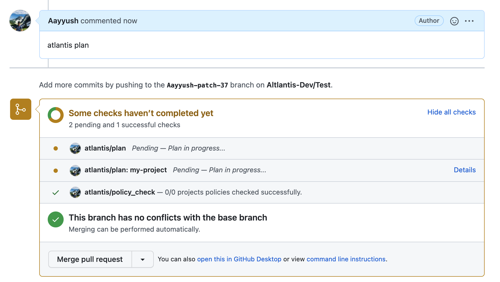
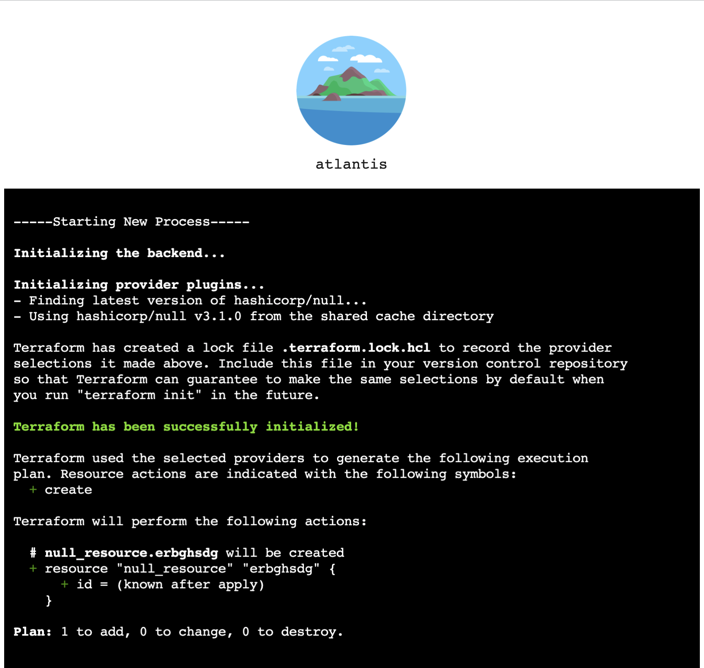

# Logs en tiempo real

Atlantis admite la transmisión de logs de terraform en tiempo real de forma predeterminada. Actualmente, solo se admiten dos comandos

* atlantis plan
* atlantis apply

::: warning
No se admiten todas las salidas de custom workflow ni otros comandos de terraform. Se ha añadido soporte para terragrunt; vea ejemplos en [Custom Workflows](./custom-workflows.md#terragrunt).
:::

Para ver los logs de terraform en tiempo real, un usuario puede navegar por la sección de *details* de la verificación de estado de plan o apply de un proyecto dado.

Esto enlazará a la UI de Atlantis, que proporciona logging en tiempo real además de resaltado de sintaxis nativo de terraform.

::: warning
Por ahora, los logs se almacenan actualmente en memoria y se borran cuando se cierra un pull request dado, por lo que este enlace no debería persistirse en ningún lugar.
:::
