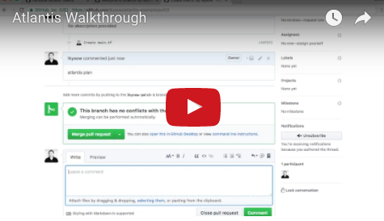

# Introducción

## Primeros pasos

* Si solo quieres probar Atlantis en un **repositorio de ejemplo**, echa un vistazo a [Test Drive](../guide/test-drive.md).
* Si quieres probar Atlantis en **tus propios repositorios**, lee [Testing Locally](../guide/testing-locally.md).
* Si ya estás listo para instalar Atlantis correctamente sobre infraestructura real, ve a la [Installation Guide](../docs/installation-guide.md).

::: tip ¿Buscas la documentación completa?
Está aquí: [www.runatlantis.io/docs](../docs.md)
:::

## Visión general: ¿qué es Atlantis?

Atlantis es una aplicación para automatizar Terraform mediante pull requests. Se despliega
como una aplicación independiente dentro de tu infraestructura. Ningún tercero tiene acceso a
tus credenciales.

Atlantis escucha los webhooks de GitHub, GitLab o Bitbucket sobre pull requests de Terraform. A
continuación ejecuta `terraform plan` y publica la salida como comentario en el pull request.

Cuando quieras aplicar los cambios, comenta `atlantis apply` en el pull request y Atlantis
ejecutará `terraform apply` y responderá con la salida.

## Vídeo

Mira el vídeo de abajo para verlo en acción:

## ¿Por qué ejecutar Atlantis?

### Mayor visibilidad

Cuando cada persona ejecuta Terraform en su propio equipo, es difícil conocer el
estado actual de tu infraestructura:

* ¿Está desplegado lo que hay en la rama `main`?
* ¿Alguien olvidó crear un pull request para ese último cambio?
* ¿Cuál fue la salida de aquel último `terraform apply`?

Con Atlantis todo queda visible en el pull request. Puedes consultar el historial
de todo lo que se ha hecho sobre tu infraestructura.

### Colaboración con todo el equipo

Probablemente no quieras repartir credenciales de Terraform a toda la organización
de ingeniería, pero ahora cualquiera puede abrir un pull request de Terraform.

Puedes exigir una aprobación antes de que el pull request se aplique, de modo que nada ocurra
por accidente.

### Revisa mejor los pull requests de Terraform

No se puede revisar del todo un cambio de Terraform sin ver la salida de `terraform plan`.
Ahora esa salida se añade al pull request automáticamente.

### Estandariza tus workflows

Atlantis bloquea un directorio/workspace hasta que el pull request se fusiona o el bloqueo
se elimina manualmente. Así se garantiza que los cambios se apliquen en el orden esperado.

Los comandos exactos que ejecuta Atlantis son configurables. Puedes ejecutar scripts
personalizados para construir tu workflow ideal.

## Siguientes pasos

* Si solo quieres probar Atlantis en un **repositorio de ejemplo**, echa un vistazo a [Test Drive](../guide/test-drive.md).
* Si quieres probar Atlantis en **tus propios repositorios**, lee [Testing Locally](../guide/testing-locally.md).
* Si ya estás listo para instalar Atlantis correctamente sobre infraestructura real, ve a la [Installation Guide](../docs/installation-guide.md).
