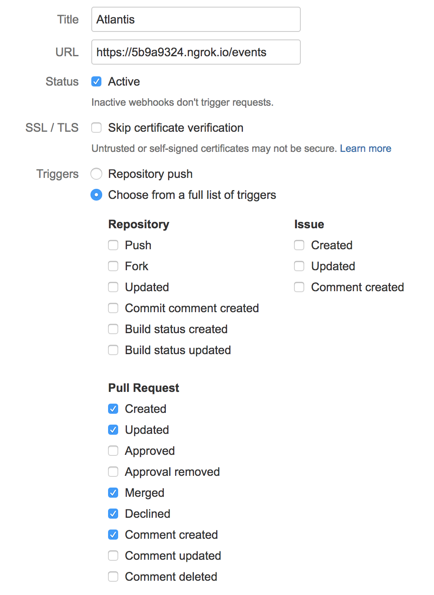
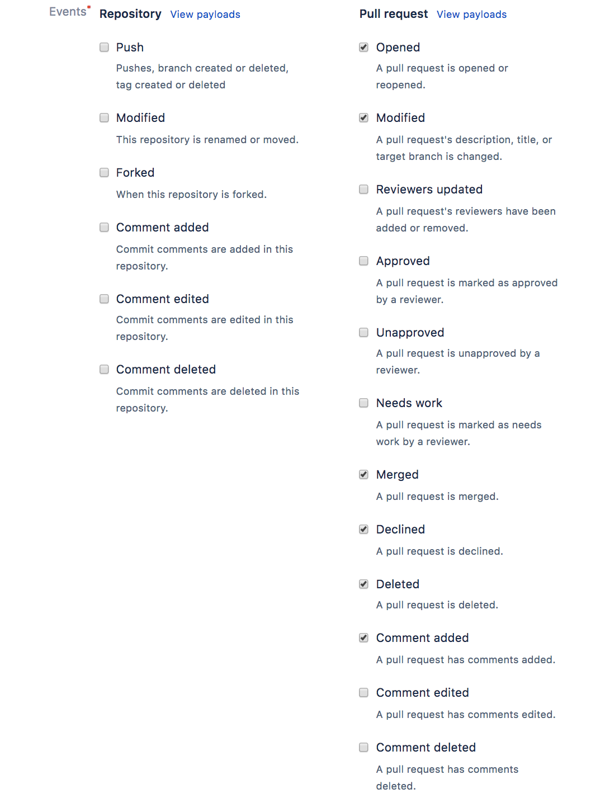

# Probar localmente

Estas instrucciones son para ejecutar Atlantis **localmente en tu propia computadora** para que puedas probarlo con
tus propios repositorios antes de decidir si instalarlo de forma más permanente.

::: tip
Si quieres configurar una instalación de Atlantis lista para producción, lee [Deployment](../docs/deployment.md).
:::

Pasos:

## Instalar Terraform

`terraform` necesita estar en el `$PATH` para Atlantis.
Descarga desde [Terraform](https://developer.hashicorp.com/terraform/downloads)

```shell
unzip path/to/terraform_*.zip -d /usr/local/bin
```

## Descargar Atlantis

Obtén la versión más reciente desde [GitHub](https://github.com/runatlantis/atlantis/releases)
y descomprímela.

## Descargar Ngrok

Atlantis necesita ser accesible en algún lugar al que github.com/gitlab.com/bitbucket.org o tu instalación de GitHub/GitLab Enterprise pueda llegar.
Una manera de lograr esto es con ngrok, una herramienta que reenvía tu puerto local a un nombre de host
público aleatorio.

[Download](https://ngrok.com/download) ngrok y `unzip`.

Inicia `ngrok` en el puerto `4141` y toma nota del nombre de host que te da:

```bash
./ngrok http 4141
```

En una nueva pestaña (donde pronto iniciarás Atlantis) crea una variable de entorno con
el nombre de host de ngrok:

```bash
URL="https://{YOUR_HOSTNAME}.ngrok.io"
```

## Crear un secreto de webhook

GitHub y GitLab usan secretos de webhook para que los clientes puedan verificar que los webhooks
vinieron de ellos.

Crea una cadena aleatoria de cualquier longitud (puedes usar [random.org](https://www.random.org/strings/))
y establece una variable de entorno:

```shell
SECRET="{YOUR_RANDOM_STRING}"
```

## Agregar webhook

Toma la URL que ngrok mostró y crea un webhook en tu repo de GitHub, GitLab o Bitbucket:

### Webhook de GitHub o GitHub Enterprise

<details>
    <summary>Expand</summary>
    <ul>
        <li>Ve a la configuración de tu repo</li>
        <li>Selecciona <strong>Webhooks</strong> o <strong>Hooks</strong> en la barra lateral</li>
        <li>Haz clic en <strong>Add webhook</strong></li>
        <li>establece <strong>Payload URL</strong> en tu URL de ngrok con <code>/events</code> al final. Ej. <code>https://c5004d84.ngrok.io/events</code></li>
        <li>verifica de nuevo que agregaste <code>/events</code> al final de tu URL.</li>
        <li>establece <strong>Content type</strong> en <code>application/json</code></li>
        <li>establece <strong>Secret</strong> en tu cadena aleatoria</li>
        <li>selecciona <strong>Let me select individual events</strong></li>
        <li>marca las casillas
            <ul>
                <li><strong>Pull request reviews</strong></li>
                <li><strong>Pushes</strong></li>
                <li><strong>Issue comments</strong></li>
                <li><strong>Pull requests</strong></li>
            </ul>
        </li>
        <li>deja <strong>Active</strong> marcado</li>
        <li>haz clic en <strong>Add webhook</strong></li>
    </ul>
</details>

### Webhook de GitLab o GitLab Enterprise

<details>
    <summary>Expand</summary>
    <ul>
        <li>Ve a la página principal de tu repo</li>
        <li>Haz clic en <strong>Settings &gt; Webhooks</strong> en la barra lateral</li>
        <li>establece <strong>URL</strong> en tu URL de ngrok con <code>/events</code> al final. Ej. <code>https://c5004d84.ngrok.io/events</code></li>
        <li>verifica de nuevo que agregaste <code>/events</code> al final de tu URL.</li>
        <li>establece <strong>Secret Token</strong> en tu cadena aleatoria</li>
        <li>marca las casillas
            <ul>
                <li><strong>Push events</strong></li>
                <li><strong>Comments</strong></li>
                <li><strong>Merge Request events</strong></li>
            </ul>
        </li>
        <li>deja <strong>Enable SSL verification</strong> marcado</li>
        <li>haz clic en <strong>Add webhook</strong></li>
    </ul>
</details>

### Webhook de Bitbucket Cloud (bitbucket.org)

<details>
    <summary>Expand</summary>
    <ul>
        <li>Ve a la página principal de tu repo</li>
        <li>Haz clic en <strong>Settings</strong> en la barra lateral</li>
        <li>Haz clic en <strong>Webhooks</strong> bajo la sección <strong>WORKFLOW</strong></li>
        <li>Haz clic en <strong>Add webhook</strong></li>
        <li>Ingresa "Atlantis" en <strong>Title</strong></li>
        <li>Establece <strong>URL</strong> en tu URL de ngrok con <code>/events</code> al final. Ej. <code>https://c5004d84.ngrok.io/events</code></li>
        <li>Verifica de nuevo que agregaste <code>/events</code> al final de tu URL.</li>
        <li>Mantén <strong>Status</strong> como Active</li>
        <li>No marques <strong>Skip certificate validation</strong> porque NGROK tiene un cert válido.</li>
        <li>Selecciona <strong>Choose from a full list of triggers</strong></li>
        <li>Bajo <strong>Repository</strong><strong>des</strong>marca todo</li>
        <li>Bajo <strong>Issues</strong> deja todo <strong>des</strong>marcado</li>
        <li>Bajo <strong>Pull Request</strong>, selecciona: Created, Updated, Merged, Declined y Comment created</li>
        <li>Haz clic en <strong>Save</strong></li>
    </ul>
</details>

### Webhook de Bitbucket Server (también conocido como Stash)

<details>
    <summary>Expand</summary>
    <ul>
        <li>Ve a la página principal de tu repo</li>
        <li>Haz clic en <strong>Settings</strong> en la barra lateral</li>
        <li>Haz clic en <strong>Webhooks</strong> bajo la sección <strong>WORKFLOW</strong></li>
        <li>Haz clic en <strong>Create webhook</strong></li>
        <li>Ingresa "Atlantis" en <strong>Name</strong></li>
        <li>Establece <strong>URL</strong> en tu URL de ngrok con <code>/events</code> al final. Ej. <code>https://c5004d84.ngrok.io/events</code></li>
        <li>Verifica de nuevo que agregaste <code>/events</code> al final de tu URL.</li>
        <li>Establece <strong>Secret</strong> en tu cadena aleatoria</li>
        <li>Bajo <strong>Pull Request</strong>, selecciona: Opened, Source branch updated, Merged, Declined, Deleted y Comment added</li>
        <li>Haz clic en <strong>Save</strong></li>
    </ul>
</details>

### Webhook de Gitea

<details>
    <summary>Expand</summary>
    <ul>
        <li>Haz clic en <strong>Settings &gt; Webhooks</strong> en la barra superior y luego en la barra lateral</li>
        <li>Haz clic en <strong>Add webhook &gt; Gitea</strong> (los webhooks de Gitea son específicos del servicio, pero esto funciona)</li>
        <li>establece <strong>Target URL</strong> en <code>http://$URL/events</code> (o <code>https://$URL/events</code> si estás usando SSL) donde <code>$URL</code> es donde Atlantis está alojado. <strong>Asegúrate de agregar <code>/events</code></strong></li>
        <li>verifica de nuevo que agregaste <code>/events</code> al final de tu URL.</li>
        <li>establece <strong>Secret</strong> en el secreto de webhook que generaste anteriormente
        <ul>
            <li><strong>NOTA</strong> Si estás agregando un webhook a múltiples repositorios, cada repositorio necesitará usar el <strong>mismo</strong> secreto.</li>
        </ul>
        </li>
        <li>Selecciona <strong>Custom Events...</strong></li>
        <li>Marca las casillas
            <ul>
                <li><strong>Repository events &gt; Push</strong></li>
                <li><strong>Issue events &gt; Issue Comment</strong></li>
                <li><strong>Pull Request events &gt; Pull Request</strong></li>
                <li><strong>Pull Request events &gt; Pull Request Comment</strong></li>
                <li><strong>Pull Request events &gt; Pull Request Reviewed</strong></li>
                <li><strong>Pull Request events &gt; Pull Request Synchronized</strong></li>
            </ul>
        </li>
        <li>Deja <strong>Active</strong> marcado</li>
        <li>Haz clic en <strong>Add Webhook</strong></li>
        <li>Consulta <a href="#next-steps">Next Steps</a></li>
    </ul>
</details>

## Crear un token de acceso para Atlantis

Recomendamos usar un usuario de CI dedicado o crear un nuevo usuario llamado **@atlantis** que realice todas las acciones de API, sin embargo para pruebas,
puedes usar tu propio usuario. Aquí crearemos el token de acceso que Atlantis usa para comentar en el pull request y
establecer estados de commit.

### Token de acceso de GitHub o GitHub Enterprise

- Crea un [Personal Access Token](https://docs.github.com/en/authentication/keeping-your-account-and-data-secure/creating-a-personal-access-token#creating-a-fine-grained-personal-access-token)
- crea un token con alcance **repo**
- establece el token como una variable de entorno

```shell
TOKEN="{YOUR_TOKEN}"
```

### Token de acceso de GitLab o GitLab Enterprise

- sigue [GitLab: Create a personal access token](https://docs.gitlab.com/user/profile/personal_access_tokens/#create-a-personal-access-token)
- crea un token con alcance **api**
- establece el token como una variable de entorno

```shell
TOKEN="{YOUR_TOKEN}"
```

### Token de acceso de Bitbucket Cloud (bitbucket.org)

- sigue [BitBucket Cloud: Create an app password](https://support.atlassian.com/bitbucket-cloud/docs/create-an-app-password/)
- Etiqueta la contraseña como "atlantis"
- Selecciona **Pull requests**: **Read** y **Write** para que Atlantis pueda leer tus pull requests y escribir comentarios en ellos
- establece el token como una variable de entorno

```shell
TOKEN="{YOUR_TOKEN}"
```

### Token de acceso de Bitbucket Server (también conocido como Stash)

- Haz clic en tu avatar en la esquina superior derecha y selecciona **Manage account**
- Haz clic en **HTTP access tokens** en la barra lateral
- Haz clic en **Create token**
- Nombra el token **atlantis**
- Da al token permisos de proyecto **Read** y permisos de pull request **Write**
- Elige una opción de expiración **Do not expire** o **Expire automatically**
- Haz clic en **Create** y establece el token como una variable de entorno

```shell
TOKEN="{YOUR_TOKEN}"
```

### Token de acceso de Gitea

- Ve a "Profile and Settings" > "Settings" en Gitea (arriba a la derecha)
- Ve a "Applications" bajo "User Settings" en Gitea
- Crea un token bajo "Manage Access Tokens" con los siguientes permisos:
  - issue: Read and Write
  - repository: Read and Write
- Guarda el token de acceso

## Iniciar Atlantis

Ya casi estás listo para iniciar Atlantis, solo establece dos variables más:

```bash
USERNAME="{the username of your GitHub, GitLab or Bitbucket user}"
REPO_ALLOWLIST="$YOUR_GIT_HOST/$YOUR_USERNAME/$YOUR_REPO"
# ex. REPO_ALLOWLIST="github.com/runatlantis/atlantis"
# If you're using Bitbucket Server, $YOUR_GIT_HOST will be the domain name of your
# server without scheme or port and $YOUR_USERNAME will be the name of the **project** the repo
# is under, **not the key** of the project.
```

Ahora puedes iniciar Atlantis. El comando exacto difiere según tu host de Git:

### Comando de GitHub

```bash
atlantis server \
--atlantis-url="$URL" \
--gh-user="$USERNAME" \
--gh-token="$TOKEN" \
--gh-webhook-secret="$SECRET" \
--repo-allowlist="$REPO_ALLOWLIST"
```

### Comando de GitHub Enterprise

```bash
HOSTNAME=YOUR_GITHUB_ENTERPRISE_HOSTNAME # ex. github.runatlantis.io
atlantis server \
--atlantis-url="$URL" \
--gh-user="$USERNAME" \
--gh-token="$TOKEN" \
--gh-webhook-secret="$SECRET" \
--gh-hostname="$HOSTNAME" \
--repo-allowlist="$REPO_ALLOWLIST"
```

### Comando de GitLab

```bash
atlantis server \
--atlantis-url="$URL" \
--gitlab-user="$USERNAME" \
--gitlab-token="$TOKEN" \
--gitlab-webhook-secret="$SECRET" \
--repo-allowlist="$REPO_ALLOWLIST"
```

### Comando de GitLab Enterprise

```bash
HOSTNAME=YOUR_GITLAB_ENTERPRISE_HOSTNAME # ex. gitlab.runatlantis.io
atlantis server \
--atlantis-url="$URL" \
--gitlab-user="$USERNAME" \
--gitlab-token="$TOKEN" \
--gitlab-webhook-secret="$SECRET" \
--gitlab-hostname="$HOSTNAME" \
--repo-allowlist="$REPO_ALLOWLIST"
```

### Comando de Bitbucket Cloud (bitbucket.org)

```bash
atlantis server \
--atlantis-url="$URL" \
--bitbucket-user="$USERNAME" \
--bitbucket-token="$TOKEN" \
--repo-allowlist="$REPO_ALLOWLIST"
```

### Comando de Bitbucket Server (también conocido como Stash)

```bash
BASE_URL=YOUR_BITBUCKET_SERVER_URL # ex. http://bitbucket.mycorp:7990
atlantis server \
--atlantis-url="$URL" \
--bitbucket-user="$USERNAME" \
--bitbucket-token="$TOKEN" \
--bitbucket-webhook-secret="$SECRET" \
--bitbucket-base-url="$BASE_URL" \
--repo-allowlist="$REPO_ALLOWLIST"
```

### Azure DevOps

Se requiere un certificado y una clave privada si se usa autenticación Basic para webhooks.

```bash
atlantis server \
--atlantis-url="$URL" \
--azuredevops-user="$USERNAME" \
--azuredevops-token="$TOKEN" \
--azuredevops-webhook-user="$ATLANTIS_AZUREDEVOPS_WEBHOOK_USER" \
--azuredevops-webhook-password="$ATLANTIS_AZUREDEVOPS_WEBHOOK_PASSWORD" \
--repo-allowlist="$REPO_ALLOWLIST"
--ssl-cert-file=file.crt
--ssl-key-file=file.key
```

### Gitea

```bash
atlantis server \
--atlantis-url="$URL" \
--gitea-user="$ATLANTIS_GITEA_USER" \
--gitea-token="$ATLANTIS_GITEA_TOKEN" \
--gitea-webhook-secret="$ATLANTIS_GITEA_WEBHOOK_SECRET" \
--gitea-base-url="$ATLANTIS_GITEA_BASE_URL" \
--gitea-page-size="$ATLANTIS_GITEA_PAGE_SIZE" \
--repo-allowlist="$REPO_ALLOWLIST"
--ssl-cert-file=file.crt
--ssl-key-file=file.key
```

## Crear un pull request

Crea un pull request para que puedas probar Atlantis.
::: tip
Podrías agregar un recurso nulo como prueba:

```hcl
resource "null_resource" "example" {}
```

O simplemente modifica los espacios en blanco en un archivo.
:::

### Autoplan

Deberías ver que Atlantis registra que recibió el webhook y deberías ver la salida de `terraform plan` en tu repo.

Atlantis intenta determinar el directorio en el que hacer plan en función de los archivos modificados.
Si necesitas personalizar los directorios en los que Atlantis se ejecuta o los comandos que ejecuta si estás usando workspaces
o archivos `.tfvars`, consulta [atlantis.yaml Reference](../docs/repo-level-atlantis-yaml.md#reference).

### Plan manual

Para hacer manualmente `plan` en un directorio o workspace específico, comenta en el pull request usando los flags `-d` o `-w`:

```shell
atlantis plan -d mydir
atlantis plan -w staging
```

Para agregar argumentos adicionales al `terraform plan` subyacente puedes usar:

```shell
atlantis plan -- -target=resource -var 'foo=bar'
```

### Apply

Si te gustaría `apply`, escribe un comentario: `atlantis apply`. Puedes usar los flags `-d` o `-w` para apuntar
a Atlantis a un plan específico. De lo contrario intenta aplicar el plan para el directorio raíz.

## Logs en tiempo real

La [salida de terraform en tiempo real](../docs/streaming-logs.md) para tu comando se puede encontrar al hacer clic en la verificación de estado para un proyecto dado en un PR, que
enlaza a la UI de streaming de logs. Esta es una UI de terminal donde puedes ver tus comandos ejecutándose en tiempo real.

## Próximos pasos

- Si las cosas están funcionando como se espera, puedes `Ctrl-C` el comando `atlantis server` y el comando `ngrok`.
- Esperamos que Atlantis esté funcionando con tu repo y que estés listo para pasar a un [production-ready deployment](../docs/deployment.md).
- Si no está funcionando como se espera, puede que necesites personalizar cómo se ejecuta Atlantis con un archivo `atlantis.yaml`.
Consulta [atlantis.yaml use cases](../docs/repo-level-atlantis-yaml.md#use-cases).
- Revisa nuestra [documentación completa](../docs.md) para más detalles.
