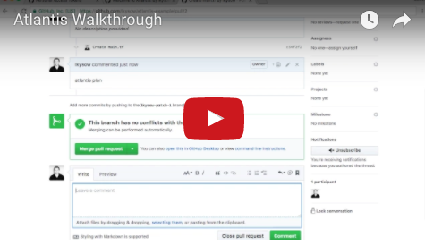

# Introduction

## Getting Started
* If you'd like to just test out running Atlantis on an **example repo** check out the [Test Drive](test-drive.html).
* If you'd like to test out running Atlantis on **your repos** then read [Testing Locally](testing-locally.html).
* If you're ready to properly install Atlantis on real infrastructure then head over to the [Installation Guide](/docs/installation-guide.html).

::: tip Looking for the full docs?
Go here: [www.runatlantis.io/docs](/docs/)
:::

## Overview – What Is Atlantis?
Atlantis is an application for automating Terraform via pull requests. It is deployed
as a standalone application into your infrastructure. No third-party has access to
your credentials.

Atlantis listens for GitHub, GitLab or Bitbucket webhooks about Terraform pull requests. It
then runs `terraform plan` and comments with the output back on the pull request.

When you want to apply, comment `atlantis apply` on the pull request and Atlantis
will run `terraform apply` and comment back with the output.

## Watch
Check out the video below to see it in action:

## Why would you run Atlantis?
### Increased visibility
When everyone is executing Terraform on their own computers, it's hard to know the
current state of your infrastructure:
* Is what's in `master` deployed?
* Did someone forget to create a pull request for that latest change?
* What was the output from that last `terraform apply`?

With Atlantis, everything is visible on the pull request. You can view the history
of everything that was done to your infrastructure.

### Enable collaboration with everyone
You probably don't want to distribute Terraform credentials to everyone in your
engineering organization, but now anyone can open up a Terraform pull request.

You can require approval before the pull request is applied so nothing happens
accidentally.

### Review Terraform pull requests better
You can't fully review a Terraform change without seeing the output of `terraform plan`.
Now that output is added to the pull request automatically.

### Standardize your workflows
Atlantis locks a directory/workspace until the pull request is merged or the lock
is manually deleted. This ensures that changes are applied in the order expected.

The exact commands that Atlantis runs are configurable. You can run custom scripts
to construct your ideal workflow.

## Next Steps
* If you'd like to just test out running Atlantis on an **example repo** check out the [Test Drive](test-drive.html).
* If you'd like to test out running Atlantis on **your repos** then read [Testing Locally](testing-locally.html).
* If you're ready to properly install Atlantis on real infrastructure then head over to the [Installation Guide](/docs/installation-guide.html).
