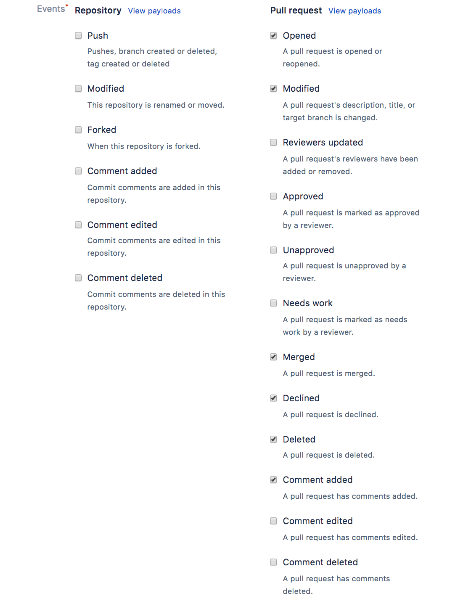

# Testing Locally
These instructions are for running Atlantis **locally on your own computer** so you can test it out against
your own repositories before deciding whether to install it more permanently.

::: tip
If you want to set up a production-ready Atlantis installation, read [Deployment](../docs/deployment.html).
:::

Steps:

[[toc]]

## Install Terraform
`terraform` needs to be in the `$PATH` for Atlantis.
Download from [https://www.terraform.io/downloads.html](https://www.terraform.io/downloads.html)
```
unzip path/to/terraform_*.zip -d /usr/local/bin
```

## Download Atlantis
Get the latest release from [https://github.com/runatlantis/atlantis/releases](https://github.com/runatlantis/atlantis/releases)
and unpackage it.

## Download Ngrok
Atlantis needs to be accessible somewhere that github.com/gitlab.com/bitbucket.org or your GitHub/GitLab Enterprise installation can reach.
One way to accomplish this is with ngrok, a tool that forwards your local port to a random
public hostname.

Go to [https://ngrok.com/download](https://ngrok.com/download), download ngrok and `unzip` it.

Start `ngrok` on port `4141` and take note of the hostname it gives you:
```bash
./ngrok http 4141
```

In a new tab (where you'll soon start Atlantis) create an environment variable with
ngrok's hostname:
```bash
URL="https://{YOUR_HOSTNAME}.ngrok.io"
```

## Create a Webhook Secret
GitHub and GitLab use webhook secrets so clients can verify that the webhooks came
from them.
::: warning
Bitbucket Cloud (bitbucket.org) doesn't use webhook secrets so if you're using Bitbucket Cloud you can skip this step.
When you're ready to do a production deploy of Atlantis you should allowlist [Bitbucket IPs](https://confluence.atlassian.com/bitbucket/what-are-the-bitbucket-cloud-ip-addresses-i-should-use-to-configure-my-corporate-firewall-343343385.html)
to ensure the webhooks are coming from them.
:::
Create a random string of any length (you can use [https://www.random.org/strings/](https://www.random.org/strings/))
and set an environment variable:
```
SECRET="{YOUR_RANDOM_STRING}"
```

## Add Webhook
Take the URL that ngrok output and create a webhook in your GitHub, GitLab or Bitbucket repo:

### GitHub or GitHub Enterprise Webhook
<details>
    <summary>Expand</summary>
    <ul>
        <li>Go to your repo's settings</li>
        <li>Select <strong>Webhooks</strong> or <strong>Hooks</strong> in the sidebar</li>
        <li>Click <strong>Add webhook</strong></li>
        <li>set <strong>Payload URL</strong> to your ngrok url with <code>/events</code> at the end. Ex. <code>https://c5004d84.ngrok.io/events</code></li>
        <li>double-check you added <code>/events</code> to the end of your URL.</li>
        <li>set <strong>Content type</strong> to <code>application/json</code></li>
        <li>set <strong>Secret</strong> to your random string</li>
        <li>select <strong>Let me select individual events</strong></li>
        <li>check the boxes
            <ul>
                <li><strong>Pull request reviews</strong></li>
                <li><strong>Pushes</strong></li>
                <li><strong>Issue comments</strong></li>
                <li><strong>Pull requests</strong></li>
            </ul>
        </li>
        <li>leave <strong>Active</strong> checked</li>
        <li>click <strong>Add webhook</strong></li>
    </ul>
</details>

### GitLab or GitLab Enterprise Webhook
<details>
    <summary>Expand</summary>
    <ul>
        <li>Go to your repo's home page</li>
        <li>Click <strong>Settings &gt; Webhooks</strong> in the sidebar</li>
        <li>set <strong>URL</strong> to your ngrok url with <code>/events</code> at the end. Ex. <code>https://c5004d84.ngrok.io/events</code></li>
        <li>double-check you added <code>/events</code> to the end of your URL.</li>
        <li>set <strong>Secret Token</strong> to your random string</li>
        <li>check the boxes
            <ul>
                <li><strong>Push events</strong></li>
                <li><strong>Comments</strong></li>
                <li><strong>Merge Request events</strong></li>
            </ul>
        </li>
        <li>leave <strong>Enable SSL verification</strong> checked</li>
        <li>click <strong>Add webhook</strong></li>
    </ul>
</details>

### Bitbucket Cloud (bitbucket.org) Webhook
<details>
    <summary>Expand</summary>
    <ul>
        <li>Go to your repo's home page</li>
        <li>Click <strong>Settings</strong> in the sidebar</li>
        <li>Click <strong>Webhooks</strong> under the <strong>WORKFLOW</strong> section</li>
        <li>Click <strong>Add webhook</strong></li>
        <li>Enter "Atlantis" for <strong>Title</strong></li>
        <li>Set <strong>URL</strong> to your ngrok url with <code>/events</code> at the end. Ex. <code>https://c5004d84.ngrok.io/events</code></li>
        <li>Double-check you added <code>/events</code> to the end of your URL.</li>
        <li>Keep <strong>Status</strong> as Active</li>
        <li>Don't check <strong>Skip certificate validation</strong> because NGROK has a valid cert.</li>
        <li>Select <strong>Choose from a full list of triggers</strong></li>
        <li>Under <strong>Repository</strong><strong>un</strong>check everything</li>
        <li>Under <strong>Issues</strong> leave everything <strong>un</strong>checked</li>
        <li>Under <strong>Pull Request</strong>, select: Created, Updated, Merged, Declined and Comment created</li>
        <li>Click <strong>Save</strong></li>
    </ul>
</details>

### Bitbucket Server (aka Stash) Webhook
<details>
    <summary>Expand</summary>
    <ul>
        <li>Go to your repo's home page</li>
        <li>Click <strong>Settings</strong> in the sidebar</li>
        <li>Click <strong>Webhooks</strong> under the <strong>WORKFLOW</strong> section</li>
        <li>Click <strong>Create webhook</strong></li>
        <li>Enter "Atlantis" for <strong>Name</strong></li>
        <li>Set <strong>URL</strong> to your ngrok url with <code>/events</code> at the end. Ex. <code>https://c5004d84.ngrok.io/events</code></li>
        <li>Double-check you added <code>/events</code> to the end of your URL.</li>
        <li>Set <strong>Secret</strong> to your random string</li>
        <li>Under <strong>Pull Request</strong>, select: Opened, Source branch updated, Merged, Declined, Deleted and Comment added</li>
        <li>Click <strong>Save</strong></li>
    </ul>
</details>


## Create an access token for Atlantis
We recommend using a dedicated CI user or creating a new user named **@atlantis** that performs all API actions, however for testing,
you can use your own user. Here we'll create the access token that Atlantis uses to comment on the pull request and
set commit statuses.

### GitHub or GitHub Enterprise Access Token
- follow [https://help.github.com/articles/creating-a-personal-access-token-for-the-command-line/#creating-a-token](https://help.github.com/articles/creating-a-personal-access-token-for-the-command-line/#creating-a-token)
- create a token with **repo** scope
- set the token as an environment variable
```
TOKEN="{YOUR_TOKEN}"
```

### GitLab or GitLab Enterprise Access Token
- follow [https://docs.gitlab.com/ce/user/profile/personal_access_tokens.html#create-a-personal-access-token](https://docs.gitlab.com/ce/user/profile/personal_access_tokens.html#create-a-personal-access-token)
- create a token with **api** scope
- set the token as an environment variable
```
TOKEN="{YOUR_TOKEN}"
```

### Bitbucket Cloud (bitbucket.org) Access Token
- follow [https://support.atlassian.com/bitbucket-cloud/docs/app-passwords/#Create-an-app-password](https://support.atlassian.com/bitbucket-cloud/docs/app-passwords/#Create-an-app-password)
- Label the password "atlantis"
- Select **Pull requests**: **Read** and **Write** so that Atlantis can read your pull requests and write comments to them
- set the token as an environment variable
```
TOKEN="{YOUR_TOKEN}"
```

### Bitbucket Server (aka Stash) Access Token
- Click on your avatar in the top right and select **Manage account**
- Click **Personal access tokens** in the sidebar
- Click **Create a token**
- Name the token **atlantis**
- Give the token **Read** Project permissions and **Write** Pull request permissions
- Click **create** and set the token as an environment variable
```
TOKEN="{YOUR_TOKEN}"
```


## Start Atlantis
You're almost ready to start Atlantis, just set two more variables:

```bash
USERNAME="{the username of your GitHub, GitLab or Bitbucket user}"
REPO_ALLOWLIST="$YOUR_GIT_HOST/$YOUR_USERNAME/$YOUR_REPO"
# ex. REPO_ALLOWLIST="github.com/runatlantis/atlantis"
# If you're using Bitbucket Server, $YOUR_GIT_HOST will be the domain name of your
# server without scheme or port and $YOUR_USERNAME will be the name of the **project** the repo
# is under, **not the key** of the project.
```
Now you can start Atlantis. The exact command differs depending on your Git host:

### GitHub Command
```bash
atlantis server \
--atlantis-url="$URL" \
--gh-user="$USERNAME" \
--gh-token="$TOKEN" \
--gh-webhook-secret="$SECRET" \
--repo-allowlist="$REPO_ALLOWLIST"
```

### GitHub Enterprise Command
```bash
HOSTNAME=YOUR_GITHUB_ENTERPRISE_HOSTNAME # ex. github.runatlantis.io
atlantis server \
--atlantis-url="$URL" \
--gh-user="$USERNAME" \
--gh-token="$TOKEN" \
--gh-webhook-secret="$SECRET" \
--gh-hostname="$HOSTNAME" \
--repo-allowlist="$REPO_ALLOWLIST"
```

### GitLab Command
```bash
atlantis server \
--atlantis-url="$URL" \
--gitlab-user="$USERNAME" \
--gitlab-token="$TOKEN" \
--gitlab-webhook-secret="$SECRET" \
--repo-allowlist="$REPO_ALLOWLIST"
```

### GitLab Enterprise Command
```bash
HOSTNAME=YOUR_GITLAB_ENTERPRISE_HOSTNAME # ex. gitlab.runatlantis.io
atlantis server \
--atlantis-url="$URL" \
--gitlab-user="$USERNAME" \
--gitlab-token="$TOKEN" \
--gitlab-webhook-secret="$SECRET" \
--gitlab-hostname="$HOSTNAME" \
--repo-allowlist="$REPO_ALLOWLIST"
```

### Bitbucket Cloud (bitbucket.org) Command
```bash
atlantis server \
--atlantis-url="$URL" \
--bitbucket-user="$USERNAME" \
--bitbucket-token="$TOKEN" \
--repo-allowlist="$REPO_ALLOWLIST"
```

### Bitbucket Server (aka Stash) Command
```bash
BASE_URL=YOUR_BITBUCKET_SERVER_URL # ex. http://bitbucket.mycorp:7990
atlantis server \
--atlantis-url="$URL" \
--bitbucket-user="$USERNAME" \
--bitbucket-token="$TOKEN" \
--bitbucket-webhook-secret="$SECRET" \
--bitbucket-base-url="$BASE_URL" \
--repo-allowlist="$REPO_ALLOWLIST"
```

### Azure DevOps

A certificate and private key are required if using Basic authentication for webhooks.

```bash
atlantis server \
--atlantis-url="$URL" \
--azuredevops-user="$USERNAME" \
--azuredevops-token="$TOKEN" \
--azuredevops-webhook-user="$ATLANTIS_AZUREDEVOPS_WEBHOOK_USER" \
--azuredevops-webhook-password="$ATLANTIS_AZUREDEVOPS_WEBHOOK_PASSWORD" \
--repo-allowlist="$REPO_ALLOWLIST"
--ssl-cert-file=file.crt
--ssl-key-file=file.key
```

## Create a pull request
Create a pull request so you can test Atlantis.
::: tip
You could add a null resource as a test:
```hcl
resource "null_resource" "example" {}
```
Or just modify the whitespace in a file.
:::

### Autoplan
You should see Atlantis logging about receiving the webhook and you should see the output of `terraform plan` on your repo.

Atlantis tries to figure out the directory to plan in based on the files modified.
If you need to customize the directories that Atlantis runs in or the commands it runs if you're using workspaces
or `.tfvars` files, see [atlantis.yaml Reference](/docs/repo-level-atlantis-yaml.html#reference).

### Manual Plan
To manually `plan` in a specific directory or workspace, comment on the pull request using the `-d` or `-w` flags:
```
atlantis plan -d mydir
atlantis plan -w staging
```

To add additional arguments to the underlying `terraform plan` you can use:
```
atlantis plan -- -target=resource -var 'foo=bar'
```

### Apply
If you'd like to `apply`, type a comment: `atlantis apply`. You can use the `-d` or `-w` flags to point
Atlantis at a specific plan. Otherwise it tries to apply the plan for the root directory.

## Real-time logs
The [real-time terraform output](/docs/streaming-logs.md) for your command can be found by clicking into the status check for a given project in a PR which
links to the log-streaming UI. This is a terminal UI where you can view your commands executing in real-time. 

## Next Steps
* If things are working as expected you can `Ctrl-C` the `atlantis server` command and the `ngrok` command.
* Hopefully Atlantis is working with your repo and you're ready to move on to a [production-ready deployment](../docs/deployment.html).
* If it's not working as expected, you may need to customize how Atlantis runs with an `atlantis.yaml` file.
See [atlantis.yaml use cases](/docs/repo-level-atlantis-yaml.html#use-cases).
* Check out our [full documentation](../docs/) for more details.
