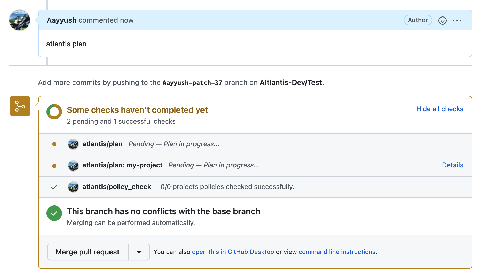
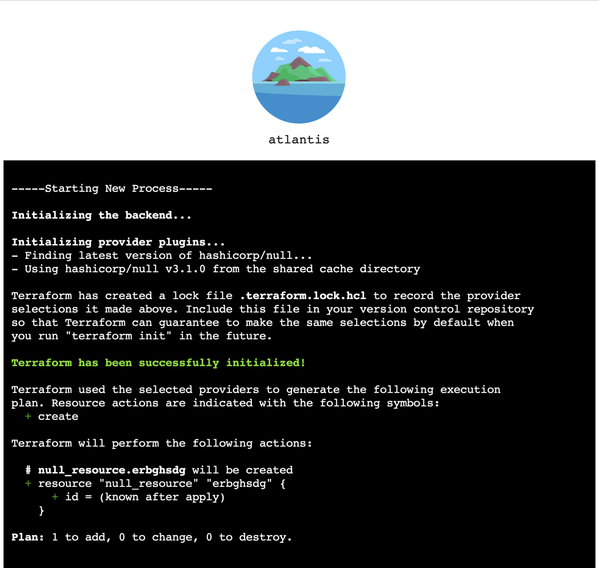
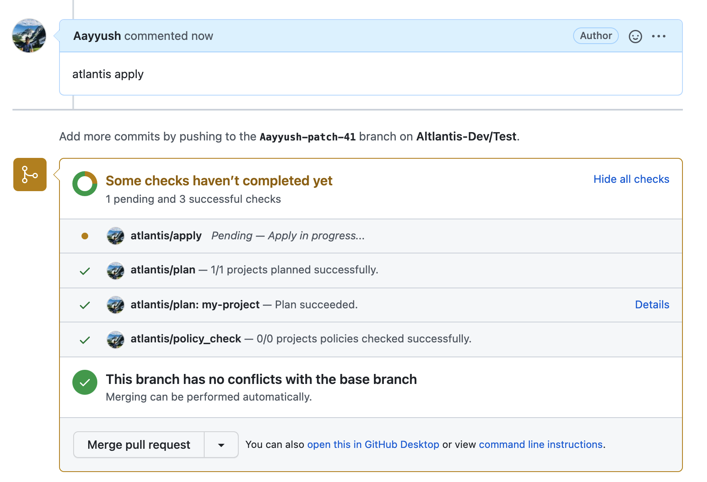
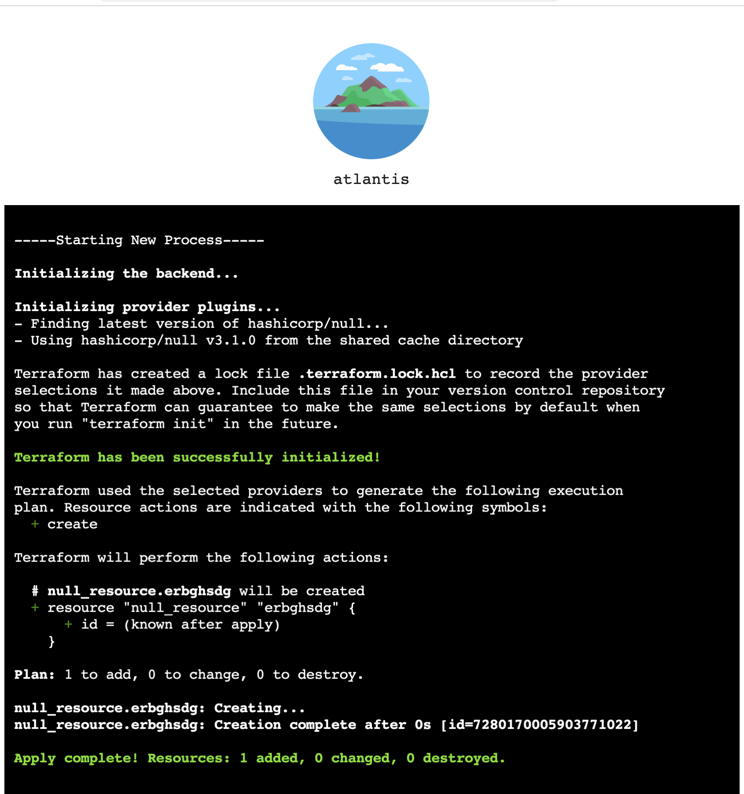

# Real-time Atlantis logs

## Getting Started
Atlantis supports streaming terraform logs in real time by default. Currently, only two commands are supported

### atlantis plan 
When a user runs atlantis plan in their PR, Atlantis will add a atlantis/plan status check for all the projects as shown below: 

The user can then navigate to the log-streaming UI by navigating to the link in the github check for their project. This will open up a new tab which shows the terraform logs of their operation in real time. 

### atlantis apply
When a user runs atlantis apply in their PR, Atlantis will add a atlantis/apply status check for all the projects as shown below: 

The user can then navigate to the log-streaming UI by navigating to the link in the github check for their project. This will open up a new tab which shows the terraform logs of their operation in real time. 

## Future Work 
In the future, users will also be able to persist the logs into a storage backend of their choice. 

